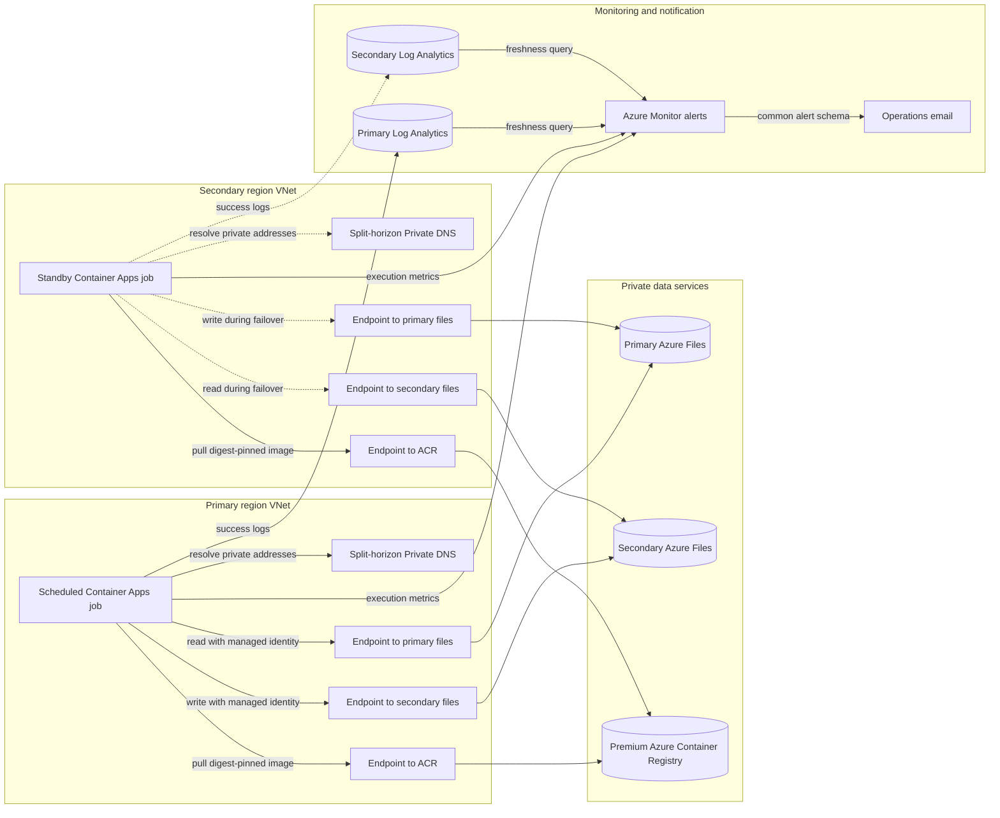

# Azure Files Replication Non-Region Pair

Bicep and Azure CLI deployment for private Azure Files replication between two Azure regions that do not need to be an Azure paired-region set. Two regional Azure Container Apps Jobs run a digest-pinned AzCopy image in active/passive mode.

## Architecture

<!-- mermaid-checked: safe labels, quoted edge labels, closed subgraphs, and unique ids -->


The VNets are intentionally not peered. Each VNet has private endpoints for both file accounts and ACR, with its own split-horizon Private DNS zones. Only one replication direction is scheduled at a time.

## Design

- No VNet peering or public storage access.
- Both file accounts have a private endpoint in each VNet so either regional job can reach both shares.
- Regional split-horizon Azure Private DNS zones prevent cross-region private endpoint DNS ambiguity.
- Managed identities authenticate to Azure Files; no storage keys or SAS tokens are used.
- The selected primary region synchronizes forward. The secondary region is a manual standby with reverse synchronization preconfigured.
- Azure Monitor sends email for failed executions and when the active direction has no successful replication within the configured threshold.
- The requested regional blob accounts and private containers are provisioned for application/demo use; they are not part of the Azure Files transfer path.

See [docs/infrastructure-plan.md](docs/infrastructure-plan.md) for topology and failover controls.

## Deployment profiles

- `infra/main.bicep` creates the complete demonstration topology, including storage, VNets, endpoints, DNS, and ACR.
- `infra/existing.bicep` references existing storage accounts, file shares, networking, private endpoints, DNS, and a container registry. It creates replication identities and RBAC, Log Analytics workspaces, Container Apps environments and jobs, and Azure Monitor alerting resources.

The existing-resource profile is additive. It does not redeploy or change the supplied storage accounts, VNets, private endpoints, private DNS zones, or ACR.

## Prerequisites

- Azure CLI with the Bicep and Container Apps extensions.
- Subscription Owner or equivalent rights to create resource groups, resources, and role assignments.
- PowerShell 7 when using `scripts/deploy.ps1`; direct Bicep deployment needs only Azure CLI.
- Sufficient Premium ACR, Container Apps environment, private endpoint, and regional storage quota.
- For the existing-resource profile, an existing ACR that both job subnets can reach (Premium when reached through private endpoints) and a digest-pinned AzCopy job image in that ACR.
- One dedicated, empty Container Apps infrastructure subnet of at least `/23`, delegated to `Microsoft.App/environments`, in each region. The templates create workload profiles environments that run the jobs on the serverless Consumption profile, and this environment type requires the delegation.
- A network path that supports server-side copy between the two private storage accounts. See [Network requirements for server-side copy](#network-requirements-for-server-side-copy).

Review the active subscription before deployment:

```powershell
az account show --output table
az account set --subscription <subscription-id>
```

## Inventory check

`scripts/inventory.ps1` reports which services already exist and what a deployment would provision. It is read-only: it runs only Azure CLI `show`, `list`, Bicep build, and deployment what-if commands.

```powershell
# Greenfield demonstration profile
pwsh ./scripts/inventory.ps1

# Existing-resource profile, with a shareable JSON report
pwsh ./scripts/inventory.ps1 -ParametersFile ./infra/existing.bicepparam -OutputPath ./inventory-report.json
```

The report contains two tables:

- **Prerequisites** lists placeholder parameters, resource provider registration, and Container Apps availability in both regions. For the greenfield profile, it also checks storage SKU availability. For the existing-resource profile, it checks the storage accounts and shares, the VNets and delegated subnets, the registry and digest-pinned image, the [server-side copy network layout](#network-requirements-for-server-side-copy), the private DNS records for the file endpoints, and registry reachability. Each item is `Ready`, `Action required`, `Warning`, or `Not verified`.
- **Template resources** lists every resource from `az deployment sub what-if` as `To be provisioned`, `Exists, will be redeployed`, or `Exists, not managed by this template`. The inventory requests resource IDs only, so it reports whether each resource exists but doesn't compare properties. To review property-level differences, run `az deployment sub what-if` with the same parameter file.

Resource lookups need Reader access. What-if needs deployment permissions; use `-SkipWhatIf` to omit it. Resolve every `Action required` item before deploying.

## RBAC requirements

The templates create two user-assigned managed identities, one for each regional Container Apps Job, and create these assignments automatically:

| Principal | Built-in role | Scope | Purpose |
| --- | --- | --- | --- |
| Primary job identity | Storage File Data Privileged Contributor (`69566ab7-960f-475b-8e7c-b3118f30c6bd`) | Both Azure Files storage accounts | Read the active source share and write the destination share with AzCopy |
| Secondary job identity | Storage File Data Privileged Contributor (`69566ab7-960f-475b-8e7c-b3118f30c6bd`) | Both Azure Files storage accounts | Support reverse synchronization after failover |
| Primary job identity | AcrPull (`7f951dda-4ed3-4680-a7ca-43fe172d538d`) | Container registry | Pull the digest-pinned AzCopy image |
| Secondary job identity | AcrPull (`7f951dda-4ed3-4680-a7ca-43fe172d538d`) | Container registry | Pull the digest-pinned AzCopy image |

Both identities need access to both file accounts because either region can become the replication source. Do not replace the Azure Files data role with a management-plane role such as Contributor; management-plane access does not authorize file data operations. Storage keys and SAS tokens are not used.

The identity running the deployment must be able to create the subscription- and resource-group-scoped resources, attach the managed identities to the jobs, and create the role assignments above. The straightforward assignment is **Owner** at the subscription. A more separated configuration is **Contributor** plus **Role Based Access Control Administrator** at the subscription, or equivalent custom roles containing the required resource writes, `Microsoft.ManagedIdentity/userAssignedIdentities/assign/action`, and `Microsoft.Authorization/roleAssignments/write`. For the existing-resource profile, those permissions must include the workload resource group, both existing storage accounts, and the existing ACR; all referenced resources must be in the deployment subscription.

When `scripts/deploy.ps1` builds the image instead of receiving `-ContainerImage`, the caller also needs permission to queue an ACR Task build and read the resulting manifest. For a non-ABAC registry, grant **AcrPush** on the registry in addition to the required management-plane access. Supplying a prebuilt digest-pinned image avoids this build-time permission.

No additional runtime RBAC assignment is required for Log Analytics or Azure Monitor. The Container Apps environments are configured with the workspace credentials during deployment, and the alert rules call the Action Group as an Azure platform integration. Action Group email recipients should confirm and test notification delivery before production use.

An operator using `scripts/switch-direction.ps1` needs the same deployment permissions because the script redeploys the template.

Treat `Microsoft.App/jobs/start/action` as privileged. A start request can override the job's image, command, and environment variables, and the execution runs as the job's managed identity, which can read, write, and delete data in both shares. Starting the standby job without an override performs a real reverse synchronization. Grant start and stop rights only to replication operators, and use a dry run for readiness tests; see [Validate before enabling the schedule](#validate-before-enabling-the-schedule).

See [docs/infrastructure-plan.md](docs/infrastructure-plan.md#rbac-and-service-permissions) for the greenfield/brownfield permission boundaries and verification commands.

## Existing-resource deployment from Azure Cloud Shell

Use this profile when the storage accounts, file shares, VNets, private endpoints, private DNS zones, and container registry already exist. Workloads that use the shares, such as Kubernetes clusters or VMs, are not changed; the replication jobs run in their own Container Apps environments.

### Network requirements for server-side copy

AzCopy copies Azure Files data directly between the storage services. With private endpoints, the copy succeeds only when the network that runs each job has private access to both storage accounts in one of these layouts:

| Layout | Requirement |
| --- | --- |
| Local endpoints (used by `infra/main.bicep`) | Each job VNet contains a private endpoint for **both** storage accounts, and DNS in that VNet resolves both account names to those endpoints. |
| Direct peering | Each job runs in the VNet that contains its source account's private endpoint, and the two regional VNets are directly peered. |

Reaching the other region only through a hub VNet or Virtual WAN hub satisfies neither layout, and the copy fails with `403 CannotVerifyCopySource`. Microsoft documents this behavior for [Blob copies between network-restricted accounts](https://learn.microsoft.com/troubleshoot/azure/azure-storage/blobs/connectivity/copy-blobs-between-storage-accounts-network-restriction); Azure Files server-side copies use the same mechanism.

A VNet can link only one private DNS zone with a given name. If workload VNets share a central `privatelink.file.core.windows.net` zone, don't add a second private endpoint for an existing storage account to that zone: its record can redirect other workloads to the wrong endpoint. Use dedicated replication VNets with their own zone links, or use the direct-peering layout.

### Before you deploy

Run the [inventory check](#inventory-check) with your parameter file after you create it in [Deploy in stages](#deploy-in-stages); it automates most of these checks:

```powershell
pwsh ./scripts/inventory.ps1 -ParametersFile ./infra/existing.bicepparam
```

| Check | Pass condition |
| --- | --- |
| Network path | One of the layouts above. NSG, route, and firewall rules on the job subnets allow HTTPS to both storage accounts' private endpoints and to the registry. |
| Container Apps subnets | Dedicated, empty, and delegated to `Microsoft.App/environments` in each region. If job subnet traffic egresses through a firewall, allow the documented Container Apps outbound dependencies. |
| File shares | SMB shares in classic `Microsoft.Storage` storage accounts. NFS shares and `Microsoft.FileShares` resources aren't supported. The destination share is empty or disposable and has quota for the source data plus growth, because deletions aren't replicated. |
| Registry | Reachable from both job subnets. If the registry uses ABAC repository permissions, `AcrPull` isn't honored; assign **Container Registry Repository Reader** to both job identities instead. |
| Subscription and rights | All referenced resources are in the deployment subscription. The deploying identity can create resources and role assignments in the replication resource group, and can assign roles on both storage accounts and the registry. |
| Parameter file | Keep the default `tags`, or include `Workload: 'azure-files-dr-replication'`, because `scripts/switch-direction.ps1` finds the jobs by that tag. `existingPrivateEndpointIds` is recorded for reference only; the template doesn't validate endpoint approval or DNS. |

### Put the AzCopy image in the registry

Clone the repository in Cloud Shell and run the remaining commands from its root:

```bash
git clone https://github.com/bmkinney/azure-file-replication-non-region-pair.git
cd azure-file-replication-non-region-pair
```

If the registry allows public network access, build the image and read its digest:

```bash
az acr build --registry <registry-name> --image azure-files-dr-azcopy:10.30.1 src/azcopy-job
az acr manifest show-metadata <registry-name>.azurecr.io/azure-files-dr-azcopy:10.30.1 \
	--registry <registry-name> --query digest --output tsv
```

If the registry denies public network access, Cloud Shell can't upload the build context or read manifests. Build in a temporary registry, then import the image by digest. Import into a network-restricted registry requires **Allow trusted services**, which is enabled by default.

```bash
az acr create --resource-group <resource-group> --name <build-registry> --sku Basic
az acr build --registry <build-registry> --image azure-files-dr-azcopy:10.30.1 src/azcopy-job
DIGEST=$(az acr manifest show-metadata <build-registry>.azurecr.io/azure-files-dr-azcopy:10.30.1 \
	--registry <build-registry> --query digest --output tsv)
az acr import --name <registry-name> \
	--source "azure-files-dr-azcopy@$DIGEST" \
	--registry "$(az acr show --name <build-registry> --query id --output tsv)" \
	--image azure-files-dr-azcopy:10.30.1
az acr delete --name <build-registry> --yes
```

Set `containerImage` in the parameter file to `<registry-name>.azurecr.io/azure-files-dr-azcopy@<digest>`.

### Deploy in stages

Create a local parameter file that Git ignores:

```bash
cp infra/existing.example.bicepparam infra/existing.bicepparam
```

Edit every placeholder in `infra/existing.bicepparam`, and keep `activeRegion = 'none'` for the first deployment so both jobs are created without a schedule. Set `alertEmailAddresses` to one or more monitored operations addresses. The deployment creates an Azure Monitor Action Group and enables Common Alert Schema for every receiver. Supported `replicationLagThresholdMinutes` values are `20`, `30`, and `60`; the default is `30`.

Validate, preview, and deploy:

```bash
az bicep build --file infra/existing.bicep
az deployment sub validate --location <primary-region> --parameters infra/existing.bicepparam
az deployment sub what-if --location <primary-region> --parameters infra/existing.bicepparam
az deployment sub create --name azure-files-dr-stage1 \
	--location <primary-region> \
	--parameters infra/existing.bicepparam
```

Deployments run server-side. If the Cloud Shell session ends (sessions time out after 20 minutes without interaction), check progress with `az deployment sub show --name azure-files-dr-stage1 --query properties.provisioningState`.

After the validation steps below succeed, enable the primary schedule:

```bash
az deployment sub create --name azure-files-dr-activate \
	--location <primary-region> \
	--parameters infra/existing.bicepparam \
	--parameters activeRegion=primary
```

Then set `activeRegion = 'primary'` in `infra/existing.bicepparam`. A later deployment that still uses `none` removes the schedule and disables the freshness alerts.

`scripts/deploy.ps1` runs both stages in one command, but it activates the primary schedule without pausing for validation, and every run redeploys `activeRegion=none` before activating the primary region again. Use it only for an initial deployment:

```powershell
pwsh ./scripts/deploy.ps1 `
	-Location '<primary-region>' `
	-ParametersFile ./infra/existing.bicepparam `
	-ContainerImage '<registry>.azurecr.io/<repository>@sha256:<digest>'
```

### Validate before enabling the schedule

1. Run the primary job once, then check the execution:

   ```bash
   az containerapp job start --name <primary-job> --resource-group <replication-resource-group>
   az containerapp job execution list --name <primary-job> --resource-group <replication-resource-group> --output table
   ```

   The execution should end as `Succeeded`, and the console log should contain `AZURE_FILES_REPLICATION_SUCCEEDED`. The marker includes `startedAt` and `durationSeconds`; use the duration to estimate the final synchronization time for a planned failover. To follow the logs live, run `az containerapp job logs show --name <primary-job> --resource-group <replication-resource-group> --container azcopy --follow`.

2. From a client in the secondary region that mounts the destination share, such as a VM or Kubernetes pod, compare file counts and confirm that modification times match the source.

3. Test the standby job with a dry run. A dry run checks the image pull, managed identity, DNS, private endpoints, and read access to both shares without writing data. Export the job's template:

   ```bash
   az containerapp job show --name <secondary-job> --resource-group <replication-resource-group> \
       --query properties.template --output yaml > standby-dry-run.yaml
   ```

   Add this entry to the `env` list of the `azcopy` container in `standby-dry-run.yaml`, then start one execution with the edited template. The override applies only to that execution.

   ```yaml
   - name: DRY_RUN
     value: 'true'
   ```

   ```bash
   az containerapp job start --name <secondary-job> --resource-group <replication-resource-group> \
       --yaml standby-dry-run.yaml
   ```

   The log reports `AZURE_FILES_REPLICATION_DRY_RUN_COMPLETED` with `wouldCopy`, `wouldRemove`, and `wouldSetProperties` counts. Expect `wouldCopy` to include most replicated files: sync compares REST `Last-Modified` times, and replicated files carry their copy time. A real reverse run would therefore rewrite nearly every file in the primary share.

   > [!WARNING]
   > `DRY_RUN` requires an image built from a revision of `src/azcopy-job/run-sync.sh` that supports it. An older image ignores the variable and performs a real reverse synchronization.

4. Enable the schedule with the activation deployment, confirm two or three scheduled successes, and test the Action Group from its **Test action group** pane in the Azure portal.

### Troubleshooting

| Symptom | Likely cause |
| --- | --- |
| `403 CannotVerifyCopySource` | The network path meets neither server-side copy layout. |
| `403 AuthorizationFailure` | DNS resolved an account name to its public endpoint, or the storage firewall blocked the request. |
| `403 AuthorizationPermissionMismatch` | A role assignment is missing or hasn't propagated yet; wait about 10 minutes and retry. |
| Image pull errors in `ContainerAppSystemLogs_CL` | A missing registry role, an ABAC-mode registry, or no network path to the registry. |
| Execution fails after about 60 minutes | The copy exceeded the one-hour replica timeout, for example during the initial copy of a large share. |

When AzCopy fails, the wrapper prints the last lines of the AzCopy log with URLs redacted, so file paths aren't written to Log Analytics.

### Avoid during initial testing

- Starting the secondary job without a dry-run override, including **Run now** in the portal. It performs a real reverse synchronization.
- Setting `DELETE_DESTINATION=true`, running `scripts/switch-direction.ps1` against production data, or rerunning `scripts/deploy.ps1` after the initial deployment.
- Adding a second private endpoint for an existing storage account to a shared private DNS zone.

## Validate the demonstration profile

```powershell
az bicep build --file infra/main.bicep
az deployment sub validate --location southcentralus --parameters infra/main.bicepparam
az deployment sub what-if --location southcentralus --parameters infra/main.bicepparam
pwsh ./scripts/inventory.ps1
pwsh ./tests/test-monitoring-template.ps1
pwsh ./tests/test-foundation-templates.ps1
pwsh ./tests/test-inventory.ps1
pwsh ./tests/test-deployment-scripts.ps1
pwsh ./src/azcopy-job/test-run-sync.ps1
```

## Deploy the demonstration profile

The script validates and previews changes, creates the private foundation, builds AzCopy in ACR, pins the deployed image by digest, disables ACR public access, and activates the primary schedule.

Keep environment-specific values, such as the alert email address, in a local parameter file that Git ignores. Files that match `infra/*.local.bicepparam` are ignored:

```powershell
Copy-Item ./infra/main.bicepparam ./infra/main.local.bicepparam
# Set alertEmailAddresses, and optionally the regions and resource group names, in infra/main.local.bicepparam.
pwsh ./scripts/inventory.ps1 -ParametersFile ./infra/main.local.bicepparam
pwsh ./scripts/deploy.ps1 -ParametersFile ./infra/main.local.bicepparam -WhatIf
pwsh ./scripts/deploy.ps1 -ParametersFile ./infra/main.local.bicepparam
```

`deploy.ps1` and `switch-direction.ps1` find the template from the parameter file's `using` declaration, so `-TemplateFile` is needed only for a parameter file without one.

After the deployment succeeds, set `activeRegion = 'primary'`, `acrPublicNetworkAccess = 'Disabled'`, and `containerImage` to the pinned image that the script prints in your local parameter file. Later inventory and what-if runs then reflect the deployed state, and a direct `az deployment sub create` with that file doesn't revert the jobs to the bootstrap image. Pass the same file to `switch-direction.ps1` with `-ParametersFile`.

Deployment changes Azure resources and is intentionally not run automatically from this repository.

## Replication job settings

`src/azcopy-job/run-sync.sh` runs `azcopy sync` with `--preserve-info=true`, `--include-root=true`, and `--force-if-read-only=true`. SMB timestamps and attributes, including those of the share root, are copied, and read-only destination files can be updated. AzCopy defaults `--preserve-info` to `false` for Linux SMB share-to-share copies, so the wrapper sets it explicitly.

| Environment variable | Default | Purpose |
| --- | --- | --- |
| `DELETE_DESTINATION` | `false` | Set to `true` to delete destination files that no longer exist at the source. `prompt` is rejected because jobs are non-interactive. |
| `PRESERVE_PERMISSIONS` | `true` | Copies NTFS ACLs and ownership. Set to `false` to skip permissions, for example when the shares don't use identity-based access. |
| `DRY_RUN` | `false` | Reports what a synchronization would copy or remove without writing data. |
| `AZCOPY_LOG_LEVEL` | `ERROR` | AzCopy log verbosity inside the container. The log is discarded when the execution ends; failed runs print its last lines with URLs redacted. |

The templates set `DELETE_DESTINATION=false`. The other variables use the wrapper defaults unless an execution overrides them.

## Monitoring and alerts

Both deployment profiles create the following stateful Azure Monitor rules:

| Alert | Severity | Signal | Enabled state |
| --- | --- | --- | --- |
| Primary job failed | Sev 1 | `Microsoft.App/jobs` `Executions` metric with `state=Failed` | Always when monitoring is enabled |
| Secondary job failed | Sev 1 | `Microsoft.App/jobs` `Executions` metric with `state=Failed` | Always when monitoring is enabled |
| Primary replication stale | Sev 2 | No `AZURE_FILES_REPLICATION_SUCCEEDED` console marker for the configured threshold | Only when `activeRegion=primary` |
| Secondary replication stale | Sev 2 | No `AZURE_FILES_REPLICATION_SUCCEEDED` console marker for the configured threshold | Only when `activeRegion=secondary` |

Failed-execution alerts cover scheduled and manually started jobs, including failures where the AzCopy wrapper cannot emit an error marker. Freshness is an operational RPO signal: it measures time since a completed successful AzCopy run, not the age or equality of every file. With `activeRegion=none`, both freshness rules are disabled so bootstrap and planned pauses do not generate stale-replication notifications.

The success marker includes `startedAt` and `durationSeconds`. Dry runs emit `AZURE_FILES_REPLICATION_DRY_RUN_COMPLETED` instead, so they never satisfy a freshness rule.

On a greenfield deployment, Log Analytics creates `ContainerAppConsoleLogs_CL` only after the first Container Apps log is ingested. The freshness rules therefore skip query validation during resource creation; Azure Monitor begins normal evaluation after the jobs emit logs and the table exists.

Each deployment records its time in the freshness query, and the active direction counts as fresh until one lag threshold after that time. Without this grace period, activating a direction with `deploy.ps1` or `switch-direction.ps1` can raise a stale alert before the first scheduled run is logged, and before Azure Monitor sees a newly created log table. A redeployment therefore delays stale detection by at most one threshold. Because the recorded time changes, what-if always reports both freshness rules as modified.

`switch-direction.ps1` redeploys the templates with the new `activeRegion`. The old direction's freshness rule is disabled and the new direction's rule is enabled as part of that deployment. Alerts automatically resolve after their conditions clear. A stateful log search alert that runs every 10 minutes resolves after three evaluations in which its condition isn't met, which takes about 30 minutes.

Inspect the deployed resources:

```powershell
az monitor action-group list --resource-group <replication-resource-group> --output table
az monitor metrics alert list --resource-group <replication-resource-group> --output table
az monitor scheduled-query list --resource-group <replication-resource-group> --output table
```

View each workspace GUID and its latest successful replication markers from Azure Cloud Shell. The explicit management API version avoids Azure CLI releases whose built-in workspace-list command selects an API version that the command path rejects:

```bash
RG='<replication-resource-group>'
SUB=$(az account show --query id --output tsv)

az rest --method get \
	--url "https://management.azure.com/subscriptions/$SUB/resourceGroups/$RG/providers/Microsoft.OperationalInsights/workspaces?api-version=2025-07-01" \
	--query "value[].{Name:name,WorkspaceId:properties.customerId}" --output table

az monitor log-analytics query \
	--workspace '<workspace-guid>' \
	--analytics-query 'ContainerAppConsoleLogs_CL
	| where Log_s contains "AZURE_FILES_REPLICATION_SUCCEEDED"
	| project TimeGenerated, Log_s
	| order by TimeGenerated desc
	| take 10' --output table
```

Run the query with each workspace GUID to inspect both regional jobs. Before the first Container Apps log is ingested, the custom table does not exist and the query returns a table-resolution error rather than replication history.

Before production use, test the Action Group from its **Test action group** pane in the Azure portal. In a nonproduction deployment, also induce one controlled failed execution and pause the active schedule long enough to cross a shortened threshold. Confirm the Sev 1 and Sev 2 emails arrive, then restore a successful execution and verify both alert instances resolve. Do not test freshness by stopping production replication.

## Switch direction

After fencing application writes and validating the target:

```powershell
# Fail over: the secondary region becomes authoritative and syncs in reverse.
pwsh ./scripts/switch-direction.ps1 -ActiveRegion secondary -WritesFenced -WhatIf
pwsh ./scripts/switch-direction.ps1 -ActiveRegion secondary -WritesFenced

# Fail back after reconciliation: the primary region resumes forward sync.
pwsh ./scripts/switch-direction.ps1 -ActiveRegion primary -WritesFenced
```

For the existing-resource profile, also identify the replication resource group and parameter file:

```powershell
pwsh ./scripts/switch-direction.ps1 `
	-ActiveRegion secondary `
	-WritesFenced `
	-ResourceGroupName '<replication-resource-group>' `
	-Location '<primary-region>' `
	-ParametersFile ./infra/existing.bicepparam
```

The switch script refuses to proceed while either job is running or when the deployed images differ or are not digest-pinned.

The first run in the new direction recopies files that were replicated earlier, because sync compares `Last-Modified` times and replicated files carry their copy time. Plan time and egress for a full-share copy after each switch.
