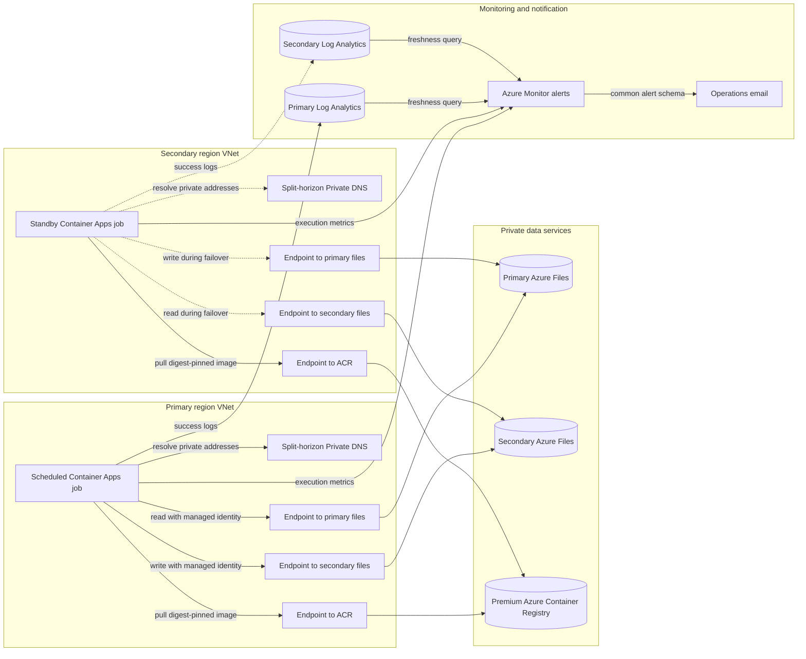

# Azure Files Replication Non-Region Pair

Bicep and Azure CLI deployment for private Azure Files replication between two Azure regions that do not need to be an Azure paired-region set. Two regional Azure Container Apps Jobs run a digest-pinned AzCopy image in active/passive mode.

## Contents

- [Architecture](#architecture) and [design](#design)
- [Deployment profiles](#deployment-profiles), [prerequisites](#prerequisites), and [repository layout](#repository-layout)
- [Greenfield deployment](#greenfield-deployment)
- [Deploy with existing resources](#deploy-with-existing-resources), including how to [customize the parameter file](#customize-the-parameter-file)
- [Verify a deployment](#verify-a-deployment) and test replication end to end
- [RBAC requirements](#rbac-requirements)
- [Replication job settings](#replication-job-settings), [monitoring and alerts](#monitoring-and-alerts), and [switching direction](#switch-direction)
- [Scripts and tests](#scripts-and-tests)
- [Troubleshooting](#troubleshooting)

## Architecture

<!-- mermaid-checked: safe labels, quoted edge labels, closed subgraphs, and unique ids -->


The VNets are intentionally not peered. Each VNet has private endpoints for both file accounts and ACR, with its own split-horizon Private DNS zones. Only one replication direction is scheduled at a time.

The diagram shows a greenfield deployment. The existing-resource profile keeps the same data paths, but it can reuse your storage accounts, VNets, private endpoints, DNS zones, and registry, and it also supports directly peered VNets.

## Design

- No VNet peering or public storage access in a greenfield deployment.
- Both file accounts have a private endpoint in each VNet so either regional job can reach both shares.
- Regional split-horizon Azure Private DNS zones prevent cross-region private endpoint DNS ambiguity.
- Managed identities authenticate to Azure Files; no storage keys or SAS tokens are used.
- The selected primary region synchronizes forward. The secondary region is a manual standby with reverse synchronization preconfigured.
- Azure Monitor sends email for failed executions and when the active direction has no successful replication within the configured threshold.
- A greenfield deployment also provisions a regional blob account and private container in each region for application use. They aren't part of the Azure Files transfer path.

See [docs/infrastructure-plan.md](docs/infrastructure-plan.md) for topology, permission boundaries, and failover controls.

## Deployment profiles

| | Greenfield deployment | Existing-resource profile |
| --- | --- | --- |
| Template | `infra/main.bicep` | `infra/existing.bicep` |
| Parameter file | `infra/main.bicepparam`, copied to the git-ignored `infra/main.local.bicepparam` | The git-ignored `infra/existing.bicepparam`, [generated by the reuse audit](#generate-the-parameter-file) or copied from `infra/existing.example.bicepparam` |
| Creates | The complete topology: VNets, split-horizon private DNS, private endpoints, file and blob storage, a Premium registry with geo-replication, managed identities and RBAC, Log Analytics, Container Apps environments and jobs, and alerts | Managed identities and RBAC, Log Analytics, Container Apps environments and jobs, and alerts, plus each service that you set to `new` |
| Reuses | Nothing | Each storage account and share, VNet and subnet, private endpoint, private DNS zone, and registry that you set to `existing` |
| Resource groups | One workload group and two DNS groups | [One group, one per region, or one per service](#choose-the-resource-groups) |
| Use it to | Deploy the complete solution into a subscription that has none of the services | Add replication to an environment that already has some of the services |

The existing-resource profile is additive. It doesn't redeploy or change the properties of the storage accounts, VNets, private endpoints, private DNS zones, or ACR that it reuses. It adds to them only what you request: a job subnet in `newSubnet` mode, private endpoint connections for the endpoints it creates, DNS records in the zones you name, and role assignments for the job identities.

## Prerequisites

Tools:

- Azure CLI with Bicep. Run `az bicep upgrade` first; the templates use recent Bicep features such as `fail()` and sealed types.
- The Azure CLI `containerapp` extension for the `az containerapp job` commands: `az extension add --name containerapp --upgrade`. Listing freshness alerts with `az monitor scheduled-query` also needs the `scheduled-query` extension.
- PowerShell 7 (`pwsh`) for the scripts and tests. Direct Bicep deployments need only Azure CLI.
- Git to clone the repository. The AzCopy wrapper test also uses `sh` when it's available; Git for Windows includes it.

Sign in to the target tenant and subscription, and confirm the target before you run any command that changes Azure resources:

```powershell
az login --tenant <tenant-id-or-domain>
az account set --subscription <subscription-id-or-name>
az account show --output table
```

Azure requirements:

- Subscription **Owner**, or **Contributor** plus **Role Based Access Control Administrator**. See [RBAC requirements](#rbac-requirements).
- Registered resource providers: `Microsoft.App`, `Microsoft.ContainerRegistry`, `Microsoft.Insights`, `Microsoft.ManagedIdentity`, `Microsoft.Network`, `Microsoft.OperationalInsights`, and `Microsoft.Storage`. The [inventory check](#inventory-check) reports any that aren't registered.
- Container Apps availability in both regions, and quota for Container Apps environments, private endpoints, Premium ACR, and the storage SKUs.
- For each region's job, a dedicated Container Apps infrastructure subnet that is empty, delegated to `Microsoft.App/environments`, and at least `/27`. The templates create workload profiles environments that run the jobs on the serverless Consumption profile, and this environment type requires the delegation. Greenfield deployments and new VNets use a `/23`. With existing resources, you can reuse such a subnet, add one to an existing VNet, or create a VNet.
- A network path that supports server-side copy between the two private storage accounts. See [Network requirements for server-side copy](#network-requirements-for-server-side-copy).

Prefer a local terminal to Azure Cloud Shell for deployments, because Cloud Shell ends sessions after 20 idle minutes. A deployment continues server-side if the session ends.

## Repository layout

| Path | Contents |
| --- | --- |
| `infra/main.bicep`, `infra/main.bicepparam` | Greenfield deployment and its default parameters |
| `infra/existing.bicep`, `infra/existing.example.bicepparam` | Existing-resource profile and an annotated example parameter file |
| `infra/modules/foundation.bicep` | Greenfield network, DNS, endpoints, storage, registry, identities, RBAC, and compute |
| `infra/modules/replication-identity.bicep`, `replication-region.bicep` | Existing-resource profile: one region's job identity, and its Log Analytics workspace, Container Apps environment, and job |
| `infra/modules/new-file-storage.bicep`, `new-network.bicep`, `new-subnet.bicep`, `new-registry.bicep` | Services that the existing-resource profile creates in `new` or `newSubnet` mode |
| `infra/modules/storage-private-endpoint.bicep`, `regional-dns.bicep` | Private endpoints, and split-horizon private DNS zones for a VNet |
| `infra/modules/existing-storage-rbac.bicep`, `existing-acr-rbac.bicep` | Role assignments for the job identities on the storage accounts and registry |
| `infra/modules/monitoring.bicep` | Action group and alert rules for both profiles |
| `scripts/` | [Inventory, reuse audit, deployment, and direction-switch scripts](#scripts-and-tests) |
| `src/azcopy-job/` | AzCopy image: `Dockerfile`, the `run-sync.sh` entrypoint, and its test |
| `tests/` | [Offline tests](#tests) for the templates and scripts |
| `docs/infrastructure-plan.md` | Topology, permission boundaries, replication and monitoring state, and failover controls |

Keep environment-specific values, such as alert addresses, in git-ignored parameter files: `infra/existing.bicepparam` and files that match `infra/*.local.bicepparam`. Git also ignores the `inventory-report*.json` and `audit-report*.json` reports, which contain subscription and tenant IDs.

## Greenfield deployment

A greenfield deployment creates every service in a subscription that has none of them. By default, it deploys to South Central US (primary) and West US (secondary), with resource group metadata in Central US, and it creates the resource groups `rg-azure-files-replication-demo`, `rg-azure-files-replication-demo-primary-dns`, and `rg-azure-files-replication-demo-secondary-dns`.

1. Create a local parameter file that Git ignores, and set `alertEmailAddresses` to a monitored address. Optionally change the regions, the resource group names, and `environmentName`. Choose them before the first deployment: resource names and placement derive from them, so a later deployment with different values creates new resources instead of renaming the existing ones. Don't change `resourceGroupLocation` after the first deployment, because resource group locations are immutable.

   ```powershell
   Copy-Item ./infra/main.bicepparam ./infra/main.local.bicepparam
   ```

2. Run the [inventory check](#inventory-check). Before the first deployment, every template resource is `To be provisioned`. Resolve each `Action required` item, such as an unregistered resource provider, before you continue.

   ```powershell
   pwsh ./scripts/inventory.ps1 -ParametersFile ./infra/main.local.bicepparam
   ```

3. Preview the deployment, review the what-if output, and then deploy. The [deployment script](#deployment-script) validates the template, creates the private foundation with temporary registry public access, builds the AzCopy image in ACR, pins the image by digest, disables registry public access, and activates the primary schedule.

   ```powershell
   pwsh ./scripts/deploy.ps1 -ParametersFile ./infra/main.local.bicepparam -WhatIf
   pwsh ./scripts/deploy.ps1 -ParametersFile ./infra/main.local.bicepparam
   ```

4. Record the deployed state in the local parameter file: set `activeRegion = 'primary'`, `acrPublicNetworkAccess = 'Disabled'`, and `containerImage` to the pinned image that the script prints. Later inventory and what-if runs then reflect the deployed state, and a direct `az deployment sub create` with the file doesn't revert the jobs to the bootstrap image. Pass the same file to `switch-direction.ps1`.

5. [Verify the deployment](#verify-a-deployment), and test replication end to end.

`deploy.ps1` and `switch-direction.ps1` use the template that the parameter file's `using` declaration names, which is also the template that Azure CLI deploys, so you don't need `-TemplateFile`. Deployment changes Azure resources and is intentionally not run automatically from this repository.

To check the template without deploying, compile it, validate it, and preview its changes:

```powershell
az bicep build --file infra/main.bicep
az deployment sub validate --location southcentralus --parameters infra/main.local.bicepparam
az deployment sub what-if --location southcentralus --parameters infra/main.local.bicepparam
```

## Deploy with existing resources

Use the existing-resource profile when some or all of the storage accounts, file shares, VNets, private endpoints, private DNS zones, and container registry already exist. Services that don't exist, or that you prefer to replace, can be [created by the same deployment](#reuse-or-create-each-service). Workloads that use the shares, such as Kubernetes clusters or VMs, aren't changed; the replication jobs run in their own Container Apps environments.

Work through these steps in order:

1. Confirm that your network design supports [server-side copy](#network-requirements-for-server-side-copy).
2. Run the [reuse audit](#reuse-audit) against the resource groups that hold candidate services to see what can be reused.
3. [Customize the parameter file](#customize-the-parameter-file): generate it with the audit or copy the example, and choose `existing` or `new` for each service.
4. Run the [inventory check](#inventory-check) until it reports no `Action required` items, and review the [pre-deployment checklist](#before-you-deploy).
5. [Put the AzCopy image in the registry](#put-the-azcopy-image-in-the-registry), or let `scripts/deploy.ps1` build it.
6. [Deploy in stages](#deploy-in-stages) with `activeRegion = 'none'`.
7. [Validate the jobs before enabling the schedule](#validate-before-enabling-the-schedule), and then activate the primary region.

### Network requirements for server-side copy

AzCopy copies Azure Files data directly between the storage services. With private endpoints, the copy succeeds only when the network that runs each job has private access to both storage accounts in one of these layouts:

| Layout | Requirement |
| --- | --- |
| Local endpoints (used by `infra/main.bicep`) | Each job VNet contains a private endpoint for **both** storage accounts, and DNS in that VNet resolves both account names to those endpoints. |
| Direct peering | Each job runs in the VNet that contains its source account's private endpoint, and the two regional VNets are directly peered. |

Reaching the other region only through a hub VNet or Virtual WAN hub satisfies neither layout, and the copy fails with `403 CannotVerifyCopySource`. Microsoft documents this behavior for [Blob copies between network-restricted accounts](https://learn.microsoft.com/troubleshoot/azure/azure-storage/blobs/connectivity/copy-blobs-between-storage-accounts-network-restriction); Azure Files server-side copies use the same mechanism.

A VNet can link only one private DNS zone with a given name. If workload VNets share a central `privatelink.file.core.windows.net` zone, don't add a second private endpoint for an existing storage account to that zone: its record can redirect other workloads to the wrong endpoint. Use dedicated replication VNets with their own zone links, or use the direct-peering layout.

### Reuse or create each service

Each service has a mode parameter. `existing` is the default, so parameter files written before the modes existed keep working. A new service needs no names or resource groups: the deployment generates the names and creates the service in its region's resource group. To choose either, see [Name new resources](#name-new-resources) and [Choose the resource groups](#choose-the-resource-groups).

| Service | Mode parameters | `existing` | `new` |
| --- | --- | --- | --- |
| Storage | `primaryStorageMode`, `secondaryStorageMode` | Reuses the account and SMB share that you name. | Creates a private storage account and SMB share. Set the SKU with `primaryStorageSkuName` or `secondaryStorageSkuName` (default `Standard_LRS`; Premium SKUs create a FileStorage account) and the quota with `newFileShareQuotaGiB`. |
| Network | `primaryNetworkMode`, `secondaryNetworkMode` | Reuses the VNet and its empty delegated subnet. `newSubnet` adds a delegated job subnet to that VNet at `primaryInfrastructureSubnetPrefix` or `secondaryInfrastructureSubnetPrefix`. | Creates a dedicated VNet at `primaryVnetAddressPrefix` or `secondaryVnetAddressPrefix`, `/22` or larger. It gets a `/23` job subnet, an endpoint subnet, and its own split-horizon private DNS zones in `primaryDnsResourceGroupName` or `secondaryDnsResourceGroupName`. |
| Registry | `registryMode` | Reuses the registry that you name. For a Basic or Standard registry that the jobs reach publicly, set `registryPrivateEndpointsEnabled = false`. | Creates a Premium registry with a replica in the secondary region. `scripts/deploy.ps1` builds the AzCopy image into it, opening public access only during the build. |

The deployment creates a private endpoint in each job VNet for:

- every service it creates;
- every service, when it creates the VNet; and
- each existing service listed in `primaryEndpointsToCreate` or `secondaryEndpointsToCreate`, for a VNet you reuse. Valid values are `primaryStorage`, `secondaryStorage`, and `registry`.

Endpoints between existing resources that aren't listed must already exist. Endpoints created in an existing VNet go in `primaryPrivateEndpointSubnetName` or `secondaryPrivateEndpointSubnetName`, and they register in the zones given by the `*FileDnsZoneId` and `*RegistryDnsZoneId` parameters. Leave a zone ID empty when Azure Policy or another process creates the records.

The registry is the one target that doesn't need a private endpoint. For an existing registry that the jobs reach through its public endpoint, set `registryPrivateEndpointsEnabled = false`: the deployment then creates no registry endpoints, even in a new VNet, and the job subnets need outbound HTTPS access to the registry.

A deployment that is missing a required input fails validation with a message that names the parameters, before any resource changes; see [Parameter file errors](#parameter-file-errors). To remove what the deployment created, delete the resource groups it created; the inventory lists them as `To be created` before the first deployment. Delete resources that it added to groups listed in `existingResourceGroups` individually. A subnet added in `newSubnet` mode stays in its VNet: delete it after the environment, and add it to any other IaC that manages the VNet so that a later deployment doesn't remove it.

Creating services needs rights beyond the [RBAC requirements](#rbac-requirements):

- `Microsoft.Network/virtualNetworks/subnets/join/action` on the subnets that get endpoints or a Container Apps environment.
- `Microsoft.Network/virtualNetworks/subnets/write` on a VNet that gets a subnet.
- Private DNS Zone Contributor on the zones that receive records.
- `privateEndpointConnectionsApproval/action` on each existing storage account and registry that gets a new endpoint, for example through Owner or Contributor on the resource. The template requests automatic approval, so without this right the endpoint fails with `LinkedAuthorizationFailed` instead of waiting for approval.

### Customize the parameter file

The parameter file tells `infra/existing.bicep` which services to reuse, which to create, and where to put what it creates. The steps below cover each group of settings in order, and the [parameter reference](#parameter-reference) lists every parameter.

1. [Create the parameter file](#create-the-parameter-file).
2. [Set the regions and region codes](#set-the-regions-and-region-codes).
3. [Choose the storage accounts](#choose-the-storage-accounts).
4. [Choose the job networks](#choose-the-job-networks).
5. [Connect the jobs to storage and the registry](#connect-the-jobs-to-storage-and-the-registry).
6. [Choose the registry and image](#choose-the-registry-and-image).
7. Optionally [name new resources](#name-new-resources) and [choose the resource groups](#choose-the-resource-groups).
8. [Set the schedule, alerts, and tags](#set-the-schedule-alerts-and-tags).
9. [Validate the parameter file](#validate-the-parameter-file).

The [example parameter files](#example-parameter-files) show complete configurations for common starting points.

#### Create the parameter file

Generate the file from what already exists, or start from the annotated example. Both paths produce `infra/existing.bicepparam`, which Git ignores.

- **Generate it.** The [reuse audit](#generate-the-parameter-file) fills in the services it can reuse, sets `new` for the rest, and writes empty name and resource group lines for each new service. This is the fastest start when services already exist:

  ```powershell
  pwsh ./scripts/audit-existing-resources.ps1 -ResourceGroupName rg-storage, rg-network, rg-dns `
  	-PrimaryLocation eastus2 -SecondaryLocation westus2 -PrimaryRegionCode eus2 -SecondaryRegionCode wus2 `
  	-ReplicationResourceGroupName rg-files-replication -AlertEmailAddress ops@example.com `
  	-ParametersOutputPath ./infra/existing.bicepparam
  ```

- **Copy the example.** `infra/existing.example.bicepparam` shows every setting with comments, and its placeholders are in angle brackets:

  ```powershell
  Copy-Item ./infra/existing.example.bicepparam ./infra/existing.bicepparam
  ```

Either way, keep these rules in mind:

- The first line, `using './existing.bicep'`, is the template's path relative to the parameter file. Update it if you keep the file in another folder.
- A parameter that you don't set uses its default. The defaults reuse every service and place everything that the deployment creates in `resourceGroupName`.
- Values in angle brackets, such as `'<primary-vnet>'`, are placeholders. The inventory reports them as `Action required` and skips resource lookups and what-if until you replace them. Lines that start with `//` are comments.
- Any file name works. Keep files with real values in `infra/existing.bicepparam` or `infra/*.local.bicepparam` so that Git ignores them, and pass the file to the scripts with `-ParametersFile`.

#### Set the regions and region codes

| Parameter | What to set |
| --- | --- |
| `primaryLocation` | The region of the replication source: the primary storage account and the primary job. |
| `secondaryLocation` | The region of the replication destination and the standby job. The regions don't need to be an Azure region pair. |
| `primaryRegionCode`, `secondaryRegionCode` | Short, different codes of 2 to 8 characters used in generated names, such as `eus2` and `wus2`. |
| `resourceGroupName` | The resource group for primary-region compute and monitoring. It's also the default for anything that the deployment creates, as described in [Choose the resource groups](#choose-the-resource-groups). |
| `resourceGroupLocation` | The metadata region of `resourceGroupName` when the deployment creates it. Usually the primary region. |
| `environmentName` | A short label, such as `prod`, that's part of generated names and the `Environment` tag. |

Reused VNets must be in the region of their role, and reused storage accounts should be. The inventory reports a VNet in another region as `Action required`, because the job environment and its endpoints must be in the VNet's region, and it reports a storage account in another region as a warning.

> [!IMPORTANT]
> Choose the region codes, `environmentName`, and the resource group names before the first deployment. Generated names are derived from them, so changing one later creates a second set of resources instead of renaming the first, and `scripts/switch-direction.ps1` then finds more than two jobs.

#### Choose the storage accounts

The primary share is the replication source, and the secondary share is the destination. For each one, reuse an existing account and share, or create them.

To reuse an existing share, name the account, its resource group, and the share. The mode defaults to `existing`:

```bicep
param primaryStorageMode = 'existing'
param primaryStorageAccountName = 'stfilesprimary01'
param primaryStorageResourceGroupName = 'rg-storage-eus2'
param primaryFileShareName = 'data'
```

A reused account and share must meet these requirements:

- The account is a classic `Microsoft.Storage` account of kind `StorageV2`, `FileStorage`, or general-purpose v1 (`Storage`), in the deployment subscription. `Microsoft.FileShares` resources aren't supported.
- The share uses SMB. NFS shares aren't supported.
- Both job VNets can reach the account through one of the [server-side copy layouts](#network-requirements-for-server-side-copy). You can keep public network access and shared key access disabled, because the jobs use their managed identities over private endpoints.
- The destination share is empty or disposable, and its quota covers the source data plus growth. Replication copies into it and never deletes extra files.

The deployment changes a reused account only by assigning **Storage File Data Privileged Contributor** to both job identities and by adding the private endpoint connections that it creates.

To create the account instead, set the mode to `new`. Every other setting is optional:

```bicep
param secondaryStorageMode = 'new'
param secondaryStorageAccountName = 'stfilesdr01'      // Empty generates stfile<token>.
param secondaryStorageResourceGroupName = ''           // Empty uses the secondary region's group.
param secondaryFileShareName = 'data'                  // Empty uses replication.
param secondaryStorageSkuName = 'Standard_ZRS'         // Premium_LRS or Premium_ZRS creates a FileStorage account.
param newFileShareQuotaGiB = 2048                      // Applies to every share that the deployment creates.
```

A new account denies public network access and shared key access, requires TLS 1.2, keeps deleted shares for 14 days, and allows SMB 3.0 and 3.1.1. The deployment creates its file endpoint in both job VNets. When a job VNet already exists, that endpoint needs the VNet's endpoint subnet and DNS zone, as described in [Connect the jobs to storage and the registry](#connect-the-jobs-to-storage-and-the-registry).

#### Choose the job networks

Each region's job runs in a Container Apps environment in a VNet of that region. Choose one of three network modes for each region.

To reuse a VNet and an existing job subnet, use `existing` mode:

```bicep
param primaryNetworkMode = 'existing'
param primaryVnetName = 'vnet-apps-eus2'
param primaryVnetResourceGroupName = 'rg-network-eus2'
param primaryInfrastructureSubnetName = 'snet-replication-jobs'
```

The subnet must be empty and dedicated to this environment, at least `/27`, and delegated to `Microsoft.App/environments`. Subnet sizes can't change after an environment uses the subnet.

To add a job subnet to an existing VNet, use `newSubnet` mode and give a free prefix inside the VNet's address space. The subnet name is optional and defaults to `snet-replication-jobs`:

```bicep
param primaryNetworkMode = 'newSubnet'
param primaryVnetName = 'vnet-apps-eus2'
param primaryVnetResourceGroupName = 'rg-network-eus2'
param primaryInfrastructureSubnetPrefix = '10.1.8.0/23'
```

The deployment adds the delegated subnet to your VNet, which needs `Microsoft.Network/virtualNetworks/subnets/write` on the VNet. Add the subnet to any other IaC that manages the VNet, so that a later deployment of that IaC doesn't try to remove it.

To create a dedicated VNet, use `new` mode. Every other setting is optional:

```bicep
param secondaryNetworkMode = 'new'
param secondaryVnetName = ''                                    // Empty uses vnet-replication-<region-code>.
param secondaryVnetAddressPrefix = '10.61.0.0/22'               // /22 or larger.
param secondaryDnsResourceGroupName = 'rg-files-dns-wus2'       // Its own split-horizon DNS zones.
```

The first `/23` of the address space becomes the delegated job subnet, and the third `/24` becomes the endpoint subnet. The new VNet isn't peered, and it gets its own `privatelink.file`, `privatelink.blob`, and `privatelink.azurecr.io` zones, so the records that the deployment adds can't redirect other workloads. It also gets private endpoints for both storage accounts and, unless `registryPrivateEndpointsEnabled` is `false`, the registry. Choose an address space that doesn't overlap networks you might connect later; the audit picks non-overlapping ranges, and the inventory warns about overlaps.

For any mode, the job subnet's network security groups, route tables, and firewalls must allow outbound HTTPS to the endpoints of both storage accounts and the registry. When the subnet's traffic goes through a firewall, also allow the [Container Apps outbound dependencies](https://learn.microsoft.com/azure/container-apps/use-azure-firewall). If a VNet uses custom DNS servers, they must resolve the `privatelink` records, for example by forwarding to Azure DNS. The inventory can't verify custom DNS; [check name resolution from inside the job](#collect-diagnostics).

#### Connect the jobs to storage and the registry

Each job VNet needs private access to both storage accounts, and access to the registry: through a private endpoint, or through the registry's public endpoint when the registry allows public network access and `registryPrivateEndpointsEnabled = false`. Decide for each VNet and each target that it reaches privately:

1. **The VNet or the target is new.** The deployment creates the endpoint. For the registry, this also requires `registryPrivateEndpointsEnabled = true`, the default.
2. **An approved endpoint already exists.** Reuse it. For the destination account, an endpoint in a directly peered VNet also works. Optionally list the endpoint's resource ID in `existingPrivateEndpointIds`, which the template records in its outputs for reference only.
3. **Otherwise,** add the target to that VNet's `primaryEndpointsToCreate` or `secondaryEndpointsToCreate` list: `primaryStorage`, `secondaryStorage`, or `registry`.

When the deployment creates any endpoint in an **existing** VNet, set these parameters for that VNet:

- `primaryPrivateEndpointSubnetName` or `secondaryPrivateEndpointSubnetName`: an existing subnet for the endpoints. It must not be delegated.
- `primaryFileDnsZoneId` and `primaryRegistryDnsZoneId`, or the `secondary` equivalents: the resource IDs of the `privatelink.file` and `privatelink.azurecr.io` zones that are linked to the VNet. The deployment adds each endpoint's records to them. The zones can be in another subscription. Leave an ID empty when Azure Policy or another process creates the records.
- Optionally `primaryEndpointResourceGroupName` or `secondaryEndpointResourceGroupName`, for the endpoint resources. The default is `resourceGroupName` for the primary VNet and `secondaryResourceGroupName` for the secondary VNet.

For example, when each existing VNet already has an endpoint for its local account and the registry, create the endpoint for the other region's account:

```bicep
param primaryEndpointsToCreate = ['secondaryStorage']
param primaryPrivateEndpointSubnetName = 'snet-private-endpoints'
param primaryFileDnsZoneId = '/subscriptions/<subscription-id>/resourceGroups/rg-dns-eus2/providers/Microsoft.Network/privateDnsZones/privatelink.file.core.windows.net'

param secondaryEndpointsToCreate = ['primaryStorage']
param secondaryPrivateEndpointSubnetName = 'snet-private-endpoints'
param secondaryFileDnsZoneId = '/subscriptions/<subscription-id>/resourceGroups/rg-dns-wus2/providers/Microsoft.Network/privateDnsZones/privatelink.file.core.windows.net'
```

The audit's **Replication network readiness** table shows which endpoints each VNet already has and whether the linked zone resolves them. You can also look them up directly:

```bash
az network private-endpoint list --query "[].{name:name, subnet:subnet.id, target:privateLinkServiceConnections[0].privateLinkServiceId}" --output table
az network private-dns zone list --query "[?name=='privatelink.file.core.windows.net'].id" --output tsv
az network private-dns link vnet list --resource-group <dns-resource-group> --zone-name privatelink.file.core.windows.net --query "[].virtualNetwork.id" --output tsv
```

The DNS in each job VNet must resolve both account names to endpoints that the VNet can reach. When several VNets share one `privatelink.file` zone, a new endpoint for an existing account adds a record that every linked VNet uses, which can send other workloads to an endpoint they can't reach. In that case, use a new VNet with its own zones, or the direct-peering layout.

#### Choose the registry and image

The jobs pull the AzCopy image from a registry by digest. Reuse a registry, or create one.

To reuse a registry, name it and its resource group:

```bicep
param registryMode = 'existing'
param registryName = 'acrsharedservices01'
param registryResourceGroupName = 'rg-shared-services'
```

A reused registry must be in the deployment subscription and reachable from both job subnets:

- A Premium registry reached through private endpoints in both job VNets or a directly peered VNet. Missing endpoints can be created with `primaryEndpointsToCreate` or `secondaryEndpointsToCreate`.
- Or a registry of any SKU that allows public network access. For Basic and Standard, which don't support private endpoints, set `registryPrivateEndpointsEnabled = false`, and allow the job subnets outbound HTTPS to the registry.

The deployment assigns **AcrPull** to both job identities. A registry that uses ABAC repository permissions ignores AcrPull; assign **Container Registry Repository Reader** to both identities after the first deployment instead. For failover, replicate the registry to the secondary region, so that the standby job can pull its image when the primary region is unavailable.

To create a registry, set the mode to `new`. The name is optional; an empty name generates `acr<token>`:

```bicep
param registryMode = 'new'
param registryName = 'acrfilesreplication01'
```

A new registry is Premium, with dedicated data endpoints, a replica in the secondary region, and no admin user. Its public network access is set by `acrPublicNetworkAccess`, which defaults to `Disabled`; `scripts/deploy.ps1` enables it only while it builds the image. The deployment creates the registry's endpoints in both job VNets, so `registryPrivateEndpointsEnabled` must stay `true`.

The `containerImage` parameter is the digest-pinned image that both jobs run, such as `acrsharedservices01.azurecr.io/azure-files-dr-azcopy@sha256:<digest>`. `scripts/deploy.ps1` builds the image and sets this parameter for you. For a direct Bicep deployment, first [put the image in the registry](#put-the-azcopy-image-in-the-registry) and set the parameter.

#### Name new resources

The deployment generates a name for each resource that it creates, unless you set one in the parameters below. The rest have fixed or derived names: private DNS zones use the names that Private Link requires, and the template names virtual network links, role assignments, and child resources such as file services and registry replicas. Resource groups take their names from the [resource group parameters](#choose-the-resource-groups).

For a service in `new` mode, its name parameters name the new resource:

| Service | Name parameters | Generated names |
| --- | --- | --- |
| Storage | `primaryStorageAccountName` and `primaryFileShareName`, and the `secondary` equivalents | `stfile<token>` and `replication` |
| Network | `primaryVnetName`, `primaryInfrastructureSubnetName`, and `primaryPrivateEndpointSubnetName`, and the `secondary` equivalents | `vnet-replication-<region-code>` with subnets `jobs` and `endpoints`. A subnet added in `newSubnet` mode is named `snet-replication-jobs`. |
| Registry | `registryName` | `acr<token>` |

Name the other resources in the optional `resourceNames` object. Omitted keys keep their generated names, and an unknown key fails compilation:

| Keys | Resources | Generated names |
| --- | --- | --- |
| `primaryIdentity`, `secondaryIdentity` | Job managed identities | `id-replication-<region-code>-<token>` |
| `primaryLogWorkspace`, `secondaryLogWorkspace` | Log Analytics workspaces | `log-replication-<region-code>-<token>` |
| `primaryEnvironment`, `secondaryEnvironment` | Container Apps environments | `cae-replication-<region-code>-<token>` |
| `primaryJob`, `secondaryJob` | Container Apps jobs | `job-sync-<region-code>-<token>` |
| `primaryVnetPrimaryStorageEndpoint`, `primaryVnetSecondaryStorageEndpoint`, `primaryVnetRegistryEndpoint`, and the `secondaryVnet` equivalents | Private endpoints that the deployment creates in each job VNet | `pe-<region-code>-primary-file`, `pe-<region-code>-secondary-file`, and `pe-<region-code>-registry`, with the code of the VNet's region |
| `actionGroup` | Azure Monitor action group | `ag-replication-<token>` |
| `primaryFailureAlert`, `secondaryFailureAlert` | Failed-execution metric alerts | `alert-replication-failed-primary-<token>` and `alert-replication-failed-secondary-<token>` |
| `primaryFreshnessAlert`, `secondaryFreshnessAlert` | Freshness log search alerts | `alert-replication-stale-primary-<token>` and `alert-replication-stale-secondary-<token>` |

`<token>` is a 13-character hash of the subscription, the resource group, `environmentName`, and, for regional resources, the region. It doesn't change between deployments.

```bicep
param resourceNames = {
  primaryJob: 'job-files-eus2'
  secondaryJob: 'job-files-wus2'
  actionGroup: 'ag-files-replication'
}
```

Custom names must follow the naming rules of their resource types. The inventory checks each custom name against these rules. Storage account and registry names must also be globally unique, so the inventory checks that the names you set for a new account or registry are still available. It doesn't check generated names, which are derived from a hash and rarely collide:

| Resource | Naming rule |
| --- | --- |
| Storage account | 3 to 24 lowercase letters and digits |
| File share | 3 to 63 lowercase letters, digits, and single hyphens, starting and ending with a letter or digit |
| Registry | 5 to 50 letters and digits |
| VNet, subnet, and private endpoint | Up to 64 letters, digits, periods, hyphens, and underscores, starting with a letter or digit and ending with a letter, digit, or underscore |
| Container Apps job | 2 to 32 lowercase letters, digits, and single hyphens, starting with a letter and ending with a letter or digit |
| Container Apps environment | 2 to 60 lowercase letters, digits, and single hyphens, starting with a letter and ending with a letter or digit |
| Managed identity | 3 to 128 letters, digits, hyphens, and underscores, starting with a letter or digit |
| Log Analytics workspace | 4 to 63 letters, digits, and hyphens, starting and ending with a letter or digit |
| Action group and alert rules | Up to 260 characters, without `* # & + : < > ? @ % { } \ /`, and not ending with a period or space |

Set names before the first deployment. A later name change creates another resource and leaves the old one in place, and `scripts/switch-direction.ps1` refuses to run while more than two replication jobs exist.

#### Choose the resource groups

By default, everything that the deployment creates goes in `resourceGroupName`, except the private DNS zones of new VNets. Choose one of these layouts:

| Layout | Parameters |
| --- | --- |
| Single resource group | `resourceGroupName` only. When both VNets are new, their two sets of DNS zones need two different groups. By default, each set gets a group of its own; to keep one set in `resourceGroupName`, set `primaryDnsResourceGroupName` or `secondaryDnsResourceGroupName` to it. |
| One resource group per region | Also set `secondaryResourceGroupName` and `secondaryResourceGroupLocation`. Secondary-region compute and new secondary-region services go there. |
| Per service | Also set the resource group parameter of each new service, such as `primaryStorageResourceGroupName`, `secondaryVnetResourceGroupName`, or `registryResourceGroupName`. Set `primaryEndpointResourceGroupName` or `secondaryEndpointResourceGroupName` for the private endpoints that the deployment creates in each job VNet. |

The deployment places resources as follows:

- Primary-region compute (the identity, Log Analytics workspace, Container Apps environment, and job) goes in `resourceGroupName`, together with the action group and all alert rules. Secondary-region compute goes in `secondaryResourceGroupName`, which defaults to `resourceGroupName`.
- A new service goes in its resource group parameter when you set it, and otherwise in its region's group. The registry belongs to the primary region.
- Private endpoints that the deployment creates go in the endpoint resource group parameter when you set it. Otherwise, they go in the group of a new VNet, or in the region's group for an existing VNet.
- A new VNet's split-horizon DNS zones go in `primaryDnsResourceGroupName` or `secondaryDnsResourceGroupName`, which default to `<region-group>-<region-code>-dns`. A resource group can hold only one zone with a given name, so the two DNS resource groups must differ when both VNets are new. Use groups without other `privatelink` zones: the deployment takes over zones with the same names and links them to the new VNet, which changes name resolution for every VNet already linked to them.
- Reused services, and subnets added in `newSubnet` mode, stay in their existing resource groups.

The deployment creates each resource group that it places resources in, with the template's tags, except the groups listed in `existingResourceGroups`. List every target group that already exists: the deployment adds resources to a listed group without changing the group, but it replaces the tags of an existing group that isn't listed, and it fails with `InvalidResourceGroupLocation` when that group is in another region. The inventory reports an unlisted existing group as a warning, and a listed group that doesn't exist as `Action required`. One resource group per region, or per service, lets you grant access to, manage, or remove each part separately.

#### Set the schedule, alerts, and tags

| Parameter | What to set |
| --- | --- |
| `activeRegion` | Keep `none` for the first deployment, so that both jobs are created without a schedule. After [validation](#validate-before-enabling-the-schedule), set `primary`. `scripts/switch-direction.ps1` changes it during failover. |
| `scheduleCronExpression` | How often the active job runs. The default, `*/10 * * * *`, runs every 10 minutes. Cron expressions are evaluated in UTC. |
| `alertEmailAddresses` | One or more monitored operations addresses. The deployment creates an Azure Monitor action group with Common Alert Schema for every receiver. |
| `replicationLagThresholdMinutes` | `20`, `30` (the default), or `60` minutes without a successful active-direction replication before the freshness alert fires. |
| `monitoringEnabled` | `true` creates and enables the alert rules. |
| `tags` | Tags for the resources and resource groups that the deployment creates. Keep the default tags, or include `Workload: 'azure-files-dr-replication'`: `scripts/switch-direction.ps1` finds the jobs by that tag, and the inventory uses it to recognize resource groups and DNS zones from earlier deployments. |

#### Validate the parameter file

Check the file before every deployment, and again after each change:

1. Compile it. Errors name the line and a Bicep diagnostic code; see [Parameter file errors](#parameter-file-errors).

   ```powershell
   az bicep build-params --file ./infra/existing.bicepparam --stdout
   ```

2. Run the inventory with a JSON report, and resolve every `Action required` item. Review each warning, and rerun until the summary shows `0 action required`.

   ```powershell
   pwsh ./scripts/inventory.ps1 -ParametersFile ./infra/existing.bicepparam -OutputPath ./inventory-report.json
   ```

3. Review the property-level changes. The inventory's what-if lists resources only, so run the full what-if for the details:

   ```powershell
   az deployment sub what-if --location <primary-region> --parameters ./infra/existing.bicepparam
   ```

The file is ready when it has no placeholders, both job copy paths and registry paths are `Ready`, every resource group is `Ready` or `To be created`, and the what-if creates only what you expect and changes nothing that you reuse.

#### Example parameter files

Each example is a complete file for `infra/existing.bicepparam`. Replace the names, regions, and placeholders with yours, then [validate the file](#validate-the-parameter-file). `tests/test-existing-profile.ps1` compiles these examples, so they stay in sync with the template.

**Reuse every service.** Both storage accounts already have approved file endpoints in both VNets, each VNet's `privatelink.file` zone resolves them, both VNets have an empty delegated job subnet, and the Premium registry has endpoints in both VNets. The modes default to `existing`, so the file doesn't set them.

```bicep
using './existing.bicep'

param resourceGroupName = 'rg-files-replication'
param resourceGroupLocation = 'eastus2'
param primaryLocation = 'eastus2'
param secondaryLocation = 'westus2'
param primaryRegionCode = 'eus2'
param secondaryRegionCode = 'wus2'
// The replication resource group already exists, so the deployment leaves it unchanged.
param existingResourceGroups = ['rg-files-replication']

param primaryStorageAccountName = 'stfilesprimary01'
param primaryStorageResourceGroupName = 'rg-storage-eus2'
param primaryFileShareName = 'data'
param secondaryStorageAccountName = 'stfilesdr01'
param secondaryStorageResourceGroupName = 'rg-storage-wus2'
param secondaryFileShareName = 'data'

param primaryVnetName = 'vnet-apps-eus2'
param primaryVnetResourceGroupName = 'rg-network-eus2'
param primaryInfrastructureSubnetName = 'snet-replication-jobs'
param secondaryVnetName = 'vnet-apps-wus2'
param secondaryVnetResourceGroupName = 'rg-network-wus2'
param secondaryInfrastructureSubnetName = 'snet-replication-jobs'

param registryName = 'acrsharedservices01'
param registryResourceGroupName = 'rg-shared-services'

param alertEmailAddresses = ['storage-operations@example.com']
```

**Reuse the storage accounts and VNets, add what's missing, and create the registry.** Each VNet has a free address range but no job subnet, and an endpoint for its local account only. Each region has its own `privatelink` zones.

```bicep
using './existing.bicep'

param resourceGroupName = 'rg-files-replication'
param resourceGroupLocation = 'eastus2'
param primaryLocation = 'eastus2'
param secondaryLocation = 'westus2'
param primaryRegionCode = 'eus2'
param secondaryRegionCode = 'wus2'

param primaryStorageAccountName = 'stfilesprimary01'
param primaryStorageResourceGroupName = 'rg-storage-eus2'
param primaryFileShareName = 'data'
param secondaryStorageAccountName = 'stfilesdr01'
param secondaryStorageResourceGroupName = 'rg-storage-wus2'
param secondaryFileShareName = 'data'

// Add a delegated job subnet to each existing VNet.
param primaryNetworkMode = 'newSubnet'
param primaryVnetName = 'vnet-apps-eus2'
param primaryVnetResourceGroupName = 'rg-network-eus2'
param primaryInfrastructureSubnetPrefix = '10.1.8.0/23'
param secondaryNetworkMode = 'newSubnet'
param secondaryVnetName = 'vnet-apps-wus2'
param secondaryVnetResourceGroupName = 'rg-network-wus2'
param secondaryInfrastructureSubnetPrefix = '10.2.8.0/23'

// Create an endpoint for the other region's account. The new registry gets endpoints in both VNets automatically.
param primaryEndpointsToCreate = ['secondaryStorage']
param primaryPrivateEndpointSubnetName = 'snet-private-endpoints'
param primaryFileDnsZoneId = '/subscriptions/<subscription-id>/resourceGroups/rg-dns-eus2/providers/Microsoft.Network/privateDnsZones/privatelink.file.core.windows.net'
param primaryRegistryDnsZoneId = '/subscriptions/<subscription-id>/resourceGroups/rg-dns-eus2/providers/Microsoft.Network/privateDnsZones/privatelink.azurecr.io'
param secondaryEndpointsToCreate = ['primaryStorage']
param secondaryPrivateEndpointSubnetName = 'snet-private-endpoints'
param secondaryFileDnsZoneId = '/subscriptions/<subscription-id>/resourceGroups/rg-dns-wus2/providers/Microsoft.Network/privateDnsZones/privatelink.file.core.windows.net'
param secondaryRegistryDnsZoneId = '/subscriptions/<subscription-id>/resourceGroups/rg-dns-wus2/providers/Microsoft.Network/privateDnsZones/privatelink.azurecr.io'

param registryMode = 'new'
param registryName = 'acrfilesreplication01'

param alertEmailAddresses = ['storage-operations@example.com']
```

**Reuse only the source share, and use one resource group per region.** The deployment creates the destination account, a dedicated VNet in each region, and the registry. Both new VNets get an endpoint for the existing source account, so the deploying identity needs approval rights on that account.

```bicep
using './existing.bicep'

param resourceGroupName = 'rg-files-replication-eus2'
param resourceGroupLocation = 'eastus2'
param secondaryResourceGroupName = 'rg-files-replication-wus2'
param secondaryResourceGroupLocation = 'westus2'
param primaryLocation = 'eastus2'
param secondaryLocation = 'westus2'
param primaryRegionCode = 'eus2'
param secondaryRegionCode = 'wus2'

param primaryStorageAccountName = 'stfilesprimary01'
param primaryStorageResourceGroupName = 'rg-storage-eus2'
param primaryFileShareName = 'data'

// Created in rg-files-replication-wus2 with a generated account name.
param secondaryStorageMode = 'new'
param secondaryFileShareName = 'data'
param secondaryStorageSkuName = 'Standard_ZRS'

param primaryNetworkMode = 'new'
param primaryVnetAddressPrefix = '10.60.0.0/22'
param primaryDnsResourceGroupName = 'rg-files-replication-dns-eus2'
param secondaryNetworkMode = 'new'
param secondaryVnetAddressPrefix = '10.61.0.0/22'
param secondaryDnsResourceGroupName = 'rg-files-replication-dns-wus2'

param registryMode = 'new'

param alertEmailAddresses = ['storage-operations@example.com']
```

**Use a resource group per service, and name each resource that the deployment creates.** The platform team created the primary compute group. The deployment creates the destination account in its own group, adds its endpoint to the existing primary VNet in a separate endpoint group, and creates a secondary VNet with its own network and DNS groups. The new VNet gets endpoints for the existing source account and registry, so the deploying identity needs approval rights on both.

```bicep
using './existing.bicep'

param resourceGroupName = 'rg-files-compute-eus2'
param resourceGroupLocation = 'eastus2'
param secondaryResourceGroupName = 'rg-files-compute-wus2'
param secondaryResourceGroupLocation = 'westus2'
param primaryLocation = 'eastus2'
param secondaryLocation = 'westus2'
param primaryRegionCode = 'eus2'
param secondaryRegionCode = 'wus2'
param existingResourceGroups = ['rg-files-compute-eus2']

param primaryStorageAccountName = 'stfilesprimary01'
param primaryStorageResourceGroupName = 'rg-storage-eus2'
param primaryFileShareName = 'data'

param secondaryStorageMode = 'new'
param secondaryStorageAccountName = 'stfilesdrwus201'
param secondaryStorageResourceGroupName = 'rg-files-storage-wus2'
param secondaryFileShareName = 'data'

// The existing primary VNet already has endpoints for the source account and the registry.
param primaryVnetName = 'vnet-apps-eus2'
param primaryVnetResourceGroupName = 'rg-network-eus2'
param primaryInfrastructureSubnetName = 'snet-replication-jobs'
param primaryPrivateEndpointSubnetName = 'snet-private-endpoints'
param primaryEndpointResourceGroupName = 'rg-files-endpoints-eus2'
param primaryFileDnsZoneId = '/subscriptions/<subscription-id>/resourceGroups/rg-dns-eus2/providers/Microsoft.Network/privateDnsZones/privatelink.file.core.windows.net'

param secondaryNetworkMode = 'new'
param secondaryVnetName = 'vnet-files-replication-wus2'
param secondaryVnetResourceGroupName = 'rg-files-network-wus2'
param secondaryVnetAddressPrefix = '10.61.0.0/22'
param secondaryInfrastructureSubnetName = 'snet-files-jobs'
param secondaryPrivateEndpointSubnetName = 'snet-files-endpoints'
param secondaryDnsResourceGroupName = 'rg-files-dns-wus2'

param registryName = 'acrsharedservices01'
param registryResourceGroupName = 'rg-shared-services'

// The primary VNet reuses its endpoints for the source account and the registry, so only its new endpoint needs a name.
param resourceNames = {
  primaryIdentity: 'id-files-replication-eus2'
  secondaryIdentity: 'id-files-replication-wus2'
  primaryLogWorkspace: 'log-files-replication-eus2'
  secondaryLogWorkspace: 'log-files-replication-wus2'
  primaryEnvironment: 'cae-files-replication-eus2'
  secondaryEnvironment: 'cae-files-replication-wus2'
  primaryJob: 'job-files-sync-eus2'
  secondaryJob: 'job-files-sync-wus2'
  primaryVnetSecondaryStorageEndpoint: 'pe-eus2-stfilesdrwus201'
  secondaryVnetPrimaryStorageEndpoint: 'pe-wus2-stfilesprimary01'
  secondaryVnetSecondaryStorageEndpoint: 'pe-wus2-stfilesdrwus201'
  secondaryVnetRegistryEndpoint: 'pe-wus2-acrsharedservices01'
  actionGroup: 'ag-files-replication'
  primaryFailureAlert: 'alert-files-replication-failed-eus2'
  secondaryFailureAlert: 'alert-files-replication-failed-wus2'
  primaryFreshnessAlert: 'alert-files-replication-stale-eus2'
  secondaryFreshnessAlert: 'alert-files-replication-stale-wus2'
}

param alertEmailAddresses = ['storage-operations@example.com']
```

#### Parameter reference

Every parameter of `infra/existing.bicep`. Parameters marked **required** have no default. `<token>` in generated names is described in [Name new resources](#name-new-resources).

**Regions and resource groups**

| Parameter | Default | Description |
| --- | --- | --- |
| `resourceGroupName` | **Required** | Resource group for primary-region compute, the action group, and all alert rules. The default group for new primary-region services. |
| `resourceGroupLocation` | **Required** | Metadata region of `resourceGroupName` when the deployment creates it. |
| `secondaryResourceGroupName` | `resourceGroupName` | Resource group for secondary-region compute. The default group for new secondary-region services. |
| `secondaryResourceGroupLocation` | `secondaryLocation` | Metadata region of `secondaryResourceGroupName` when the deployment creates it. |
| `existingResourceGroups` | `[]` | Target resource groups that already exist. The deployment doesn't create or change them. |
| `primaryLocation`, `secondaryLocation` | **Required** | Regions of the replication source and destination. |
| `primaryRegionCode`, `secondaryRegionCode` | **Required** | Different codes of 2 to 8 characters used in generated names. |
| `environmentName` | `prod` | Part of generated names and the `Environment` tag. |
| `tags` | `Environment`, `Workload: 'azure-files-dr-replication'`, and `ManagedBy: 'Bicep'` | Tags for the resources and resource groups that the deployment creates. Keep the `Workload` tag. |

**Storage**, for each of the `primary` and `secondary` roles

| Parameter | Default | `existing` mode | `new` mode |
| --- | --- | --- | --- |
| `primaryStorageMode` | `existing` | Reuses an account and share | Creates a private account and SMB share |
| `primaryStorageAccountName` | `''` | **Required:** the account to reuse | Optional name; `stfile<token>` when empty |
| `primaryStorageResourceGroupName` | `''` | **Required:** the account's resource group | Optional; the region's group when empty |
| `primaryFileShareName` | `''` | **Required:** the SMB share | Optional; `replication` when empty |
| `primaryStorageSkuName` | `Standard_LRS` | Not used | `Standard_LRS`, `Standard_ZRS`, `Standard_GRS`, `Standard_GZRS`, `Premium_LRS`, or `Premium_ZRS`. Premium SKUs create a FileStorage account. |
| `newFileShareQuotaGiB` | `1024` | Not used | Quota of each share that the deployment creates: 100 to 102,400 GiB. Shared by both roles. |

**Networks**, for each of the `primary` and `secondary` roles

| Parameter | Default | `existing` mode | `newSubnet` mode | `new` mode |
| --- | --- | --- | --- | --- |
| `primaryNetworkMode` | `existing` | Reuses a VNet and job subnet | Adds a job subnet to a VNet | Creates a VNet |
| `primaryVnetName` | `''` | **Required** | **Required** | Optional; `vnet-replication-<region-code>` when empty |
| `primaryVnetResourceGroupName` | `''` | **Required** | **Required** | Optional; the region's group when empty |
| `primaryInfrastructureSubnetName` | `''` | **Required:** an empty delegated subnet, `/27` or larger | Optional; `snet-replication-jobs` when empty | Optional; `jobs` when empty |
| `primaryInfrastructureSubnetPrefix` | `''` | Not used | **Required:** a free range inside the VNet, `/27` or larger | Not used |
| `primaryVnetAddressPrefix` | `10.10.0.0/16` for primary, `10.20.0.0/16` for secondary | Not used | Not used | `/22` or larger |
| `primaryDnsResourceGroupName` | `<resourceGroupName>-<primaryRegionCode>-dns` for primary, `<secondaryResourceGroupName>-<secondaryRegionCode>-dns` for secondary | Not used | Not used | Resource group for the VNet's private DNS zones |

**Private endpoints and DNS**, for each of the `primary` and `secondary` job VNets

| Parameter | Default | Description |
| --- | --- | --- |
| `primaryEndpointsToCreate` | `[]` | For an existing VNet: existing services that need an endpoint there. Values: `primaryStorage`, `secondaryStorage`, and `registry`. New services and new VNets get their endpoints automatically. |
| `primaryPrivateEndpointSubnetName` | `''` | For an existing VNet: **required** when the deployment creates any endpoint there; a subnet that isn't delegated. For a new VNet: optional name of its endpoint subnet, `endpoints` when empty. |
| `primaryEndpointResourceGroupName` | `''` | Resource group for the endpoints that the deployment creates in the VNet. The default is the group of a new VNet, or the region's group for an existing VNet. |
| `primaryFileDnsZoneId` | `''` | For an existing VNet: resource ID of the `privatelink.file` zone that receives the records of new file endpoints. Empty when Azure Policy or another process creates the records. |
| `primaryRegistryDnsZoneId` | `''` | For an existing VNet: resource ID of the `privatelink.azurecr.io` zone that receives the records of a new registry endpoint. |
| `existingPrivateEndpointIds` | `[]` | Reference only: resource IDs of existing endpoints that the layout uses. Recorded in the deployment outputs; not validated. Shared by both VNets. |

**Registry and image**

| Parameter | Default | Description |
| --- | --- | --- |
| `registryMode` | `existing` | `existing` reuses a registry; `new` creates a Premium registry with a replica in `secondaryLocation`. |
| `registryName` | `''` | `existing`: **required**. `new`: optional; `acr<token>` when empty. |
| `registryResourceGroupName` | `''` | `existing`: **required**. `new`: optional; `resourceGroupName` when empty. |
| `registryPrivateEndpointsEnabled` | `true` | Creates registry endpoints where the job VNets need them. Set `false` for a Basic or Standard registry that the jobs reach publicly. Must be `true` for a new registry. |
| `acrPublicNetworkAccess` | `Disabled` | Public network access of a new registry. `scripts/deploy.ps1` enables it only while it builds the image. |
| `containerImage` | A placeholder image | The digest-pinned AzCopy image that both jobs run. `scripts/deploy.ps1` and `scripts/switch-direction.ps1` set it. |

**Names, schedule, and monitoring**

| Parameter | Default | Description |
| --- | --- | --- |
| `resourceNames` | `{}` | Optional names for identities, workspaces, environments, jobs, endpoints, and monitoring resources; see [Name new resources](#name-new-resources). |
| `activeRegion` | `none` | The only region with a scheduled job: `none`, `primary`, or `secondary`. |
| `scheduleCronExpression` | `*/10 * * * *` | Schedule of the active job, evaluated in UTC. |
| `alertEmailAddresses` | **Required** | One or more email addresses for Azure Monitor alerts. |
| `replicationLagThresholdMinutes` | `30` | `20`, `30`, or `60` minutes without a successful active-direction replication before the freshness alert fires. |
| `monitoringEnabled` | `true` | Creates and enables the alert rules. |

### Before you deploy

Run the [inventory check](#inventory-check) with your parameter file; it automates most of these checks. For a service set to `new`, it checks the inputs instead: SKU availability, the availability of storage account and registry names that you set, a free subnet prefix, and the endpoint subnet and DNS zones for endpoints created in existing VNets.

```powershell
pwsh ./scripts/inventory.ps1 -ParametersFile ./infra/existing.bicepparam
```

| Check | Pass condition |
| --- | --- |
| Network path | One of the [server-side copy layouts](#network-requirements-for-server-side-copy). NSG, route, and firewall rules on the job subnets allow HTTPS to both storage accounts' private endpoints and to the registry. |
| Container Apps subnets | In `existing` mode, dedicated, empty, at least `/27`, and delegated to `Microsoft.App/environments` in each region. If job subnet traffic egresses through a firewall, allow the documented [Container Apps outbound dependencies](https://learn.microsoft.com/azure/container-apps/use-azure-firewall). |
| File shares | SMB shares in classic `Microsoft.Storage` storage accounts. NFS shares and `Microsoft.FileShares` resources aren't supported. The destination share is empty or disposable and has quota for the source data plus growth, because deletions aren't replicated. |
| Registry | Reachable from both job subnets. If the registry uses ABAC repository permissions, `AcrPull` isn't honored; assign **Container Registry Repository Reader** to both job identities instead. |
| Subscription and rights | All referenced resources are in the deployment subscription. The deploying identity can create resources and role assignments in the replication resource groups, and can assign roles on both storage accounts and the registry. For new endpoints, it also needs the [additional rights](#reuse-or-create-each-service). |
| Parameter file | Each service's mode matches your intent: `existing` services meet the checks above, and `new` services are created. `existingResourceGroups` lists every target resource group that already exists. The default `tags`, or at least `Workload: 'azure-files-dr-replication'`, are kept. `existingPrivateEndpointIds` is recorded for reference only; the template doesn't validate endpoint approval or DNS. |

### Put the AzCopy image in the registry

`scripts/deploy.ps1` builds the image for you when this host can upload to the registry. Otherwise, build the image yourself. Clone the repository, for example in Cloud Shell, and run the remaining commands from its root:

```bash
git clone https://github.com/bmkinney/azure-file-replication-non-region-pair.git
cd azure-file-replication-non-region-pair
```

If the registry allows public network access, build the image and read its digest:

```bash
az acr build --registry <registry-name> --image azure-files-dr-azcopy:10.30.1 src/azcopy-job
az acr manifest show-metadata <registry-name>.azurecr.io/azure-files-dr-azcopy:10.30.1 \
	--registry <registry-name> --query digest --output tsv
```

If the registry denies public network access, Cloud Shell can't upload the build context or read manifests. Build in a temporary registry, then import the image by digest. Import into a network-restricted registry requires **Allow trusted services**, which is enabled by default.

```bash
az acr create --resource-group <resource-group> --name <build-registry> --sku Basic
az acr build --registry <build-registry> --image azure-files-dr-azcopy:10.30.1 src/azcopy-job
DIGEST=$(az acr manifest show-metadata <build-registry>.azurecr.io/azure-files-dr-azcopy:10.30.1 \
	--registry <build-registry> --query digest --output tsv)
az acr import --name <registry-name> \
	--source "azure-files-dr-azcopy@$DIGEST" \
	--registry "$(az acr show --name <build-registry> --query id --output tsv)" \
	--image azure-files-dr-azcopy:10.30.1
az acr delete --name <build-registry> --yes
```

Set `containerImage` in the parameter file to `<registry-name>.azurecr.io/azure-files-dr-azcopy@<digest>`.

If `registryMode` is `new`, the registry doesn't exist until the first deployment. Either let `scripts/deploy.ps1` build the image, or create the registry with public access for the build: add `--parameters acrPublicNetworkAccess=Enabled` to the stage 1 deployment below, build and read the digest as above, and keep `acrPublicNetworkAccess=Disabled`, the default, for every later deployment.

`az acr build` pulls the `ubuntu:24.04` base image from Docker Hub, which rate-limits anonymous pulls. If a build fails with `toomanyrequests`, see [Image build and registry problems](#image-build-and-registry-problems).

### Deploy in stages

Complete the [parameter file](#customize-the-parameter-file) with `activeRegion = 'none'`, so that the first deployment creates both jobs without a schedule. Then validate, preview, and deploy:

```bash
az bicep build --file infra/existing.bicep
az deployment sub validate --location <primary-region> --parameters infra/existing.bicepparam
az deployment sub what-if --location <primary-region> --parameters infra/existing.bicepparam
az deployment sub create --name azure-files-dr-stage1 \
	--location <primary-region> \
	--parameters infra/existing.bicepparam
```

Deployments run server-side. If the Cloud Shell session ends (sessions time out after 20 minutes without interaction), check progress with `az deployment sub show --name azure-files-dr-stage1 --query properties.provisioningState`.

After the validation steps below succeed, enable the primary schedule:

```bash
az deployment sub create --name azure-files-dr-activate \
	--location <primary-region> \
	--parameters infra/existing.bicepparam \
	--parameters activeRegion=primary
```

Then set `activeRegion = 'primary'` in `infra/existing.bicepparam`. A later deployment that still uses `none` removes the schedule and disables the freshness alerts.

`scripts/deploy.ps1` runs both stages in one command, but it activates the primary schedule without pausing for validation, and every run redeploys `activeRegion=none` before activating the primary region again. Use it only for an initial deployment. Omit `-ContainerImage` to build the image into the registry, which works for a new registry and for an existing registry this host can reach:

```powershell
pwsh ./scripts/deploy.ps1 `
	-Location '<primary-region>' `
	-ParametersFile ./infra/existing.bicepparam `
	-ContainerImage '<registry>.azurecr.io/<repository>@sha256:<digest>'
```

### Validate before enabling the schedule

1. Run the primary job once, then check the execution:

   ```bash
   az containerapp job start --name <primary-job> --resource-group <replication-resource-group>
   az containerapp job execution list --name <primary-job> --resource-group <replication-resource-group> --output table
   ```

   The execution should end as `Succeeded`, and the console log should contain `AZURE_FILES_REPLICATION_SUCCEEDED`. The marker includes `startedAt` and `durationSeconds`; use the duration to estimate the final synchronization time for a planned failover. To follow the logs live, run `az containerapp job logs show --name <primary-job> --resource-group <replication-resource-group> --container azcopy --follow`.

2. Confirm that the files arrived. [Inspect the destination share](#inspect-the-destination-share) from inside the secondary job, or from a client in the secondary region that mounts the share, such as a VM or Kubernetes pod. Compare file counts, and confirm that modification times match the source.

3. Test the standby job with a [dry run](#dry-run-the-standby-job). A dry run checks the image pull, managed identity, DNS, private endpoints, and read access to both shares without writing data. The secondary job is in `secondaryResourceGroupName`, which defaults to the replication resource group.

   > [!WARNING]
   > `DRY_RUN` requires an image built from a revision of `src/azcopy-job/run-sync.sh` that supports it. An older image ignores the variable and performs a real reverse synchronization.

4. Enable the schedule with the activation deployment, confirm two or three scheduled successes, and test the Action Group from its **Test action group** pane in the Azure portal.

### Avoid during initial testing

- Starting the secondary job without a dry-run override, including **Run now** in the portal. It performs a real reverse synchronization.
- Setting `DELETE_DESTINATION=true`, running `scripts/switch-direction.ps1` against production data, or rerunning `scripts/deploy.ps1` after the initial deployment.
- Adding a second private endpoint for an existing storage account to a shared private DNS zone.

## Verify a deployment

These checks apply to both profiles. For the existing-resource profile, use `secondaryResourceGroupName` wherever a command refers to the secondary job, if you set it.

### Check the deployed resources

Rerun the inventory with the same parameter file. Template resources that were `To be provisioned` now have an `Exists` status, such as `Exists, will be redeployed`:

```powershell
pwsh ./scripts/inventory.ps1 -ParametersFile <parameter-file>
```

Then confirm the replication state:

```bash
az containerapp job list --resource-group <replication-resource-group> --query "[].{name:name, trigger:properties.configuration.triggerType, cron:properties.configuration.scheduleTriggerConfig.cronExpression, image:properties.template.containers[0].image}" --output table
az acr show --name <registry> --query publicNetworkAccess --output tsv
az monitor metrics alert list --resource-group <replication-resource-group> --query "[].{name:name, enabled:enabled, severity:severity}" --output table
az monitor scheduled-query list --resource-group <replication-resource-group> --output table
```

| Check | Expected with `activeRegion = 'primary'` |
| --- | --- |
| Jobs | Both jobs run the same `@sha256:` image. The primary job has trigger `Schedule` and the `scheduleCronExpression` schedule; the secondary job has trigger `Manual`. |
| Registry | `Disabled` for a registry that the templates created, after `scripts/deploy.ps1` or any deployment with `acrPublicNetworkAccess = 'Disabled'`. `infra/main.bicepparam` sets `Enabled` for the first deployment; step 4 of [Greenfield deployment](#greenfield-deployment) changes it. |
| Failed-execution alerts | Both enabled, severity 1. |
| Freshness alerts | The primary rule enabled and the secondary rule disabled, severity 2; see [Monitoring and alerts](#monitoring-and-alerts). |

### Run a one-off command in a job

The storage accounts deny public network access, and the accounts that the templates create also deny shared key access, so seed and inspect test data from inside the jobs, which have private access and a managed identity. Container Apps can [override a job's template for a single execution](https://learn.microsoft.com/azure/container-apps/jobs#start-a-job-execution-on-demand):

1. Export the job's template:

   ```bash
   az containerapp job show --name <job> --resource-group <resource-group> --query properties.template --output yaml > override.yaml
   ```

2. Edit the `azcopy` container in `override.yaml`: add a `command` and `args`, or add environment variables. Keep the existing entries. In each job, `SOURCE_FILE_URL` is the job's own region's share and `DESTINATION_FILE_URL` is the other region's share.

3. Start one execution with the edited template. The override applies only to that execution:

   ```bash
   az containerapp job start --name <job> --resource-group <resource-group> --yaml override.yaml
   ```

4. Read the output with `az containerapp job logs show --name <job> --resource-group <resource-group> --container azcopy --follow` while the execution runs, or later in `ContainerAppConsoleLogs_CL`, as shown in [Collect diagnostics](#collect-diagnostics). Log Analytics ingestion can lag 5 to 10 minutes.

A custom command replaces the image's entrypoint, `/usr/local/bin/run-sync`, so it must set up AzCopy itself, as the examples below do: `export AZCOPY_AUTO_LOGIN_TYPE=MSI` signs AzCopy in with the job's identity, and `AZCOPY_LOG_LOCATION` and `AZCOPY_JOB_PLAN_LOCATION` put AzCopy's working files in a writable folder. AzCopy reads the identity's client ID from `AZCOPY_MSI_CLIENT_ID`, which the job template already sets. A command that exits with a nonzero code fails the execution and raises the failed-execution alert.

> [!WARNING]
> Starting the secondary job without an override performs a real reverse synchronization. Start it only with an override, such as a dry run, unless you're failing over.

### Seed test files

Add this `command` and `args` to the **primary** job's `azcopy` container, at the same indentation as its `image` key, and start an execution. It writes three small files to a `replication-test` folder in the primary share and prints their hashes:

```yaml
  command:
  - /bin/sh
  - -c
  args:
  - |
    set -eu
    export AZCOPY_AUTO_LOGIN_TYPE=MSI
    export AZCOPY_LOG_LOCATION=/tmp/azcopy AZCOPY_JOB_PLAN_LOCATION=/tmp/azcopy
    mkdir -p /tmp/replication-test
    for n in 1 2 3; do date -u "+Replication test file $n written %Y-%m-%dT%H:%M:%SZ" > "/tmp/replication-test/file-$n.txt"; done
    (cd /tmp && sha256sum replication-test/*)
    azcopy copy /tmp/replication-test "$SOURCE_FILE_URL" --recursive=true
```

Seed only shares where test files are acceptable, such as a nonproduction share. The files stay in both shares after the test.

### Replicate the test files

Start the primary job without an override, or wait for its next scheduled run:

```bash
az containerapp job start --name <primary-job> --resource-group <replication-resource-group>
```

Confirm that the execution succeeded and logged the success marker. Run the query against the primary region's workspace:

```bash
az containerapp job execution list --name <primary-job> --resource-group <replication-resource-group> --output table
az monitor log-analytics query --workspace <primary-workspace-guid> --analytics-query "ContainerAppConsoleLogs_CL | where ContainerJobName_s == '<primary-job>' and Log_s has 'AZURE_FILES_REPLICATION' | project TimeGenerated, Log_s | order by TimeGenerated desc | take 10" --output table
```

The latest line should be `AZURE_FILES_REPLICATION_SUCCEEDED startedAt=<time> durationSeconds=<seconds>`.

### Inspect the destination share

Add this override to the **secondary** job's `azcopy` container. In the secondary job, `SOURCE_FILE_URL` is the secondary share, so the command lists the replicated files and prints their hashes without writing to either share:

```yaml
  command:
  - /bin/sh
  - -c
  args:
  - |
    set -eu
    export AZCOPY_AUTO_LOGIN_TYPE=MSI
    export AZCOPY_LOG_LOCATION=/tmp/azcopy AZCOPY_JOB_PLAN_LOCATION=/tmp/azcopy
    azcopy list "$SOURCE_FILE_URL/replication-test" --running-tally
    mkdir -p /tmp/verify
    azcopy copy "$SOURCE_FILE_URL/replication-test" /tmp/verify --recursive=true
    (cd /tmp/verify && sha256sum replication-test/*)
```

The hashes should match the ones that the seed execution printed.

### Dry-run the standby job

Add this entry to the `env` list of the **secondary** job's `azcopy` container, without a custom command, and start an execution:

```yaml
  - name: DRY_RUN
    value: 'true'
```

The log reports `AZURE_FILES_REPLICATION_DRY_RUN_COMPLETED` with `wouldCopy`, `wouldRemove`, and `wouldSetProperties` counts, which show what a reverse synchronization would do. Because the wrapper sets `--preserve-info=true`, sync compares SMB last-write times, which forward replication preserves on the destination. Expect `wouldCopy` to count files changed in the standby share and a few folders whose timestamps differ, not files that were replicated unchanged. Dry runs never satisfy the freshness alert.

## RBAC requirements

The templates create two user-assigned managed identities, one for each regional Container Apps Job, and create these assignments automatically:

| Principal | Built-in role | Scope | Purpose |
| --- | --- | --- | --- |
| Primary job identity | Storage File Data Privileged Contributor (`69566ab7-960f-475b-8e7c-b3118f30c6bd`) | Both Azure Files storage accounts | Read the active source share and write the destination share with AzCopy |
| Secondary job identity | Storage File Data Privileged Contributor (`69566ab7-960f-475b-8e7c-b3118f30c6bd`) | Both Azure Files storage accounts | Support reverse synchronization after failover |
| Primary job identity | AcrPull (`7f951dda-4ed3-4680-a7ca-43fe172d538d`) | Container registry | Pull the digest-pinned AzCopy image |
| Secondary job identity | AcrPull (`7f951dda-4ed3-4680-a7ca-43fe172d538d`) | Container registry | Pull the digest-pinned AzCopy image |

Both identities need access to both file accounts because either region can become the replication source. Do not replace the Azure Files data role with a management-plane role such as Contributor; management-plane access does not authorize file data operations. Storage keys and SAS tokens are not used.

The identity running the deployment must be able to create the subscription- and resource-group-scoped resources, attach the managed identities to the jobs, and create the role assignments above. The straightforward assignment is **Owner** at the subscription. A more separated configuration is **Contributor** plus **Role Based Access Control Administrator** at the subscription, or equivalent custom roles containing the required resource writes, `Microsoft.ManagedIdentity/userAssignedIdentities/assign/action`, and `Microsoft.Authorization/roleAssignments/write`. For the existing-resource profile, those permissions must include every resource group that the deployment places resources in, and each storage account and registry that it reuses. All reused resources must be in the deployment subscription; only the private DNS zones named by zone ID can be in another subscription. Creating services and endpoints needs the [additional rights](#reuse-or-create-each-service) listed with the modes.

When `scripts/deploy.ps1` builds the image instead of receiving `-ContainerImage`, the caller also needs permission to queue an ACR Task build and read the resulting manifest. For a non-ABAC registry, grant **AcrPush** on the registry in addition to the required management-plane access. Supplying a prebuilt digest-pinned image avoids this build-time permission.

No additional runtime RBAC assignment is required for Log Analytics or Azure Monitor. The Container Apps environments are configured with the workspace credentials during deployment, and the alert rules call the Action Group as an Azure platform integration. Action Group email recipients should confirm and test notification delivery before production use.

An operator using `scripts/switch-direction.ps1` needs the same deployment permissions because the script redeploys the template.

Treat `Microsoft.App/jobs/start/action` as privileged. A start request can override the job's image, command, and environment variables, and the execution runs as the job's managed identity, which can read, write, and delete data in both shares. Starting the standby job without an override performs a real reverse synchronization. Grant start and stop rights only to replication operators, and use a dry run for readiness tests; see [Validate before enabling the schedule](#validate-before-enabling-the-schedule).

See [docs/infrastructure-plan.md](docs/infrastructure-plan.md#rbac-and-service-permissions) for the greenfield/brownfield permission boundaries and verification commands.

## Replication job settings

`src/azcopy-job/run-sync.sh` runs `azcopy sync` with `--preserve-info=true`, `--include-root=true`, and `--force-if-read-only=true`. SMB timestamps and attributes, including those of the share root, are copied, and read-only destination files can be updated. AzCopy defaults `--preserve-info` to `false` for Linux SMB share-to-share copies, so the wrapper sets it explicitly. With `--preserve-info=true`, sync compares SMB last-write times instead of REST `Last-Modified` times. Replicated files therefore keep their source time and aren't copied again in either direction unless they change.

| Environment variable | Default | Purpose |
| --- | --- | --- |
| `DELETE_DESTINATION` | `false` | Set to `true` to delete destination files that no longer exist at the source. `prompt` is rejected because jobs are non-interactive. |
| `PRESERVE_PERMISSIONS` | `true` | Copies NTFS ACLs and ownership. Set to `false` to skip permissions, for example when the shares don't use identity-based access. |
| `DRY_RUN` | `false` | Reports what a synchronization would copy or remove without writing data. |
| `AZCOPY_LOG_LEVEL` | `ERROR` | AzCopy log verbosity inside the container. The log is discarded when the execution ends; failed runs print its last lines with URLs redacted. |

The templates set `DELETE_DESTINATION=false`, together with `SOURCE_FILE_URL`, `DESTINATION_FILE_URL`, and `AZCOPY_MSI_CLIENT_ID`. The other variables use the wrapper defaults unless an execution overrides them.

Each job runs one replica with 1 CPU and 2 GiB of memory on the Consumption workload profile. A replica times out after 3,600 seconds, and a failed replica is retried up to two times. The active job uses a schedule trigger, and the standby job uses a manual trigger.

Each execution that passes the wrapper's setting checks writes one marker line to the console log:

| Marker | Meaning |
| --- | --- |
| `AZURE_FILES_REPLICATION_SUCCEEDED startedAt=<time> durationSeconds=<seconds>` | The synchronization completed. The freshness alerts count only this marker. |
| `AZURE_FILES_REPLICATION_FAILED exitCode=<code> startedAt=<time> durationSeconds=<seconds>` | AzCopy failed. The lines before it contain the redacted tail of the AzCopy log. |
| `AZURE_FILES_REPLICATION_DRY_RUN_COMPLETED wouldCopy=<n> wouldRemove=<n> wouldSetProperties=<n> ...` | A dry run completed. |
| `AZURE_FILES_REPLICATION_DRY_RUN_FAILED exitCode=<code> ...` | A dry run failed. |

The wrapper exits with code `64`, before AzCopy runs, when a setting is invalid: a missing required variable, a URL that isn't an `https://<account>.file.core.windows.net/<share>` Azure Files URL, identical source and destination URLs, or a `true`/`false` setting with another value. It then writes only the validation message, without a marker; the failed-execution alert still fires.

## Monitoring and alerts

Both deployment profiles create the following stateful Azure Monitor rules:

| Alert | Severity | Signal | Enabled state |
| --- | --- | --- | --- |
| Primary job failed | Sev 1 | `Microsoft.App/jobs` `Executions` metric with `state=Failed` | Always when monitoring is enabled |
| Secondary job failed | Sev 1 | `Microsoft.App/jobs` `Executions` metric with `state=Failed` | Always when monitoring is enabled |
| Primary replication stale | Sev 2 | No `AZURE_FILES_REPLICATION_SUCCEEDED` console marker for the configured threshold | Only when `activeRegion=primary` |
| Secondary replication stale | Sev 2 | No `AZURE_FILES_REPLICATION_SUCCEEDED` console marker for the configured threshold | Only when `activeRegion=secondary` |

Failed-execution alerts cover scheduled and manually started jobs, including failures where the AzCopy wrapper cannot emit an error marker. Freshness is an operational RPO signal: it measures time since a completed successful AzCopy run, not the age or equality of every file. With `activeRegion=none`, both freshness rules are disabled so bootstrap and planned pauses do not generate stale-replication notifications.

The success marker includes `startedAt` and `durationSeconds`. Dry runs emit `AZURE_FILES_REPLICATION_DRY_RUN_COMPLETED` instead, so they never satisfy a freshness rule.

On a greenfield deployment, Log Analytics creates `ContainerAppConsoleLogs_CL` only after the first Container Apps log is ingested. The freshness rules therefore skip query validation during resource creation; Azure Monitor begins normal evaluation after the jobs emit logs and the table exists.

Each deployment records its time in the freshness query, and the active direction counts as fresh until one lag threshold after that time. Without this grace period, activating a direction with `deploy.ps1` or `switch-direction.ps1` can raise a stale alert before the first scheduled run is logged, and before Azure Monitor sees a newly created log table. A redeployment therefore delays stale detection by at most one threshold. Because the recorded time changes, what-if always reports both freshness rules as modified.

`switch-direction.ps1` redeploys the templates with the new `activeRegion`. The old direction's freshness rule is disabled and the new direction's rule is enabled as part of that deployment. Alerts automatically resolve after their conditions clear. A stateful log search alert that runs every 10 minutes resolves after three evaluations in which its condition isn't met, which takes about 30 minutes.

Inspect the deployed resources. All alert rules and the action group are in `resourceGroupName`. `az monitor scheduled-query` needs the `scheduled-query` Azure CLI extension:

```powershell
az monitor action-group list --resource-group <replication-resource-group> --output table
az monitor metrics alert list --resource-group <replication-resource-group> --output table
az monitor scheduled-query list --resource-group <replication-resource-group> --output table
```

List each regional workspace's GUID, and query its latest successful replication markers. Each region's workspace is in the same resource group as that region's job:

```bash
az monitor log-analytics workspace list --resource-group <resource-group> \
	--query "[].{Name:name, WorkspaceId:customerId}" --output table

az monitor log-analytics query \
	--workspace '<workspace-guid>' \
	--analytics-query 'ContainerAppConsoleLogs_CL
	| where Log_s contains "AZURE_FILES_REPLICATION_SUCCEEDED"
	| project TimeGenerated, Log_s
	| order by TimeGenerated desc
	| take 10' --output table
```

Some Azure CLI releases select a workspace API version that the list command rejects. If it fails, list the workspaces through the management API instead:

```bash
SUB=$(az account show --query id --output tsv)
az rest --method get \
	--url "https://management.azure.com/subscriptions/$SUB/resourceGroups/<resource-group>/providers/Microsoft.OperationalInsights/workspaces?api-version=2025-07-01" \
	--query "value[].{Name:name,WorkspaceId:properties.customerId}" --output table
```

Run the query with each workspace GUID to inspect both regional jobs. Before the first Container Apps log is ingested, the custom table does not exist and the query returns a table-resolution error rather than replication history.

Before production use, test the Action Group from its **Test action group** pane in the Azure portal. In a nonproduction deployment, also induce one controlled failed execution and pause the active schedule long enough to cross a shortened threshold. Confirm the Sev 1 and Sev 2 emails arrive, then restore a successful execution and verify both alert instances resolve. Do not test freshness by stopping production replication. The `fail-run`, `pause`, and `resume` commands of `scripts/demo.ps1` automate these tests; see [Demo walkthrough](#demo-walkthrough).

## Demo walkthrough

[docs/demo-runbook.md](docs/demo-runbook.md) is a step-by-step script for demonstrating a deployment. It covers the services inventory, the replication state in the Azure portal and the Azure CLI, a live replication, and the stale-replication and failed-run alerts. It uses `scripts/demo.ps1`, which works with both deployment profiles. Run it from a PowerShell session, such as Cloud Shell in PowerShell mode:

```powershell
./scripts/demo.ps1 status                 # Direction, recent executions, freshness, and open alerts
./scripts/demo.ps1 inventory              # Deployed services and the existing resources that the jobs use
./scripts/demo.ps1 seed                   # Write a demo file to the source share
./scripts/demo.ps1 replicate              # Run replication now
./scripts/demo.ps1 files                  # Compare the demo folder in both shares
./scripts/demo.ps1 fail-run               # One failing execution, which raises the Sev 1 alert
./scripts/demo.ps1 pause                  # Stop the schedule until the Sev 2 alert fires
./scripts/demo.ps1 resume                 # Restore the schedule
./scripts/demo.ps1 alerts                 # Alert rules, notification targets, and alert history
./scripts/demo.ps1 cleanup                # Delete the demo folder from both shares
```

For the existing-resource profile, set `$env:REPLICATION_DEMO_RESOURCE_GROUP` or pass `-ResourceGroupName`. Commands that read or write the shares run as one-off job executions with a command override, so they use the job's managed identity and network path. The standby job is never started without an override.

## Switch direction

After fencing application writes and validating the target:

```powershell
# Fail over: the secondary region becomes authoritative and syncs in reverse.
pwsh ./scripts/switch-direction.ps1 -ActiveRegion secondary -WritesFenced -WhatIf
pwsh ./scripts/switch-direction.ps1 -ActiveRegion secondary -WritesFenced

# Fail back after reconciliation: the primary region resumes forward sync.
pwsh ./scripts/switch-direction.ps1 -ActiveRegion primary -WritesFenced
```

For a greenfield deployment with a local parameter file, add `-ParametersFile ./infra/main.local.bicepparam`, and add `-ResourceGroupName` if you changed `resourceGroupName`. For the existing-resource profile, also identify the replication resource groups and the deployment region. Pass `-SecondaryResourceGroupName` when you set `secondaryResourceGroupName`:

```powershell
pwsh ./scripts/switch-direction.ps1 `
	-ActiveRegion secondary `
	-WritesFenced `
	-ResourceGroupName '<replication-resource-group>' `
	-SecondaryResourceGroupName '<secondary-resource-group>' `
	-Location '<primary-region>' `
	-ParametersFile ./infra/existing.bicepparam
```

The switch script refuses to proceed if it doesn't find exactly two replication jobs, if either job is running, or if the deployed images differ or aren't digest-pinned. After a switch, update `activeRegion` in the parameter file to the new direction, so that later deployments keep it.

The first run in the new direction copies only files whose SMB last-write time is newer than the destination copy, plus folder properties. Files that were replicated unchanged aren't recopied, because the wrapper preserves SMB timestamps and sync compares them. If both shares received writes to the same file, sync keeps the copy with the newer last-write time, so reconcile conflicting writes before releasing the fence.

Re-enabling a schedule can start the most recently missed run immediately, so the new direction may begin replicating as soon as the switch deployment finishes. The script checks for running executions only before it deploys. Start a switch right after a scheduled run completes, and afterward confirm that only the new direction's job ran.

## Scripts and tests

The scripts use the subscription that `az account show` reports, and they need PowerShell 7 and a signed-in Azure CLI. Run them from the repository root.

| Script | Purpose | Changes Azure resources | Permissions |
| --- | --- | --- | --- |
| [`scripts/inventory.ps1`](#inventory-check) | Checks the prerequisites of a parameter file and lists what a deployment would provision | No: `show`, `list`, Bicep build, and what-if | Reader; what-if also needs deployment permissions |
| [`scripts/audit-existing-resources.ps1`](#reuse-audit) | Rates existing services for reuse, and optionally writes a parameter file | No: `show`, `list`, and REST `GET`. It writes only local files. | Reader |
| [`scripts/deploy.ps1`](#deployment-script) | Initial two-stage deployment, including the image build | Yes | [Deployment permissions](#rbac-requirements), plus AcrPush for the build |
| [`scripts/switch-direction.ps1`](#direction-switch-script) | Changes the scheduled replication direction | Yes | Deployment permissions |

### Inventory check

`scripts/inventory.ps1` reports which services already exist, what a deployment would create, and what must change first. It's read-only: it runs only Azure CLI `show`, `list`, Bicep build, and deployment what-if commands.

```powershell
# Greenfield deployment, with the default parameter file
pwsh ./scripts/inventory.ps1

# Existing-resource profile, with a shareable JSON report
pwsh ./scripts/inventory.ps1 -ParametersFile ./infra/existing.bicepparam -OutputPath ./inventory-report.json

# Prerequisites only, without deployment permissions
pwsh ./scripts/inventory.ps1 -ParametersFile ./infra/existing.bicepparam -SkipWhatIf
```

| Parameter | Default | Description |
| --- | --- | --- |
| `-ParametersFile` | `infra/main.bicepparam` | The parameter file to check. The script detects the profile from the file's template. |
| `-Location` | The file's `primaryLocation` | The deployment metadata region for what-if. |
| `-SkipWhatIf` | Off | Skips the deployment what-if, which needs deployment permissions and takes a few minutes. |
| `-OutputPath` | None | Writes a JSON report. |

The report contains two tables:

- **Prerequisites** lists placeholder parameters, resource provider registration, and Container Apps availability in both regions. For a greenfield deployment, it also checks storage SKU availability. For the existing-resource profile, it checks the storage accounts and shares, the VNets and delegated subnets, the registry and digest-pinned image, the [server-side copy network layout](#network-requirements-for-server-side-copy), the private DNS records for the file endpoints, and registry reachability. Services set to `new` are reported as `To be created`, after the inventory checks their inputs: SKU availability, the availability of storage account and registry names that you set, a free and non-overlapping subnet prefix, and the endpoint subnet and DNS zones for endpoints created in existing VNets. It also checks custom names against the naming rules of their resource types, and each resource group that the deployment places resources in against [`existingResourceGroups`](#choose-the-resource-groups).
- **Template resources** lists every resource from `az deployment sub what-if`. The inventory requests resource IDs only, so it reports whether each resource exists but doesn't compare properties. To review property-level differences, run `az deployment sub what-if` with the same parameter file.

| Prerequisite status | Meaning |
| --- | --- |
| `Ready` | Meets the requirement. |
| `To be created` | The deployment creates it, and its inputs passed the checks. |
| `Action required` | Blocks the deployment or replication. Resolve it before you deploy. |
| `Warning` | Works, but review the detail, for example tags that the deployment would replace. |
| `Not verified` | The check couldn't run, for example because of missing read access or custom DNS servers. The detail explains why. |

| Template resource status | What-if change |
| --- | --- |
| `To be provisioned` | Create |
| `Exists` | NoChange |
| `Exists, will be updated` | Modify |
| `Exists, will be redeployed` | Deploy: the resource exists, and the resource-ID-only what-if doesn't compare its properties |
| `Exists, not managed by this template` | Ignore |
| `Will be deleted` | Delete |
| `Not evaluated` | Unsupported, for example role assignments named after identities that the deployment creates |

The JSON report has `Summary`, `Prerequisites`, and `Resources` properties, plus the subscription, tenant, profile, parameter file, and regions. The script exits with code 0 even when items need action; it fails only when it can't run, for example when you aren't signed in or the parameter file doesn't compile. To gate automation on the result, read the summary:

```powershell
pwsh ./scripts/inventory.ps1 -ParametersFile ./infra/existing.bicepparam -OutputPath ./inventory-report.json
$report = Get-Content ./inventory-report.json -Raw | ConvertFrom-Json
if ($report.Summary.PrerequisitesActionRequired -gt 0) { throw 'Resolve the Action required items first.' }
```

Resource lookups need Reader access. What-if needs deployment permissions; use `-SkipWhatIf` to omit it. The report contains subscription and tenant IDs; Git ignores files named `inventory-report*.json`.

### Reuse audit

`scripts/audit-existing-resources.ps1` finds existing services that the existing-resource profile can reuse, before you choose values for a parameter file. It audits the resource groups you name, or every resource group in the current subscription if you name none. It's read-only: it runs only Azure CLI `show`, `list`, and REST `GET` requests, and it writes only the local files you ask for.

```powershell
# Named resource groups; a comma-separated list also works
pwsh ./scripts/audit-existing-resources.ps1 -ResourceGroupName rg-storage, rg-network, rg-dns

# Every resource group in the current subscription, with a shareable JSON report
pwsh ./scripts/audit-existing-resources.ps1 -OutputPath ./audit-report.json
```

| Parameter | Default | Description |
| --- | --- | --- |
| `-ResourceGroupName` | Every group | Resource groups to audit. Accepts a list or comma-separated values. |
| `-OutputPath` | None | Writes a JSON report with `Summary`, `Services`, and `Networks` properties. Git ignores files named `audit-report*.json`. |
| `-ParametersOutputPath` | None | Writes a parameter file; see [Generate the parameter file](#generate-the-parameter-file). Requires `-PrimaryLocation` and `-SecondaryLocation`. |
| `-PrimaryLocation`, `-SecondaryLocation` | None | The replication regions, used to assign services to the primary and secondary roles. |
| `-New` | None | Services to create instead of reuse: `primaryStorage`, `secondaryStorage`, `primaryNetwork`, `secondaryNetwork`, or `registry`. |
| `-ReplicationResourceGroupName` | `rg-azure-files-replication` | Written as `resourceGroupName`. |
| `-SecondaryResourceGroupName` | `-ReplicationResourceGroupName` | Written as `secondaryResourceGroupName` when it differs, for one resource group per region. |
| `-PrimaryRegionCode`, `-SecondaryRegionCode` | `pri`, `sec` | Written as the region codes. |
| `-AlertEmailAddress` | A placeholder | Written as `alertEmailAddresses`. Accepts a list or comma-separated values. |
| `-Force` | Off | Replaces an existing parameter file. |

The **Services** table rates each resource as `Reusable`, `Needs changes`, `Not suitable`, or `Not verified`, and the detail explains any required change:

| Service | Reusable when |
| --- | --- |
| Storage account | It's a StorageV2, FileStorage, or general-purpose v1 account with an SMB share. If public network access is disabled, it also needs an approved file private endpoint. |
| File share | The share uses SMB. NFS shares aren't supported. |
| Virtual network | It contains a reusable Container Apps subnet. |
| Container Apps subnet | It's delegated to `Microsoft.App/environments` and empty. An empty subnet that isn't delegated needs the delegation. A subnet that an environment already uses, or that is smaller than `/27`, isn't suitable. |
| Private endpoint | It's a file or registry endpoint with an approved connection. |
| Private DNS zone | It's a `privatelink.file` or `privatelink.azurecr.io` zone linked to at least one VNet. |
| Container registry | The jobs can reach it, through private endpoints on Premium or through public access. A registry with ABAC repository permissions needs Container Registry Repository Reader for the job identities instead of AcrPull. |

The **Replication network readiness** table shows, for each VNet:

- the reusable job subnet;
- the storage accounts with approved file endpoints in the VNet or in a directly peered VNet;
- whether the linked `privatelink.file` zone resolves each account to its endpoint; and
- the registries with endpoints.

A VNet can be reused as it is when it has a job subnet, file endpoints that resolve for both storage accounts, and a registry endpoint or a path to a registry with public access. Anything missing can be created by the deployment instead; see [Reuse or create each service](#reuse-or-create-each-service).

The audit lists resources across the subscription, so endpoints, peerings, and DNS zones in resource groups you didn't name still count toward the audited resources. It doesn't see other subscriptions, such as private DNS zones in a central connectivity subscription. For VNets that use custom DNS servers, it reports name resolution as not verified. Reader access is enough; the audit ignores resources you can't read.

#### Generate the parameter file

Give the audit the two replication regions, and it writes an existing-resource parameter file from what it found:

```powershell
pwsh ./scripts/audit-existing-resources.ps1 -ResourceGroupName rg-storage, rg-network, rg-dns `
	-PrimaryLocation eastus2 -SecondaryLocation westus2 `
	-ParametersOutputPath ./infra/existing.bicepparam `
	-ReplicationResourceGroupName rg-files-replication -AlertEmailAddress ops@example.com `
	-New registry
```

For each service, the audit chooses as follows:

- **Reuse:** it sets `existing` and fills in the names when exactly one resource in the role's region qualifies. For a VNet, it prefers the one that already has endpoints for the chosen services.
- **Create:** it sets `new` when nothing in the audited resource groups qualifies, or when you list the service in `-New`.
- **Ask:** it writes a value in angle brackets, with the candidates, when several resources qualify equally. The inventory reports these values as `Action required` until you replace them.

For each reused VNet, the audit also lists in `primaryEndpointsToCreate` or `secondaryEndpointsToCreate` the reused services that have no endpoint there. When the deployment will create endpoints in the VNet, the audit fills in its endpoint subnet and the IDs of the private DNS zones linked to it. New VNets get address ranges that don't overlap any VNet in the subscription. The audit comments each choice in the file, checks that the file compiles, and refuses to overwrite an existing file without `-Force`. Keep the generated file out of source control: `infra/existing.bicepparam` and `infra/*.local.bicepparam` are git-ignored.

The generated file places everything in `-ReplicationResourceGroupName`. Add `-SecondaryResourceGroupName` for one resource group per region. For each new service, the file includes empty name and resource group parameters, and it ends with a commented `resourceNames` block for the other resources. Fill in the values you want, as described in [Name new resources](#name-new-resources) and [Choose the resource groups](#choose-the-resource-groups). The audit lists the target resource groups that already exist in `existingResourceGroups`; update the list if you change the groups. Then [validate the file](#validate-the-parameter-file).

### Deployment script

`scripts/deploy.ps1` performs an initial deployment in two stages, so that the image can be built into a registry that the deployment creates:

1. It checks the sign-in, compiles the template, validates the deployment, and prints a what-if preview.
2. It deploys `azure-files-dr-bootstrap-<timestamp>` with `activeRegion=none`. When it will build the image, it also sets `acrPublicNetworkAccess=Enabled`; with `-ContainerImage`, it keeps `Disabled`. The access setting applies only to a registry that the templates create.
3. Unless you pass `-ContainerImage`, it runs `az acr build` on `src/azcopy-job` and reads the image digest.
4. It deploys `azure-files-dr-final-<timestamp>` with the digest-pinned image, `activeRegion=primary`, and `acrPublicNetworkAccess=Disabled`.
5. It prints the job names, the action group, and the pinned image.

```powershell
pwsh ./scripts/deploy.ps1 -ParametersFile ./infra/main.local.bicepparam -WhatIf
pwsh ./scripts/deploy.ps1 -ParametersFile ./infra/main.local.bicepparam
pwsh ./scripts/deploy.ps1 -Location eastus2 -ParametersFile ./infra/existing.bicepparam -ContainerImage '<registry>.azurecr.io/azure-files-dr-azcopy@sha256:<digest>'
```

| Parameter | Default | Description |
| --- | --- | --- |
| `-ParametersFile` | `infra/main.bicepparam` | The parameter file to deploy. |
| `-TemplateFile` | From the file's `using` declaration | Rarely needed: the template that the script compiles as a pre-check. Azure CLI always deploys the template in the parameter file's `using` declaration. |
| `-Location` | `southcentralus` | The deployment metadata region. Use your primary region. |
| `-ContainerImage` | None | A prebuilt image pinned by digest. Skips the build. |
| `-ImageContext`, `-ImageRepository`, `-ImageTag` | `src/azcopy-job`, `azure-files-dr-azcopy`, `10.30.1` | The build context, repository, and tag of the image build. |
| `-SkipWhatIf` | Off | Skips the what-if preview. |
| `-WhatIf` | Off | Stops after validation and the what-if preview, without changing resources. |

The script activates the primary schedule without pausing for validation, and every run redeploys `activeRegion=none` before activating the primary region again. Use it for initial deployments; for later changes, [deploy in stages](#deploy-in-stages) or use `switch-direction.ps1`.

### Direction switch script

`scripts/switch-direction.ps1` changes which region's job is scheduled. Before it deploys, it checks that it finds exactly two jobs tagged `Workload: 'azure-files-dr-replication'` in the named resource groups, that neither job has a running execution, and that both run the same digest-pinned image. It then deploys `azure-files-dr-switch-<timestamp>` with that image, the new `activeRegion`, and `acrPublicNetworkAccess=Disabled`. With `-WhatIf`, it runs the checks without deploying.

| Parameter | Default | Description |
| --- | --- | --- |
| `-ActiveRegion` | **Required** | `primary` or `secondary`. |
| `-WritesFenced` | **Required** | Confirms that application writes to the shares are fenced. |
| `-ResourceGroupName` | `rg-azure-files-replication-demo` | The resource group of the primary job, `resourceGroupName`. |
| `-SecondaryResourceGroupName` | None | The resource group of the secondary job, when `secondaryResourceGroupName` differs. |
| `-Location` | `southcentralus` | The deployment metadata region. |
| `-ParametersFile` | `infra/main.bicepparam` | The parameter file of the deployment. |
| `-TemplateFile` | From the file's `using` declaration | Rarely needed: checked only for existence. Azure CLI always deploys the template in the parameter file's `using` declaration. |

See [Switch direction](#switch-direction) for the failover procedure.

### Tests

The tests are standalone PowerShell 7 scripts that make no Azure calls and change nothing in Azure. Each one prints a message that its checks passed and exits with code 0, or throws an error that describes the failed check and exits with a nonzero code.

| Test | Checks | Needs |
| --- | --- | --- |
| `tests/test-existing-profile.ps1` | Compiles `infra/existing.bicep` and checks its contract: service modes and defaults, the private endpoint rules, resource placement and resource group creation, sealed `resourceNames`, and the input validation. It also compiles the example parameter file, the example parameter files in this README, and single, per-region, and per-service layouts, and it checks that unknown names and values are rejected. | Azure CLI with Bicep |
| `tests/test-foundation-templates.ps1` | Compiles `foundation.bicep` and `replication-region.bicep`, and checks that each Container Apps environment is VNet-integrated with one Consumption workload profile that its job runs on. | Azure CLI with Bicep |
| `tests/test-monitoring-template.ps1` | Compiles `monitoring.bicep`, and checks that both freshness rules use a query with the configured threshold and the post-deployment grace period. | Azure CLI with Bicep |
| `tests/test-inventory.ps1` | Runs `inventory.ps1` against canned Azure CLI responses: a greenfield deployment, local-endpoint and hub-only layouts, subnet sizes, services set to `new`, resource group layouts, and custom names. | Azure CLI with Bicep, to compile the parameter files |
| `tests/test-audit.ps1` | Runs the audit against canned responses: service ratings, network readiness, read-only calls, and generated parameter files for reuse, creation, ambiguous choices, and resource group layouts. | Azure CLI with Bicep, to compile the generated files |
| `tests/test-deployment-scripts.ps1` | Runs `deploy.ps1` and `switch-direction.ps1` against a fake Azure CLI: `-WhatIf` changes nothing and leaves no temporary files, Azure CLI errors are reported, the two stages open and close registry access, and switches find jobs in one or two resource groups. | Nothing beyond PowerShell 7 |
| `src/azcopy-job/test-run-sync.ps1` | Checks that `run-sync.sh` uses LF line endings and the required AzCopy options and markers. With `sh`, it runs the wrapper against a stub `azcopy` to check the success, dry-run, and failure markers, URL redaction, and setting validation. | `sh` for the behavior checks, which are skipped without it |

Run one test, or all of them:

```powershell
pwsh -NoProfile -File ./tests/test-inventory.ps1

Get-ChildItem ./tests/test-*.ps1, ./src/azcopy-job/test-run-sync.ps1 | ForEach-Object {
	pwsh -NoProfile -File $_.FullName
	if ($LASTEXITCODE -ne 0) { throw "$($_.Name) failed." }
}
```

The script tests replace the Azure CLI with a PowerShell function named `az`, which PowerShell runs instead of the `az` executable. The function matches each call's arguments against wildcard rules and returns canned JSON. A call without a matching rule fails with `No test fixture for: <arguments>`, so a script change that adds an Azure CLI call also needs a new rule. The inventory and audit tests pass `az bicep` calls to the real Azure CLI, so that parameter files compile against the real templates. To test new behavior, copy an existing scenario: define its rules, run the script with `-OutputPath`, and assert on the statuses in the JSON report.

Run the tests after every change to the templates, scripts, or wrapper, and before you commit.

## Troubleshooting

Most configuration problems appear in the [inventory check](#inventory-check) before anything is deployed, so run it first, and again after every parameter change. The sections below list symptoms by phase, with their causes and fixes.

### Collect diagnostics

Find a failed deployment and the operations that failed:

```bash
az deployment sub list --query "[?properties.provisioningState=='Failed'].{name:name, timestamp:properties.timestamp}" --output table
az deployment operation sub list --name <deployment-name> --query "[?properties.provisioningState=='Failed'].{resource:properties.targetResource.resourceName, error:properties.statusMessage.error}" --output json
```

The subscription deployment runs nested deployments in the target resource groups, named after their purpose, such as `replication-<region-code>-compute`, `replication-new-registry`, or `storage-replication-foundation`. When a failed operation is a nested deployment, list its own failed operations:

```bash
az deployment operation group list --resource-group <resource-group> --name <nested-deployment-name> --query "[?properties.provisioningState=='Failed'].{resource:properties.targetResource.resourceName, error:properties.statusMessage.error}" --output json
```

Inspect job executions. `az containerapp job logs show` streams the console of a running execution:

```bash
az containerapp job execution list --name <job> --resource-group <resource-group> --output table
az containerapp job execution show --name <job> --resource-group <resource-group> --job-execution-name <execution>
az containerapp job logs show --name <job> --resource-group <resource-group> --container azcopy --follow
```

Query the console output and the platform events of finished executions in the region's Log Analytics workspace. `ContainerGroupName_s` identifies the execution's replica, and it starts with the execution name:

```bash
az monitor log-analytics workspace show --resource-group <resource-group> --workspace-name <workspace> --query customerId --output tsv
az monitor log-analytics query --workspace <workspace-guid> --analytics-query "ContainerAppConsoleLogs_CL | where ContainerJobName_s == '<job>' | project TimeGenerated, ContainerGroupName_s, Stream_s, Log_s | order by TimeGenerated desc | take 100" --output table
az monitor log-analytics query --workspace <workspace-guid> --analytics-query "ContainerAppSystemLogs_CL | where Type_s != 'Normal' and Log_s !contains 'exit code \'0\'' | project TimeGenerated, Reason_s, Log_s | order by TimeGenerated desc | take 50" --output table
```

The second query lists platform warnings, such as image pull failures and nonzero container exits. It leaves out clean exits, which Container Apps also logs as warnings.

Check private endpoint connections and DNS records:

```bash
az storage account show --name <account> --resource-group <resource-group> --query "privateEndpointConnections[].{endpoint:privateEndpoint.id, status:privateLinkServiceConnectionState.status}" --output table
az network private-dns record-set a list --resource-group <dns-resource-group> --zone-name privatelink.file.core.windows.net --query "[].{name:name, ips:join(', ', aRecords[].ipv4Address)}" --output table
```

Check name resolution from inside a job with a [one-off command](#run-a-one-off-command-in-a-job). This override prints the addresses that the job's DNS returns for both storage accounts. Both should be private addresses of endpoints in the job VNet or a directly peered VNet:

```yaml
  command:
  - /bin/sh
  - -c
  args:
  - |
    for url in "$SOURCE_FILE_URL" "$DESTINATION_FILE_URL"; do
      host="$(echo "$url" | cut -d/ -f3)"
      getent hosts "$host" || echo "$host doesn't resolve"
    done
```

### Inventory and audit findings

| Finding | Fix |
| --- | --- |
| `Replace placeholder values` | Replace every value in angle brackets. The inventory skips resource lookups and what-if until no placeholders remain. |
| Resource provider: `State is NotRegistered` | Run `az provider register --namespace <namespace> --wait`. Registration changes the subscription and needs register rights, which Contributor includes. |
| Container Apps or a storage SKU isn't available in a region | Choose another region or SKU. |
| A storage account, share, VNet, subnet, or registry isn't found | Check the name, the resource group, and the current subscription (`az account show`). To create the service instead, set its mode to `new`. |
| `Only SMB shares are supported` | Reuse an SMB share, or set the storage mode to `new`. |
| Container Apps subnet: `Delegate the subnet` | Delegate it with `az network vnet subnet update --resource-group <resource-group> --vnet-name <vnet> --name <subnet> --delegations Microsoft.App/environments`, or set the network mode to `newSubnet`. Delegation changes the VNet, so coordinate with its owner. |
| Container Apps subnet: smaller than `/27` | Reuse another subnet, or set the network mode to `newSubnet`. |
| Container Apps subnet: `Already used by` | Each environment needs its own empty subnet. This warning is expected only when you redeploy this solution into the subnet it already uses. |
| New subnet: overlaps a subnet, is outside the VNet address space, or is smaller than `/27` | Choose a free range inside the VNet address space. |
| New subnet: `A different subnet named ... already exists` | Set `primaryInfrastructureSubnetName` or `secondaryInfrastructureSubnetName` to an unused name. |
| Endpoint subnet: not found, delegated, or not set | Set `primaryPrivateEndpointSubnetName` or `secondaryPrivateEndpointSubnetName` to a subnet of the VNet that isn't delegated. |
| DNS zone for new endpoints: `isn't linked to the VNet` | Use the zone that's linked to the VNet, or link it. |
| DNS zone for new endpoints: empty zone ID (warning) | Set the zone ID, unless Azure Policy or another process creates the records. |
| Job copy path: no approved file private endpoint | Add the account to the VNet's `*EndpointsToCreate` list, approve a pending endpoint connection, or change the network layout. Transit through a hub VNet or Virtual WAN hub isn't supported. |
| Job DNS for file endpoints: no linked zone, no A record, or `Resolves to ..., expected ...` | Link the job VNet to a `privatelink.file` zone whose records for both accounts point to endpoints that the VNet can reach. For endpoints that the deployment creates, set the file DNS zone ID. |
| Job DNS: custom DNS servers (`Not verified`) | Confirm resolution with the DNS check in [Collect diagnostics](#collect-diagnostics). |
| Registry: a Basic or Standard registry doesn't support private endpoints | Set `registryPrivateEndpointsEnabled = false`, and allow the job subnets outbound HTTPS to the registry. |
| Registry: `ABAC repository permissions are enabled` (warning) | After the first deployment, assign Container Registry Repository Reader to both job identities on the registry. |
| Registry path: no approved private endpoint reachable from the job VNet | Add `registry` to the VNet's `*EndpointsToCreate` list. For a new VNet, keep `registryPrivateEndpointsEnabled = true`, or allow public network access on the registry. |
| `containerImage`: not set (warning) | Expected with `scripts/deploy.ps1`, which builds and pins the image. For a direct deployment, set a digest-pinned image. |
| `containerImage`: not pinned by digest, or not in the registry | Use `<registry>.azurecr.io/<repository>@sha256:<digest>` for an image in the reused registry. |
| Resource group: exists but isn't listed in `existingResourceGroups` (warning) | Add it to the list, or the deployment replaces its tags. |
| Resource group: listed but not found | Create it, or remove it from the list so that the deployment creates it. |
| DNS resource group used by both new VNets | Set different `primaryDnsResourceGroupName` and `secondaryDnsResourceGroupName` values. |
| DNS resource group already holds `privatelink` zones (warning) | Use a dedicated resource group, or the new VNet takes over those zones. |
| `Region codes` must differ | Change one region code. |
| Names: `Use ...` | Change the custom name to meet the rule shown. |
| New storage account or registry name isn't available | Choose another globally unique name, or leave it empty to generate one. |
| `Destination share contents` (warning) | Replication merges into the existing data and never deletes extra files. Confirm that's intended. |
| `Destination share capacity` | Increase the destination share's quota. |
| `Not verified` | The lookup failed. The detail shows the Azure CLI error, such as missing read access, a resource in another subscription, or a transient failure. |
| What-if: `What-if could not run` | Run `az deployment sub validate` with the same parameter file to see the full error, which is often a [validation message](#parameter-file-errors). What-if also needs deployment permissions. |
| Template resource: `Not evaluated`, named during deployment | What-if can't name role assignments whose names depend on identities that the deployment creates. This is expected. |

The audit rates services in the current subscription only. Private DNS zones in another subscription, such as a central connectivity subscription, appear as missing; set their zone IDs in the parameter file by hand.

### Parameter file errors

Compilation errors come from `az bicep build-params`, the inventory, and every deployment command:

| Error | Cause | Fix |
| --- | --- | --- |
| `BCP258: The following parameters are declared in the Bicep file but are missing an assignment` | A required parameter is missing. | Add it. The required parameters are the regions, the region codes, `resourceGroupName`, `resourceGroupLocation`, and `alertEmailAddresses`. |
| `BCP259: The parameter "..." is assigned in the params file without being declared` | A parameter name is misspelled or doesn't exist. | Check the name against the [parameter reference](#parameter-reference). |
| `BCP033: Expected a value of type ...` | A mode or another value isn't one of the allowed values. | Use a value from the message. |
| `BCP034: The enclosing array expected an item of type ...` | An `*EndpointsToCreate` item is invalid. | Use `primaryStorage`, `secondaryStorage`, or `registry`. |
| `BCP089: The property "..." is not allowed` | A `resourceNames` key is unknown. | Use a key from [Name new resources](#name-new-resources); the message suggests the closest one. |
| `BCP333` or `BCP332`: the value is too short or too long | A region code isn't 2 to 8 characters. | Shorten or lengthen the code. |
| `BCP091: An error occurred reading file` | The `using` path doesn't point to the template. | Fix the path, relative to the parameter file. |

The template also validates combinations of values before it changes anything. Validation errors appear from `az deployment sub validate`, what-if, deployments, and the inventory's what-if as `The template variable 'validatedTags' is not valid:` followed by every problem found:

| Message | Fix |
| --- | --- |
| `primaryStorageMode is existing, so set primaryStorageAccountName, primaryStorageResourceGroupName, and primaryFileShareName.` | Set all three, or set the mode to `new`. The secondary message works the same way. |
| `primaryNetworkMode is existing, so set primaryVnetName and primaryVnetResourceGroupName.` (also for `newSubnet`) | Name the VNet and its resource group, or set the mode to `new`. |
| `primaryNetworkMode is existing, so set primaryInfrastructureSubnetName.` | Name the empty delegated subnet, or set the mode to `newSubnet`. |
| `primaryNetworkMode is newSubnet, so set primaryInfrastructureSubnetPrefix.` | Give a free range inside the VNet. |
| `This deployment creates private endpoints in the existing primary VNet, so set primaryPrivateEndpointSubnetName.` | A new service, or an entry in `primaryEndpointsToCreate`, needs an endpoint in the VNet. Name a subnet for it. |
| `registryMode is existing, so set registryName and registryResourceGroupName.` | Name the registry and its resource group, or set the mode to `new`. |
| `A new registry denies public network access, so registryPrivateEndpointsEnabled must be true.` | Remove `registryPrivateEndpointsEnabled = false`. |
| `Both VNets are new and their private DNS zones have the same names, so primaryDnsResourceGroupName and secondaryDnsResourceGroupName must differ.` | Set different DNS resource groups. |
| `primaryRegionCode and secondaryRegionCode must differ because they distinguish the regional resource names.` | Change one region code. |

### Deployment errors

| Error or symptom | Cause | Fix |
| --- | --- | --- |
| `MissingSubscriptionRegistration` | A resource provider isn't registered. | Register it with `az provider register --namespace <namespace> --wait`. |
| `AuthorizationFailed` for `Microsoft.Authorization/roleAssignments/write` | The deploying identity can't assign roles on a storage account, the registry, or a resource group. | Grant Role Based Access Control Administrator, User Access Administrator, or Owner at that scope. |
| `LinkedAuthorizationFailed` for `Microsoft.Network/virtualNetworks/subnets/join/action` | The deploying identity can't place an endpoint or a Container Apps environment in a subnet of a VNet that it doesn't manage. | Grant join rights on the subnet, for example Network Contributor on the VNet. |
| `LinkedAuthorizationFailed` for `.../privateEndpointConnectionsApproval/action` | The template requests automatic endpoint approval, which needs approval rights on the target storage account or registry. | Grant those rights, for example Contributor on the resource. Otherwise, have its owner create and approve the endpoint, and remove the target from the `*EndpointsToCreate` list. See [Troubleshoot private endpoint permission errors](https://learn.microsoft.com/troubleshoot/azure/private-link/troubleshoot-private-endpoint-permission-denied). |
| `PrivateEndpointCreationNotAllowedAsSubnetIsDelegated` | The endpoint subnet is delegated to a service. | Use a subnet that isn't delegated. |
| `InvalidResourceGroupLocation` | A target resource group already exists in another region, and the deployment tried to create it. | Add the group to `existingResourceGroups`. |
| `ResourceGroupNotFound` | The resource group of a reused service is wrong, or a group listed in `existingResourceGroups` doesn't exist. | Fix the name. The inventory reports both cases. |
| `StorageAccountAlreadyTaken`, or a registry name that's already in use | Storage account and registry names are globally unique. | Choose another name, or leave it empty to generate one. |
| `DeploymentActive` | Another deployment of the same template is running, and its nested deployments have the same names. | Wait for it to finish. Don't run `deploy.ps1` or `switch-direction.ps1` concurrently. |
| `RoleAssignmentExists` | Someone assigned the same role to a job identity outside the template, under another assignment name. | Delete that assignment. The deployment recreates it. |
| A `newSubnet` subnet fails to deploy | The prefix overlaps another subnet, lies outside the VNet address space, or another deployment changed the VNet at the same time. | Choose a free range, and retry after other VNet changes finish. |
| A Container Apps environment fails to provision | The subnet isn't delegated to `Microsoft.App/environments`, is smaller than `/27`, or is used by other resources, or network rules block the environment's required traffic. | Fix the subnet, or use `newSubnet` or `new` mode. See the Container Apps [subnet requirements](https://learn.microsoft.com/azure/container-apps/custom-virtual-networks#subnet) and [NSG rules](https://learn.microsoft.com/azure/container-apps/firewall-integration). |
| What-if shows changes that you didn't make | Azure Policy can add tags, diagnostic settings, or subnet network security groups that the template doesn't declare, and what-if reports the difference. The freshness rules always change, because they record the deployment time. | Check with your policy owner which policy effects apply. Only the freshness-rule change is expected from the template itself. |
| An existing resource group's tags changed | The group wasn't listed in `existingResourceGroups`, so the deployment replaced its tags. | Restore the tags, and add the group to the list. |
| The Cloud Shell session ended during a deployment | Cloud Shell times out after 20 idle minutes. | The deployment continues. Check it with `az deployment sub show --name <deployment-name> --query properties.provisioningState`. |
| `Template file '...' was not found.` | The parameter file's `using` declaration is missing, or it doesn't point to a template file. | Fix the `using` path, which is relative to the parameter file. Azure CLI deploys that template, so `-TemplateFile` can't replace a broken `using` declaration. |
| `ContainerImage must be pinned by digest` | `-ContainerImage` has a tag instead of a digest. | Pass `<registry>/<repository>@sha256:<digest>`. |

### Image build and registry problems

| Symptom | Cause | Fix |
| --- | --- | --- |
| `az acr build` fails with `toomanyrequests` | The build pulls the `ubuntu:24.04` base image from Docker Hub, which rate-limits anonymous pulls. | Retry later. Or import the base image into your registry with `az acr import --name <registry> --source docker.io/library/ubuntu:24.04 --image ubuntu:24.04 --username <docker-hub-user> --password <docker-hub-token>`, and point the `FROM` line of `src/azcopy-job/Dockerfile` at the imported copy. |
| `az acr build` or `az acr manifest show-metadata` is denied or times out | The registry denies public network access, or its firewall excludes this host. | For a registry that the templates create, `deploy.ps1` opens access during the build. For an existing registry, [build in a temporary registry and import the image](#put-the-azcopy-image-in-the-registry). |
| A job execution fails without AzCopy output, and `ContainerAppSystemLogs_CL` shows image pull errors | The job identity's AcrPull assignment hasn't propagated yet, the registry uses ABAC repository permissions, the job VNet has no registry endpoint or no `privatelink.azurecr.io` records, or the digest isn't in the registry or its regional replica yet. | Wait a few minutes after the deployment and retry. Otherwise, check the role assignments, the registry endpoints and DNS records, including the regional data endpoints, and the digest with `az acr manifest show-metadata`. |

### Replication failures

| Log message or symptom | Cause | Fix |
| --- | --- | --- |
| `403 CannotVerifyCopySource` | The network path meets neither [server-side copy layout](#network-requirements-for-server-side-copy), for example transit through a hub. | Use the local-endpoint or direct-peering layout. |
| `403 AuthorizationFailure` | An account name resolved to its public endpoint, or the storage firewall blocked the request. | Check name resolution from inside the job, as described in [Collect diagnostics](#collect-diagnostics), and fix the zone link or records. |
| `403 AuthorizationPermissionMismatch` | The job identity lacks Storage File Data Privileged Contributor, or the assignment hasn't propagated yet. | Wait about 10 minutes after a deployment, and retry. Then [verify the assignments](docs/infrastructure-plan.md#verify-assignments). |
| `ShareNotFound`, or another `404` | A share name is wrong. | Fix `primaryFileShareName` or `secondaryFileShareName`, and redeploy. |
| Exit code `64` with `Missing required environment variable`, `must be an Azure Files HTTPS share URL`, `Source and destination URLs must differ`, or `must be true or false` | The wrapper rejected its settings, usually because of an execution override. It accepts only `https://<account>.file.core.windows.net/<share>` URLs. | Fix the override or the environment variable values. |
| `AZURE_FILES_REPLICATION_FAILED exitCode=<code>` | AzCopy failed. | Read the redacted AzCopy log tail that precedes the marker. For more detail, start an execution with `AZCOPY_LOG_LEVEL` set to `INFO` in an override. |
| An execution fails after about an hour | The replica timeout is 3,600 seconds, for example during the initial copy of a large share. | Let later executions continue: sync skips the files that earlier runs copied, so each run makes progress. |
| A changed file isn't replicated | Sync copies a file only when its source SMB last-write time is newer than the destination copy's. | Compare the timestamps. A destination copy that changed later is kept. |
| Files deleted at the source remain at the destination | `DELETE_DESTINATION` is `false` by design. | Remove them by hand, or run one execution with `DELETE_DESTINATION=true` after a dry run shows the expected `wouldRemove` count. |
| `AZURE_FILES_REPLICATION_DRY_RUN_FAILED` | The dry run failed for one of the reasons above. | Read the AzCopy log tail that precedes the marker. |
| Both jobs ran around a direction switch | Re-enabling a schedule can start the most recently missed run immediately. | Start switches right after a scheduled run completes, and reconcile any conflicting writes. |

### Monitoring problems

| Symptom | Cause | Fix |
| --- | --- | --- |
| No alert email arrives | A wrong address, mail filtering, or `monitoringEnabled = false`. | Check `alertEmailAddresses`, and test the action group from its **Test action group** pane. |
| `Failed to resolve table or column expression named 'ContainerAppConsoleLogs_CL'` | The table doesn't exist until the first Container Apps log is ingested. | Wait for the first execution, plus 5 to 10 minutes of ingestion. The alert rules skip query validation at creation for this reason. |
| A stale-replication alert fires | The active job isn't scheduled, its runs fail or haven't logged a success marker within the threshold, or ingestion is delayed. | Check the active job's trigger and its latest markers, as described in [Verify a deployment](#verify-a-deployment). Each deployment's grace period lasts one threshold. |
| A resolved condition keeps the alert open | Stateful log search alerts resolve after three evaluations without the condition, about 30 minutes. | Wait. |
| A failed-execution alert fires after a test | A one-off command exited with a nonzero code. | Expected. The alert resolves after the condition clears. |
| `az monitor scheduled-query` asks to install an extension | The command is part of the `scheduled-query` extension. | Run `az extension add --name scheduled-query`. |
| `az monitor log-analytics workspace list` fails with an API version error | Some Azure CLI releases select an unsupported API version. | Use the REST call in [Monitoring and alerts](#monitoring-and-alerts). |

### Direction switch problems

| Message or symptom | Cause | Fix |
| --- | --- | --- |
| `WritesFenced is required` | The switch requires that application writes are fenced first. | Fence writes, and pass `-WritesFenced`. |
| `Expected two replication jobs in ...; found <n>` | The jobs are in two resource groups, the `Workload` tag was removed, or a name change left extra jobs. | Pass `-SecondaryResourceGroupName`, keep the `Workload` tag, or delete the jobs that an earlier name left behind. |
| `Job '<name>' has a running execution` | Switching now would run both directions at once. | Wait for the execution to finish. |
| `Both jobs must use the same digest-pinned image` | The jobs run different images, or one isn't pinned by digest. | Redeploy with one digest-pinned `containerImage`. |
| The old direction still runs | The switch deployment failed, so the schedules didn't change. | Check the deployment error, as described in [Collect diagnostics](#collect-diagnostics), and rerun the switch. |

### Script and test problems

| Message or symptom | Cause | Fix |
| --- | --- | --- |
| `Sign in with az login before running the inventory.` (or the audit) | The Azure CLI isn't signed in. | Run `az login` and `az account set`. |
| `Could not compile '<file>'` | The parameter file has Bicep errors. | Run `az bicep build-params --file <file>` to see them; see [Parameter file errors](#parameter-file-errors). |
| `'<path>' already exists. Pass -Force to replace it.` | The audit doesn't overwrite parameter files by default. | Pass `-Force`, or choose another path. |
| `-ParametersOutputPath requires -PrimaryLocation and -SecondaryLocation ...` | The audit needs the regions to assign services to roles. | Pass both regions. |
| `Unknown -New service '<name>'` | A `-New` value is misspelled. | Use `primaryStorage`, `secondaryStorage`, `primaryNetwork`, `secondaryNetwork`, or `registry`. |
| `... was unexpected at this time` when you run `az` in PowerShell on Windows | On Windows, `az` is a batch file, so `cmd.exe` parses its arguments again, and an unquoted `)`, `&`, `\|`, `<`, or `>` breaks the command. | Run the command in Bash or Cloud Shell, or see [Considerations for running the Azure CLI in PowerShell](https://learn.microsoft.com/cli/azure/use-azure-cli-successfully-powershell). |
| A test fails with `No test fixture for: <arguments>` | The script under test made an Azure CLI call that the test doesn't fake. | Add a rule for the new call, or remove the unexpected call. |
| A template test fails with Bicep errors that the templates don't have | The Bicep CLI is out of date. | Run `az bicep upgrade`. |
| `Behavior checks were skipped because sh is not available.` | `test-run-sync.ps1` needs `sh` for its behavior checks. | Install Git for Windows, or run the test on Linux or macOS. |
| A script or test fails in Windows PowerShell 5.1 | They need PowerShell 7. | Run them with `pwsh`. |
