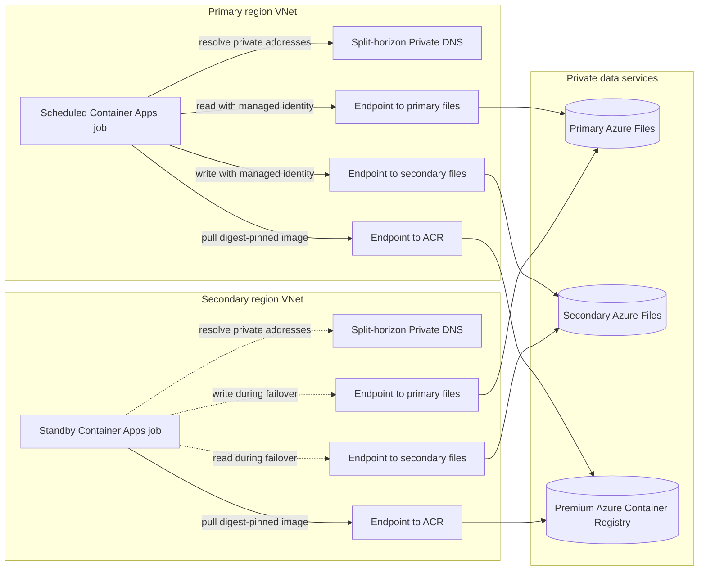

# Azure File Replication Non-Region Pair

Bicep and Azure CLI deployment for private Azure Files replication between two Azure regions that do not need to be an Azure paired-region set. Two regional Azure Container Apps Jobs run a digest-pinned AzCopy image in active/passive mode.

## Architecture

<!-- mermaid-checked: no \n, no em-dash/en-dash, no {} in labels, subgraphs are id["label"], arrows are -->|"label"|, all subgraphs closed by end, ids unique -->


The VNets are intentionally not peered. Each VNet has private endpoints for both file accounts and ACR, with its own split-horizon Private DNS zones. Only one replication direction is scheduled at a time.

## Design

- No VNet peering or public storage access.
- Both file accounts have a private endpoint in each VNet so either regional job can reach both shares.
- Regional split-horizon Azure Private DNS zones prevent cross-region private endpoint DNS ambiguity.
- Managed identities authenticate to Azure Files; no storage keys or SAS tokens are used.
- The selected primary region synchronizes forward. The secondary region is a manual standby with reverse synchronization preconfigured.
- The requested regional blob accounts and private containers are provisioned for application/demo use; they are not part of the Azure Files transfer path.

See [docs/infrastructure-plan.md](docs/infrastructure-plan.md) for topology and failover controls.

## Deployment profiles

- `infra/main.bicep` creates the complete demonstration topology, including storage, VNets, endpoints, DNS, and ACR.
- `infra/existing.bicep` references customer-owned storage, networking, private endpoints, DNS, and Premium ACR. It creates only replication identities and RBAC, Log Analytics workspaces, Container Apps environments, and jobs.

The existing-resource profile is additive. It does not redeploy or change the supplied storage accounts, VNets, private endpoints, private DNS zones, or ACR.

## Prerequisites

- Azure CLI with the Bicep and Container Apps extensions.
- Subscription Owner or equivalent rights to create resource groups, resources, and role assignments.
- PowerShell 7 when using `scripts/deploy.ps1`; direct Bicep deployment needs only Azure CLI.
- Sufficient Premium ACR, Container Apps environment, private endpoint, and regional storage quota.
- For the existing-resource profile, an existing Premium ACR and a digest-pinned AzCopy job image in that ACR.
- One delegated Container Apps infrastructure subnet of at least `/23` in each region.
- Existing private DNS resolution and approved private endpoints so each regional VNet can resolve and reach both file shares and the ACR.

Review the active subscription before deployment:

```powershell
az account show --output table
az account set --subscription <subscription-id>
```

## Customer deployment from Azure Cloud Shell

Clone the repository and create a local parameter file that Git ignores:

```bash
git clone https://github.com/bmkinney/azure-file-replication-non-region-pair.git
cd azure-file-replication-non-region-pair
cp infra/existing.example.bicepparam infra/existing.bicepparam
```

Edit every placeholder in `infra/existing.bicepparam`. The six endpoint IDs represent four file endpoints, allowing both VNets to reach both file accounts, plus one ACR endpoint in each VNet. The endpoints and corresponding `privatelink.file.*` and `privatelink.azurecr.io` DNS records must already work from the supplied VNets.

Validate and preview the additive deployment:

```bash
az bicep build --file infra/existing.bicep
az deployment sub validate \
	--location <primary-region> \
	--parameters infra/existing.bicepparam
az deployment sub what-if \
	--location <primary-region> \
	--parameters infra/existing.bicepparam
```

Deploy directly with Bicep. `containerImage` in the parameter file must be pinned to a digest in the existing ACR, and `activeRegion` should be `primary` when the customer is ready to start the schedule.

```bash
az deployment sub create \
	--name azure-files-dr-$(date +%Y%m%d%H%M%S) \
	--location <primary-region> \
	--parameters infra/existing.bicepparam
```

Alternatively, use PowerShell to orchestrate the two-stage deployment. Supplying a prebuilt digest avoids requiring Cloud Shell data-plane access to a private registry; omit `-ContainerImage` when ACR Tasks and manifest access are available:

```powershell
pwsh ./scripts/deploy.ps1 `
	-Location '<primary-region>' `
	-ParametersFile ./infra/existing.bicepparam `
	-ContainerImage '<registry>.azurecr.io/<repository>@sha256:<digest>'
```

The deploying identity needs permission to create resources and role assignments in the replication resource group and to assign Azure Files data roles on both storage accounts and `AcrPull` on the existing ACR.

## Validate the demonstration profile

```powershell
az bicep build --file infra/main.bicep
az deployment sub validate --location southcentralus --parameters infra/main.bicepparam
az deployment sub what-if --location southcentralus --parameters infra/main.bicepparam
pwsh ./src/azcopy-job/test-run-sync.ps1
```

## Deploy the demonstration profile

The script validates and previews changes, creates the private foundation, builds AzCopy in ACR, pins the deployed image by digest, disables ACR public access, and activates the primary schedule.

```powershell
pwsh ./scripts/deploy.ps1 -WhatIf
pwsh ./scripts/deploy.ps1
```

Deployment changes Azure resources and is intentionally not run automatically from this repository.

## Switch direction

After fencing application writes and validating the target:

```powershell
# Fail over: the secondary region becomes authoritative and syncs in reverse.
pwsh ./scripts/switch-direction.ps1 -ActiveRegion secondary -WritesFenced -WhatIf
pwsh ./scripts/switch-direction.ps1 -ActiveRegion secondary -WritesFenced

# Fail back after reconciliation: the primary region resumes forward sync.
pwsh ./scripts/switch-direction.ps1 -ActiveRegion primary -WritesFenced
```

For the existing-resource profile, also identify the customer replication resource group and parameter file:

```powershell
pwsh ./scripts/switch-direction.ps1 `
	-ActiveRegion secondary `
	-WritesFenced `
	-ResourceGroupName '<replication-resource-group>' `
	-Location '<primary-region>' `
	-ParametersFile ./infra/existing.bicepparam
```

The switch script refuses to proceed while either job is running or when the deployed images differ or are not digest-pinned.