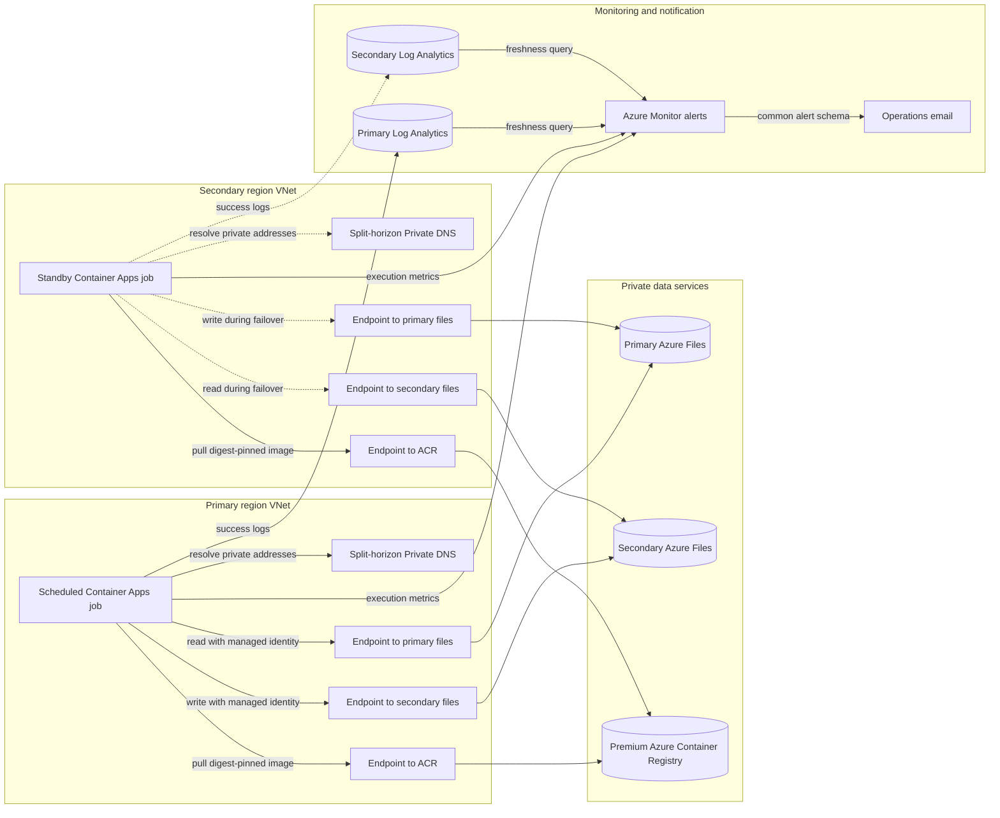

# Azure File Replication Non-Region Pair

Bicep and Azure CLI deployment for private Azure Files replication between two Azure regions that do not need to be an Azure paired-region set. Two regional Azure Container Apps Jobs run a digest-pinned AzCopy image in active/passive mode.

## Architecture

<!-- mermaid-checked: safe labels, quoted edge labels, closed subgraphs, and unique ids -->


The VNets are intentionally not peered. Each VNet has private endpoints for both file accounts and ACR, with its own split-horizon Private DNS zones. Only one replication direction is scheduled at a time.

## Design

- No VNet peering or public storage access.
- Both file accounts have a private endpoint in each VNet so either regional job can reach both shares.
- Regional split-horizon Azure Private DNS zones prevent cross-region private endpoint DNS ambiguity.
- Managed identities authenticate to Azure Files; no storage keys or SAS tokens are used.
- The selected primary region synchronizes forward. The secondary region is a manual standby with reverse synchronization preconfigured.
- Azure Monitor sends email for failed executions and when the active direction has no successful replication within the configured threshold.
- The requested regional blob accounts and private containers are provisioned for application/demo use; they are not part of the Azure Files transfer path.

See [docs/infrastructure-plan.md](docs/infrastructure-plan.md) for topology and failover controls.

## Deployment profiles

- `infra/main.bicep` creates the complete demonstration topology, including storage, VNets, endpoints, DNS, and ACR.
- `infra/existing.bicep` references customer-owned storage, networking, private endpoints, DNS, and Premium ACR. It creates replication identities and RBAC, Log Analytics workspaces, Container Apps environments and jobs, and Azure Monitor alerting resources.

The existing-resource profile is additive. It does not redeploy or change the supplied storage accounts, VNets, private endpoints, private DNS zones, or ACR.

## Prerequisites

- Azure CLI with the Bicep and Container Apps extensions.
- Subscription Owner or equivalent rights to create resource groups, resources, and role assignments.
- PowerShell 7 when using `scripts/deploy.ps1`; direct Bicep deployment needs only Azure CLI.
- Sufficient Premium ACR, Container Apps environment, private endpoint, and regional storage quota.
- For the existing-resource profile, an existing Premium ACR and a digest-pinned AzCopy job image in that ACR.
- One delegated Container Apps infrastructure subnet of at least `/23` in each region.
- Existing private DNS resolution and approved private endpoints so each regional VNet can resolve and reach both file shares and the ACR.

Review the active subscription before deployment:

```powershell
az account show --output table
az account set --subscription <subscription-id>
```

## RBAC requirements

The templates create two user-assigned managed identities, one for each regional Container Apps Job, and create these assignments automatically:

| Principal | Built-in role | Scope | Purpose |
| --- | --- | --- | --- |
| Primary job identity | Storage File Data Privileged Contributor (`69566ab7-960f-475b-8e7c-b3118f30c6bd`) | Both Azure Files storage accounts | Read the active source share and write the destination share with AzCopy |
| Secondary job identity | Storage File Data Privileged Contributor (`69566ab7-960f-475b-8e7c-b3118f30c6bd`) | Both Azure Files storage accounts | Support reverse synchronization after failover |
| Primary job identity | AcrPull (`7f951dda-4ed3-4680-a7ca-43fe172d538d`) | Container registry | Pull the digest-pinned AzCopy image |
| Secondary job identity | AcrPull (`7f951dda-4ed3-4680-a7ca-43fe172d538d`) | Container registry | Pull the digest-pinned AzCopy image |

Both identities need access to both file accounts because either region can become the replication source. Do not replace the Azure Files data role with a management-plane role such as Contributor; management-plane access does not authorize file data operations. Storage keys and SAS tokens are not used.

The identity running the deployment must be able to create the subscription- and resource-group-scoped resources, attach the managed identities to the jobs, and create the role assignments above. The straightforward assignment is **Owner** at the subscription. A more separated configuration is **Contributor** plus **Role Based Access Control Administrator** at the subscription, or equivalent custom roles containing the required resource writes, `Microsoft.ManagedIdentity/userAssignedIdentities/assign/action`, and `Microsoft.Authorization/roleAssignments/write`. For the existing-resource profile, those permissions must include the workload resource group, both existing storage accounts, and the existing ACR; all referenced resources must be in the deployment subscription.

When `scripts/deploy.ps1` builds the image instead of receiving `-ContainerImage`, the caller also needs permission to queue an ACR Task build and read the resulting manifest. For a non-ABAC registry, grant **AcrPush** on the registry in addition to the required management-plane access. Supplying a prebuilt digest-pinned image avoids this build-time permission.

No additional runtime RBAC assignment is required for Log Analytics or Azure Monitor. The Container Apps environments are configured with the workspace credentials during deployment, and the alert rules call the Action Group as an Azure platform integration. Action Group email recipients should confirm and test notification delivery before production use.

An operator using `scripts/switch-direction.ps1` needs the same deployment permissions because the script redeploys the template. An operator who only starts or stops a job for testing needs job read access plus `Microsoft.App/jobs/start/action` and `Microsoft.App/jobs/stop/action` on the relevant Container Apps Jobs.

See [docs/infrastructure-plan.md](docs/infrastructure-plan.md#rbac-and-service-permissions) for the greenfield/brownfield permission boundaries and verification commands.

## Customer deployment from Azure Cloud Shell

Clone the repository and create a local parameter file that Git ignores:

```bash
git clone https://github.com/bmkinney/azure-file-replication-non-region-pair.git
cd azure-file-replication-non-region-pair
cp infra/existing.example.bicepparam infra/existing.bicepparam
```

Edit every placeholder in `infra/existing.bicepparam`. The six endpoint IDs represent four file endpoints, allowing both VNets to reach both file accounts, plus one ACR endpoint in each VNet. The endpoints and corresponding `privatelink.file.*` and `privatelink.azurecr.io` DNS records must already work from the supplied VNets.

Set `alertEmailAddresses` to one or more monitored operations addresses. The deployment creates an Azure Monitor Action Group and enables Common Alert Schema for every receiver. Supported `replicationLagThresholdMinutes` values are `20`, `30`, and `60`; the default is `30`.

Validate and preview the additive deployment:

```bash
az bicep build --file infra/existing.bicep
az deployment sub validate \
	--location <primary-region> \
	--parameters infra/existing.bicepparam
az deployment sub what-if \
	--location <primary-region> \
	--parameters infra/existing.bicepparam
```

Deploy directly with Bicep. `containerImage` in the parameter file must be pinned to a digest in the existing ACR, and `activeRegion` should be `primary` when the customer is ready to start the schedule.

```bash
az deployment sub create \
	--name azure-files-dr-$(date +%Y%m%d%H%M%S) \
	--location <primary-region> \
	--parameters infra/existing.bicepparam
```

Alternatively, use PowerShell to orchestrate the two-stage deployment. Supplying a prebuilt digest avoids requiring Cloud Shell data-plane access to a private registry; omit `-ContainerImage` when ACR Tasks and manifest access are available:

```powershell
pwsh ./scripts/deploy.ps1 `
	-Location '<primary-region>' `
	-ParametersFile ./infra/existing.bicepparam `
	-ContainerImage '<registry>.azurecr.io/<repository>@sha256:<digest>'
```

The deploying identity needs permission to create resources and role assignments in the replication resource group and to assign Azure Files data roles on both storage accounts and `AcrPull` on the existing ACR.

## Validate the demonstration profile

```powershell
az bicep build --file infra/main.bicep
az deployment sub validate --location southcentralus --parameters infra/main.bicepparam
az deployment sub what-if --location southcentralus --parameters infra/main.bicepparam
pwsh ./src/azcopy-job/test-run-sync.ps1
```

## Deploy the demonstration profile

The script validates and previews changes, creates the private foundation, builds AzCopy in ACR, pins the deployed image by digest, disables ACR public access, and activates the primary schedule.

```powershell
pwsh ./scripts/deploy.ps1 -WhatIf
pwsh ./scripts/deploy.ps1
```

Deployment changes Azure resources and is intentionally not run automatically from this repository.

## Monitoring and alerts

Both deployment profiles create the following stateful Azure Monitor rules:

| Alert | Severity | Signal | Enabled state |
| --- | --- | --- | --- |
| Primary job failed | Sev 1 | `Microsoft.App/jobs` `Executions` metric with `state=Failed` | Always when monitoring is enabled |
| Secondary job failed | Sev 1 | `Microsoft.App/jobs` `Executions` metric with `state=Failed` | Always when monitoring is enabled |
| Primary replication stale | Sev 2 | No `AZURE_FILES_REPLICATION_SUCCEEDED` console marker for the configured threshold | Only when `activeRegion=primary` |
| Secondary replication stale | Sev 2 | No `AZURE_FILES_REPLICATION_SUCCEEDED` console marker for the configured threshold | Only when `activeRegion=secondary` |

Failed-execution alerts cover scheduled and manually started jobs, including failures where the AzCopy wrapper cannot emit an error marker. Freshness is an operational RPO signal: it measures time since a completed successful AzCopy run, not the age or equality of every file. With `activeRegion=none`, both freshness rules are disabled so bootstrap and planned pauses do not generate stale-replication notifications.

On a greenfield deployment, Log Analytics creates `ContainerAppConsoleLogs_CL` only after the first Container Apps log is ingested. The freshness rules therefore skip query validation during resource creation; Azure Monitor begins normal evaluation after the jobs emit logs and the table exists.

`switch-direction.ps1` redeploys the templates with the new `activeRegion`. The old direction's freshness rule is disabled and the new direction's rule is enabled as part of that deployment. Alerts automatically resolve after their conditions clear.

Inspect the deployed resources:

```powershell
az monitor action-group list --resource-group <replication-resource-group> --output table
az monitor metrics alert list --resource-group <replication-resource-group> --output table
az monitor scheduled-query list --resource-group <replication-resource-group> --output table
```

View each workspace GUID and its latest successful replication markers from Azure Cloud Shell. The explicit management API version avoids Azure CLI releases whose built-in workspace-list command selects an API version that the command path rejects:

```bash
RG='<replication-resource-group>'
SUB=$(az account show --query id --output tsv)

az rest --method get \
	--url "https://management.azure.com/subscriptions/$SUB/resourceGroups/$RG/providers/Microsoft.OperationalInsights/workspaces?api-version=2025-07-01" \
	--query "value[].{Name:name,WorkspaceId:properties.customerId}" --output table

az monitor log-analytics query \
	--workspace '<workspace-guid>' \
	--analytics-query 'ContainerAppConsoleLogs_CL
	| where Log_s contains "AZURE_FILES_REPLICATION_SUCCEEDED"
	| project TimeGenerated, Log_s
	| order by TimeGenerated desc
	| take 10' --output table
```

Run the query with each workspace GUID to inspect both regional jobs. Before the first Container Apps log is ingested, the custom table does not exist and the query returns a table-resolution error rather than replication history.

Before production use, test the Action Group from its **Test action group** pane in the Azure portal. In a nonproduction deployment, also induce one controlled failed execution and pause the active schedule long enough to cross a shortened threshold. Confirm the Sev 1 and Sev 2 emails arrive, then restore a successful execution and verify both alert instances resolve. Do not test freshness by stopping production replication.

## Switch direction

After fencing application writes and validating the target:

```powershell
# Fail over: the secondary region becomes authoritative and syncs in reverse.
pwsh ./scripts/switch-direction.ps1 -ActiveRegion secondary -WritesFenced -WhatIf
pwsh ./scripts/switch-direction.ps1 -ActiveRegion secondary -WritesFenced

# Fail back after reconciliation: the primary region resumes forward sync.
pwsh ./scripts/switch-direction.ps1 -ActiveRegion primary -WritesFenced
```

For the existing-resource profile, also identify the customer replication resource group and parameter file:

```powershell
pwsh ./scripts/switch-direction.ps1 `
	-ActiveRegion secondary `
	-WritesFenced `
	-ResourceGroupName '<replication-resource-group>' `
	-Location '<primary-region>' `
	-ParametersFile ./infra/existing.bicepparam
```

The switch script refuses to proceed while either job is running or when the deployed images differ or are not digest-pinned.