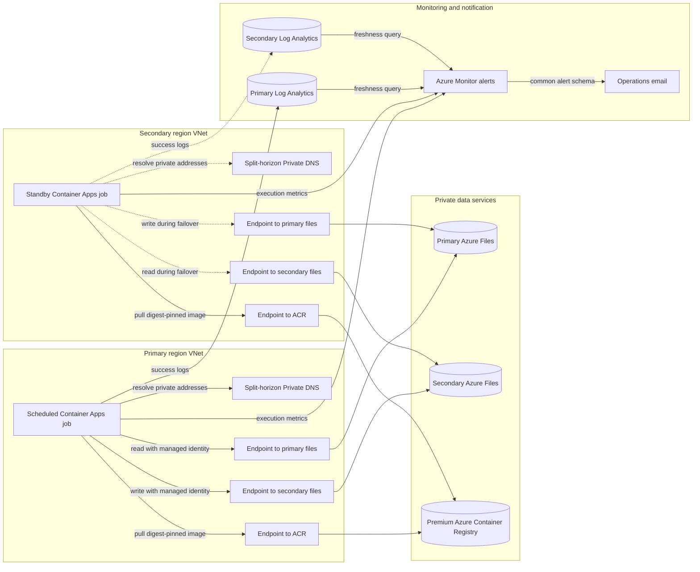

# Azure Files Replication Non-Region Pair

Private, scheduled Azure Files replication for disaster recovery between any two Azure regions, including regions that aren't an Azure paired-region set. Azure Files geo-redundant storage replicates only to the paired region; this solution replicates an SMB share to a region you choose. Two regional Azure Container Apps Jobs run a digest-pinned AzCopy image in active/passive mode, over private endpoints, with managed identities instead of storage keys.

Deploy it with Bicep, Terraform, or the Azure portal:

| Method | Guide | Best for |
| --- | --- | --- |
| Bicep | [deploy/bicep](deploy/bicep/README.md) | Greenfield deployments, and adding replication to existing storage accounts, networks, and registries with the audited existing-resource profile |
| Terraform | [deploy/terraform](deploy/terraform/README.md) | Greenfield deployments in teams that standardize on Terraform |
| Azure portal | [deploy/portal](deploy/portal/README.md) | Learning the topology step by step, or environments without infrastructure as code. Every step has expandable Azure CLI and Azure PowerShell commands. |

Example CI/CD pipelines for GitHub Actions and Azure DevOps are in [pipelines](pipelines/README.md).

## Contents

- [Architecture](#architecture), [design](#design), [network requirements for server-side copy](#network-requirements-for-server-side-copy), and [outbound access through a firewall](#outbound-access-through-a-firewall)
- [Choose a deployment method](#choose-a-deployment-method), [prerequisites](#prerequisites), and [repository layout](#repository-layout)
- [Verify a deployment](#verify-a-deployment) and test replication end to end
- [RBAC requirements](#rbac-requirements)
- [Replication job settings](#replication-job-settings), [monitoring and alerts](#monitoring-and-alerts), and [switching direction](#switch-direction)
- [Scripts and tests](#scripts-and-tests)
- [Troubleshooting](#troubleshooting)
- [Use this repository in your organization](#use-this-repository-in-your-organization), [contributing](#contributing), and [license](#license)

## Architecture

<!-- mermaid-checked: safe labels, quoted edge labels, closed subgraphs, and unique ids -->

```mermaid
flowchart LR
	subgraph PrimaryRegion["Primary region VNet"]
		PrimaryJob["Scheduled Container Apps job"]
		PrimaryDns["Split-horizon Private DNS"]
		PrimaryFileEndpoint["Endpoint to primary files"]
		PrimaryRemoteEndpoint["Endpoint to secondary files"]
		PrimaryAcrEndpoint["Endpoint to ACR"]
	end
	subgraph SecondaryRegion["Secondary region VNet"]
		SecondaryJob["Standby Container Apps job"]
		SecondaryDns["Split-horizon Private DNS"]
		SecondaryRemoteEndpoint["Endpoint to primary files"]
		SecondaryFileEndpoint["Endpoint to secondary files"]
		SecondaryAcrEndpoint["Endpoint to ACR"]
	end
	subgraph DataServices["Private data services"]
		PrimaryFiles[("Primary Azure Files")]
		SecondaryFiles[("Secondary Azure Files")]
		Registry[("Premium Azure Container Registry")]
	end
	subgraph Monitoring["Monitoring and notification"]
		PrimaryLogs[("Primary Log Analytics")]
		SecondaryLogs[("Secondary Log Analytics")]
		AzureMonitor["Azure Monitor alerts"]
		OperationsEmail["Operations email"]
	end

	PrimaryJob -->|"resolve private addresses"| PrimaryDns
	PrimaryJob -->|"read with managed identity"| PrimaryFileEndpoint
	PrimaryJob -->|"write with managed identity"| PrimaryRemoteEndpoint
	PrimaryJob -->|"pull digest-pinned image"| PrimaryAcrEndpoint
	PrimaryFileEndpoint --> PrimaryFiles
	PrimaryRemoteEndpoint --> SecondaryFiles
	PrimaryAcrEndpoint --> Registry

	SecondaryJob -.->|"resolve private addresses"| SecondaryDns
	SecondaryJob -.->|"read during failover"| SecondaryFileEndpoint
	SecondaryJob -.->|"write during failover"| SecondaryRemoteEndpoint
	SecondaryJob -->|"pull digest-pinned image"| SecondaryAcrEndpoint
	SecondaryRemoteEndpoint --> PrimaryFiles
	SecondaryFileEndpoint --> SecondaryFiles
	SecondaryAcrEndpoint --> Registry
	PrimaryJob -->|"success logs"| PrimaryLogs
	SecondaryJob -.->|"success logs"| SecondaryLogs
	PrimaryJob -->|"execution metrics"| AzureMonitor
	SecondaryJob -->|"execution metrics"| AzureMonitor
	PrimaryLogs -->|"freshness query"| AzureMonitor
	SecondaryLogs -->|"freshness query"| AzureMonitor
	AzureMonitor -->|"common alert schema"| OperationsEmail
```

The VNets are intentionally not peered. Each VNet has private endpoints for both file accounts and ACR, with its own split-horizon Private DNS zones. Only one replication direction is scheduled at a time.

The diagram shows a greenfield deployment, which all three methods can build. The Bicep existing-resource profile keeps the same data paths, but it can reuse your storage accounts, VNets, private endpoints, DNS zones, and registry, and it also supports directly peered VNets.

## Design

- No VNet peering or public storage access in a greenfield deployment.
- Both file accounts have a private endpoint in each VNet so either regional job can reach both shares.
- Regional split-horizon Azure Private DNS zones prevent cross-region private endpoint DNS ambiguity.
- Managed identities authenticate to Azure Files; no storage keys or SAS tokens are used.
- The selected primary region synchronizes forward. The secondary region is a manual standby with reverse synchronization preconfigured.
- Azure Monitor sends email for failed executions and when the active direction has no successful replication within the configured threshold.
- A greenfield deployment also provisions a regional blob account and private container in each region for application use. They aren't part of the Azure Files transfer path.

See [docs/infrastructure-plan.md](docs/infrastructure-plan.md) for topology, permission boundaries, and failover controls.

### Network requirements for server-side copy

AzCopy copies Azure Files data directly between the storage services. With private endpoints, the copy succeeds only when the network that runs each job has private access to both storage accounts in one of these layouts:

| Layout | Requirement |
| --- | --- |
| Local endpoints (used by every greenfield deployment) | Each job VNet contains a private endpoint for **both** storage accounts, and DNS in that VNet resolves both account names to those endpoints. |
| Direct peering | Each job runs in the VNet that contains its source account's private endpoint, and the two regional VNets are directly peered. |

Reaching the other region only through a hub VNet or Virtual WAN hub satisfies neither layout, and the copy fails with `403 CannotVerifyCopySource`. Microsoft documents this behavior for [Blob copies between network-restricted accounts](https://learn.microsoft.com/troubleshoot/azure/azure-storage/blobs/connectivity/copy-blobs-between-storage-accounts-network-restriction); Azure Files server-side copies use the same mechanism.

A VNet can link only one private DNS zone with a given name. If workload VNets share a central `privatelink.file.core.windows.net` zone, don't add a second private endpoint for an existing storage account to that zone: its record can redirect other workloads to the wrong endpoint. Use dedicated replication VNets with their own zone links, or use the direct-peering layout.

### Outbound access through a firewall

The jobs reach the storage accounts and the registry through private endpoints, but Container Apps itself also needs outbound HTTPS to Microsoft endpoints that don't offer private endpoints. A greenfield deployment's new VNets reach them directly. When a job subnet's internet traffic goes through a firewall, for example because a route table sends `0.0.0.0/0` to a hub firewall, or a Virtual WAN hub routes it there, the firewall must allow these from both job subnets, without TLS inspection. Microsoft lists them in [Azure Container Apps environment integration with Azure Firewall](https://learn.microsoft.com/azure/container-apps/use-azure-firewall).

| Used for | Application rule FQDNs | Network rule service tags |
| --- | --- | --- |
| Microsoft Artifact Registry: Container Apps system images, and the placeholder image that the first deployment stage gives the jobs | `mcr.microsoft.com`, `*.data.mcr.microsoft.com` | `MicrosoftContainerRegistry`, `AzureFrontDoor.FirstParty` |
| Kubernetes and network plug-in binaries for the environment's infrastructure | `packages.aks.azure.com`, `acs-mirror.azureedge.net` | None; use application rules |
| Sign-in for the job identities, which pull the image and authenticate AzCopy | `*.identity.azure.net`, `login.microsoftonline.com`, `*.login.microsoftonline.com`, `*.login.microsoft.com` | `AzureActiveDirectory` |

The Container Apps article spells the Front Door tag `AzureFrontDoorFirstParty`; firewall rules need its name from the [service tag list](https://learn.microsoft.com/azure/virtual-network/service-tags-overview#available-service-tags), `AzureFrontDoor.FirstParty`.

Without them, job creation fails with `InvalidParameterValueInContainerTemplate` and an `EOF`, a timeout, or a TLS error for `mcr.microsoft.com`, or the Container Apps environment doesn't finish provisioning, and the deployment runs until it times out. See [Container Apps deployment problems](#container-apps-deployment-problems).

These rules only allow outbound connections: nothing in your environment becomes reachable from the internet, and the storage accounts and registry keep public network access disabled. Removing the firewall route from the job subnets would also work, but it sends all of their internet traffic around the firewall; allowing these endpoints is the narrower change.

Your own images don't need public access either. `az acr import` copies an image from a public registry, or from a temporary build registry, into a registry that denies public network access, through the registry's **Allow trusted services** setting, which is enabled by default; see [Import container images](https://learn.microsoft.com/azure/container-registry/container-registry-import-images#import-container-images-from-a-public-registry). For the AzCopy image, see [Put the AzCopy image in the registry](deploy/bicep/README.md#put-the-azcopy-image-in-the-registry). Importing images doesn't remove the firewall rules above, because Container Apps needs those endpoints for its own components.

For the Bicep existing-resource profile, the [inventory check](deploy/bicep/README.md#inventory-check) reports each job subnet whose route table sends internet traffic through a firewall, or drops it. For a job subnet that the deployment adds, it warns when other subnets in the VNet use such a route table. It can't see routes that a subnet learns through BGP or from a Virtual WAN hub.

## Choose a deployment method

| | Bicep | Terraform | Azure portal |
| --- | --- | --- | --- |
| Guide | [deploy/bicep/README.md](deploy/bicep/README.md) | [deploy/terraform/README.md](deploy/terraform/README.md) | [deploy/portal/README.md](deploy/portal/README.md) |
| Greenfield deployment | `deploy/bicep/main.bicep` | `deploy/terraform` root module | Step by step, with Azure CLI and Azure PowerShell equivalents |
| Reuse existing storage, networks, DNS, and registry | The existing-resource profile, `deploy/bicep/existing.bicep`, with the [reuse audit](deploy/bicep/README.md#reuse-audit) and [inventory check](deploy/bicep/README.md#inventory-check) | Not yet; use the Bicep profile | [Guidance](deploy/portal/README.md#reuse-existing-services) on which steps to skip |
| Two-stage deployment with image build | `scripts/deploy.ps1` | `deploy/terraform/deploy.ps1` | Manual `az acr build` step |
| Direction switch | `scripts/switch-direction.ps1 -ParametersFile` | `scripts/switch-direction.ps1 -TerraformDirectory` | Manual trigger changes |
| Separately granted job roles | `createRoleAssignments = false`, then `scripts/grant-access.ps1 -DeploymentName` | `create_role_assignments = false`, then `scripts/grant-access.ps1 -TerraformDirectory` | An administrator performs the role assignment step |
| Example CI/CD pipelines | [GitHub Actions and Azure DevOps](pipelines/README.md) | [GitHub Actions and Azure DevOps](pipelines/README.md) | None |

All methods build the same topology, and the [verification](#verify-a-deployment), [monitoring](#monitoring-and-alerts), and [troubleshooting](#troubleshooting) guidance in this README applies to each of them. Manage each environment with one method only: the Bicep and Terraform deployments generate different resource names, and neither tracks resources that the other created.

The examples in this README use the Bicep parameter names, such as `activeRegion` and `createRoleAssignments`. The Terraform variables have the same names in snake case, such as `active_region` and `create_role_assignments`.

## Prerequisites

Tools:

- Azure CLI, for every method. The scripts and the image build use it.
- For Bicep: Bicep in Azure CLI. Run `az bicep upgrade` first; the templates use recent Bicep features such as `fail()` and sealed types.
- For Terraform: Terraform 1.9 or later.
- For the portal guide's PowerShell commands: the Az PowerShell modules.
- The Azure CLI `containerapp` extension for the `az containerapp job` commands: `az extension add --name containerapp --upgrade`. Listing freshness alerts with `az monitor scheduled-query` also needs the `scheduled-query` extension.
- PowerShell 7 (`pwsh`) for the scripts and tests. Direct Bicep and Terraform deployments need only Azure CLI and the deployment tool.
- Git to clone the repository. The AzCopy wrapper test also uses `sh` when it's available; Git for Windows includes it.

Sign in to the target tenant and subscription, and confirm the target before you run any command that changes Azure resources:

```powershell
az login --tenant <tenant-id-or-domain>
az account set --subscription <subscription-id-or-name>
az account show --output table
```

Azure requirements:

- Rights to deploy: subscription **Owner**, or **Contributor** plus **Role Based Access Control Administrator**. An identity with Contributor-level rights only, such as a pipeline identity, can deploy with `createRoleAssignments = false` (`create_role_assignments = false` in Terraform) while an administrator grants the job identities' roles. See [RBAC requirements](#rbac-requirements).
- Registered resource providers: `Microsoft.App`, `Microsoft.ContainerRegistry`, `Microsoft.Insights`, `Microsoft.ManagedIdentity`, `Microsoft.Network`, `Microsoft.OperationalInsights`, and `Microsoft.Storage`. Register any that aren't with `az provider register --namespace <namespace> --wait`. For Bicep, the [inventory check](deploy/bicep/README.md#inventory-check) reports them.
- Container Apps availability in both regions, and quota for Container Apps environments, private endpoints, Premium ACR, and the storage SKUs.
- For each region's job, a dedicated Container Apps infrastructure subnet that is empty, delegated to `Microsoft.App/environments`, and at least `/27`. The templates create workload profiles environments that run the jobs on the serverless Consumption profile, and this environment type requires the delegation. Greenfield deployments and new VNets use a `/23`. With existing resources, you can reuse such a subnet, add one to an existing VNet, or create a VNet.
- A network path that supports server-side copy between the two private storage accounts. See [Network requirements for server-side copy](#network-requirements-for-server-side-copy).
- When a job subnet's internet traffic goes through a firewall, outbound access from it to the endpoints that Container Apps needs. See [Outbound access through a firewall](#outbound-access-through-a-firewall).

Prefer a local terminal to Azure Cloud Shell for deployments, because Cloud Shell ends sessions after 20 idle minutes. A deployment continues server-side if the session ends.

## Repository layout

| Path | Contents |
| --- | --- |
| [`deploy/bicep/`](deploy/bicep/README.md) | Bicep templates for the greenfield deployment and the existing-resource profile, with their parameter files and modules |
| [`deploy/terraform/`](deploy/terraform/README.md) | Terraform root module and modules for the greenfield deployment, its example variable and backend files, `deploy.ps1`, and Terraform tests |
| [`deploy/portal/`](deploy/portal/README.md) | Azure portal guide with Azure CLI and Azure PowerShell equivalents |
| [`pipelines/`](pipelines/README.md), `.github/workflows/` | Example Azure DevOps pipelines, GitHub Actions workflows, and their setup guide |
| `.github/` | Issue and pull request templates, code owners, and Dependabot configuration |
| `scripts/` | [Inventory, reuse audit, deployment, direction-switch, access grant, and demo scripts](#scripts-and-tests) |
| `src/azcopy-job/` | AzCopy image: `Dockerfile`, the `run-sync.sh` entrypoint, and its test |
| `tests/` | [Offline tests](#tests) for the templates, Terraform configuration, scripts, pipelines, and documentation links |
| `docs/infrastructure-plan.md` | Topology, permission boundaries, replication and monitoring state, and failover controls |
| `docs/demo-runbook.md` | Step-by-step script for demonstrating a deployment |

Keep environment-specific values, such as alert addresses, out of source control. Git ignores the Bicep files `deploy/bicep/existing.bicepparam` and `deploy/bicep/*.local.bicepparam`, the Terraform files `deploy/terraform/terraform.tfvars`, `*.local.tfvars`, `backend.hcl`, and state, and the `inventory-report*.json` and `audit-report*.json` reports, which contain subscription and tenant IDs.

## Verify a deployment

These checks apply to every deployment method and profile. For the Bicep existing-resource profile, use `secondaryResourceGroupName` wherever a command refers to the secondary job, if you set it.

### Check the deployed resources

For a Bicep deployment, rerun the inventory with the same parameter file. Template resources that were `To be provisioned` now have an `Exists` status, such as `Exists, will be redeployed`. For a Terraform deployment, `terraform plan` with the same variable file should report no changes.

```powershell
pwsh ./scripts/inventory.ps1 -ParametersFile <parameter-file>
```

Then confirm the replication state:

```bash
az containerapp job list --resource-group <replication-resource-group> --query "[].{name:name, trigger:properties.configuration.triggerType, cron:properties.configuration.scheduleTriggerConfig.cronExpression, image:properties.template.containers[0].image}" --output table
az acr show --name <registry> --query publicNetworkAccess --output tsv
az monitor metrics alert list --resource-group <replication-resource-group> --query "[].{name:name, enabled:enabled, severity:severity}" --output table
az monitor scheduled-query list --resource-group <replication-resource-group> --output table
```

| Check | Expected with `activeRegion = 'primary'` |
| --- | --- |
| Jobs | Both jobs run the same `@sha256:` image. The primary job has trigger `Schedule` and the `scheduleCronExpression` schedule; the secondary job has trigger `Manual`. |
| Registry | `Disabled` for a registry that the templates created, after `scripts/deploy.ps1` or any deployment with `acrPublicNetworkAccess = 'Disabled'`. `deploy/bicep/main.bicepparam` sets `Enabled` for the first deployment; step 4 of [Greenfield deployment](deploy/bicep/README.md#greenfield-deployment) changes it. |
| Failed-execution alerts | Both enabled, severity 1. |
| Freshness alerts | The primary rule enabled and the secondary rule disabled, severity 2; see [Monitoring and alerts](#monitoring-and-alerts). |

### Run a one-off command in a job

The storage accounts deny public network access, and the accounts that the templates create also deny shared key access, so seed and inspect test data from inside the jobs, which have private access and a managed identity. Container Apps can [override a job's template for a single execution](https://learn.microsoft.com/azure/container-apps/jobs#start-a-job-execution-on-demand):

1. Export the job's template:

   ```bash
   az containerapp job show --name <job> --resource-group <resource-group> --query properties.template --output yaml > override.yaml
   ```

2. Edit the `azcopy` container in `override.yaml`: add a `command` and `args`, or add environment variables. Keep the existing entries. In each job, `SOURCE_FILE_URL` is the job's own region's share and `DESTINATION_FILE_URL` is the other region's share.

3. Start one execution with the edited template. The override applies only to that execution:

   ```bash
   az containerapp job start --name <job> --resource-group <resource-group> --yaml override.yaml
   ```

4. Read the output with `az containerapp job logs show --name <job> --resource-group <resource-group> --container azcopy --follow` while the execution runs, or later in `ContainerAppConsoleLogs_CL`, as shown in [Collect diagnostics](#collect-diagnostics). Log Analytics ingestion can lag 5 to 10 minutes.

A custom command replaces the image's entrypoint, `/usr/local/bin/run-sync`, so it must set up AzCopy itself, as the examples below do: `export AZCOPY_AUTO_LOGIN_TYPE=MSI` signs AzCopy in with the job's identity, and `AZCOPY_LOG_LOCATION` and `AZCOPY_JOB_PLAN_LOCATION` put AzCopy's working files in a writable folder. AzCopy reads the identity's client ID from `AZCOPY_MSI_CLIENT_ID`, which the job template already sets. A command that exits with a nonzero code fails the execution and raises the failed-execution alert.

> [!WARNING]
> Starting the secondary job without an override performs a real reverse synchronization. Start it only with an override, such as a dry run, unless you're failing over.

### Seed test files

Add this `command` and `args` to the **primary** job's `azcopy` container, at the same indentation as its `image` key, and start an execution. It writes three small files to a `replication-test` folder in the primary share and prints their hashes:

```yaml
  command:
  - /bin/sh
  - -c
  args:
  - |
    set -eu
    export AZCOPY_AUTO_LOGIN_TYPE=MSI
    export AZCOPY_LOG_LOCATION=/tmp/azcopy AZCOPY_JOB_PLAN_LOCATION=/tmp/azcopy
    mkdir -p /tmp/replication-test
    for n in 1 2 3; do date -u "+Replication test file $n written %Y-%m-%dT%H:%M:%SZ" > "/tmp/replication-test/file-$n.txt"; done
    (cd /tmp && sha256sum replication-test/*)
    azcopy copy /tmp/replication-test "$SOURCE_FILE_URL" --recursive=true
```

Seed only shares where test files are acceptable, such as a nonproduction share. The files stay in both shares after the test.

### Replicate the test files

Start the primary job without an override, or wait for its next scheduled run:

```bash
az containerapp job start --name <primary-job> --resource-group <replication-resource-group>
```

Confirm that the execution succeeded and logged the success marker. Run the query against the primary region's workspace:

```bash
az containerapp job execution list --name <primary-job> --resource-group <replication-resource-group> --output table
az monitor log-analytics query --workspace <primary-workspace-guid> --analytics-query "ContainerAppConsoleLogs_CL | where ContainerJobName_s == '<primary-job>' and Log_s has 'AZURE_FILES_REPLICATION' | project TimeGenerated, Log_s | order by TimeGenerated desc | take 10" --output table
```

The latest line should be `AZURE_FILES_REPLICATION_SUCCEEDED startedAt=<time> durationSeconds=<seconds>`.

### Inspect the destination share

Add this override to the **secondary** job's `azcopy` container. In the secondary job, `SOURCE_FILE_URL` is the secondary share, so the command lists the replicated files and prints their hashes without writing to either share:

```yaml
  command:
  - /bin/sh
  - -c
  args:
  - |
    set -eu
    export AZCOPY_AUTO_LOGIN_TYPE=MSI
    export AZCOPY_LOG_LOCATION=/tmp/azcopy AZCOPY_JOB_PLAN_LOCATION=/tmp/azcopy
    azcopy list "$SOURCE_FILE_URL/replication-test" --running-tally
    mkdir -p /tmp/verify
    azcopy copy "$SOURCE_FILE_URL/replication-test" /tmp/verify --recursive=true
    (cd /tmp/verify && sha256sum replication-test/*)
```

The hashes should match the ones that the seed execution printed.

### Dry-run the standby job

Add this entry to the `env` list of the **secondary** job's `azcopy` container, without a custom command, and start an execution:

```yaml
  - name: DRY_RUN
    value: 'true'
```

The log reports `AZURE_FILES_REPLICATION_DRY_RUN_COMPLETED` with `wouldCopy`, `wouldRemove`, and `wouldSetProperties` counts, which show what a reverse synchronization would do. Because the wrapper sets `--preserve-info=true`, sync compares SMB last-write times, which forward replication preserves on the destination. Expect `wouldCopy` to count files changed in the standby share and a few folders whose timestamps differ, not files that were replicated unchanged. Dry runs never satisfy the freshness alert.

## RBAC requirements

Three kinds of identities take part in a deployment:

| Identity | Role in the deployment | Rights |
| --- | --- | --- |
| Job identities | Two user-assigned managed identities, one for each regional job, that run AzCopy | The [job identity roles](#job-identity-roles) on both storage accounts and the registry |
| Deploying identity | Runs the inventory, `deploy.ps1`, and `switch-direction.ps1`: a user, or a [pipeline identity](deploy/bicep/README.md#deploy-with-a-pipeline-identity) | Resource management. With `createRoleAssignments = true`, also the right to assign the job identity roles. |
| Access administrator | With `createRoleAssignments = false`, [grants the job identity roles](#grant-the-job-identities-their-roles) once | The right to create role assignments on both storage accounts and the registry |

### Job identity roles

By default, the templates create the two identities and these role assignments. With `identityMode = 'existing'`, the existing-resource profile reuses identities that you name instead of creating them. With `createRoleAssignments = false`, the templates create no role assignments, and an access administrator grants them.

| Principal | Built-in role | Scope | Purpose |
| --- | --- | --- | --- |
| Primary job identity | Storage File Data Privileged Contributor (`69566ab7-960f-475b-8e7c-b3118f30c6bd`) | Both Azure Files storage accounts | Read the active source share and write the destination share with AzCopy |
| Secondary job identity | Storage File Data Privileged Contributor (`69566ab7-960f-475b-8e7c-b3118f30c6bd`) | Both Azure Files storage accounts | Support reverse synchronization after failover |
| Primary job identity | AcrPull (`7f951dda-4ed3-4680-a7ca-43fe172d538d`) | Container registry | Pull the digest-pinned AzCopy image |
| Secondary job identity | AcrPull (`7f951dda-4ed3-4680-a7ca-43fe172d538d`) | Container registry | Pull the digest-pinned AzCopy image |

Both identities need access to both file accounts because either region can become the replication source. Do not replace the Azure Files data role with a management-plane role such as Contributor; management-plane access does not authorize file data operations. Storage keys and SAS tokens are not used.

A registry with ABAC repository permissions ignores AcrPull, so the identities need **Container Registry Repository Reader** (`b93aa761-3e63-49ed-ac28-beffa264f7ac`) on it instead. `scripts/grant-access.ps1` assigns that role on such a registry; with `createRoleAssignments = true`, assign it after the first deployment.

Every Bicep deployment lists the assignments in its `jobRoleAssignments` output, and the Terraform configuration in its `job_role_assignments` output, with the names that the deployment gives them, whether or not it creates them:

```bash
az deployment sub show --name <deployment-name> --query properties.outputs.jobRoleAssignments.value --output table
terraform -chdir=deploy/terraform output job_role_assignments
```

### Choose a deployment model

| Model | `createRoleAssignments` | Deploying identity | Who assigns the job identity roles |
| --- | --- | --- | --- |
| Single privileged deployer | `true`, the default | **Owner**, or **Contributor** plus **Role Based Access Control Administrator** | The deployment |
| Separately granted roles | `false` | Contributor-level rights, such as a [pipeline identity](deploy/bicep/README.md#deploy-with-a-pipeline-identity); see [Pipeline identity rights](#pipeline-identity-rights) | An access administrator, once, with `scripts/grant-access.ps1` |
| Constrained delegation | `true` | Contributor-level rights, plus [Role Based Access Control Administrator limited to the two job roles](#deploying-identity-that-assigns-the-roles) | The deployment |

With separately granted roles, the deploying identity needs no right to assign roles for deployments or direction switches, and the right is used once, by someone who holds it anyway. Choose this model when the team that deploys can't assign roles on the storage accounts or the registry, for example because other teams own them.

### Deploying identity that assigns the roles

With `createRoleAssignments = true`, the identity running the deployment must be able to create the subscription- and resource-group-scoped resources, attach the managed identities to the jobs, and create the role assignments above. The straightforward assignment is **Owner** at the subscription. A more separated configuration is **Contributor** plus **Role Based Access Control Administrator** at the subscription, or equivalent custom roles containing the required resource writes, `Microsoft.ManagedIdentity/userAssignedIdentities/assign/action`, and `Microsoft.Authorization/roleAssignments/write`. For the existing-resource profile, those permissions must include every resource group that the deployment places resources in, and each storage account and registry that it reuses. All reused resources must be in the deployment subscription, except the private DNS zones named by zone ID and reused Log Analytics workspaces, which can be in another subscription. Creating services and endpoints needs the [additional rights](deploy/bicep/README.md#reuse-or-create-each-service) listed with the modes.

To delegate only these assignments, an Owner or User Access Administrator can assign **Role Based Access Control Administrator** with a condition that allows it to assign just AcrPull and Storage File Data Privileged Contributor, and only to service principals such as the job identities. Assign it on each storage account and the registry, or on their resource groups. The templates declare `principalType: 'ServicePrincipal'` on every assignment, which the condition requires.

```powershell
$roles = '7f951dda-4ed3-4680-a7ca-43fe172d538d, 69566ab7-960f-475b-8e7c-b3118f30c6bd'
$condition = "((!(ActionMatches{'Microsoft.Authorization/roleAssignments/write'})) OR (@Request[Microsoft.Authorization/roleAssignments:RoleDefinitionId] ForAnyOfAnyValues:GuidEquals {$roles} AND @Request[Microsoft.Authorization/roleAssignments:PrincipalType] ForAnyOfAnyValues:StringEqualsIgnoreCase {'ServicePrincipal'})) AND ((!(ActionMatches{'Microsoft.Authorization/roleAssignments/delete'})) OR (@Resource[Microsoft.Authorization/roleAssignments:RoleDefinitionId] ForAnyOfAnyValues:GuidEquals {$roles} AND @Resource[Microsoft.Authorization/roleAssignments:PrincipalType] ForAnyOfAnyValues:StringEqualsIgnoreCase {'ServicePrincipal'}))"
az role assignment create --assignee-object-id <deploying-identity-object-id> --assignee-principal-type User `
	--role 'Role Based Access Control Administrator' --scope <storage-account-or-registry-resource-id> `
	--condition $condition --condition-version 2.0
```

Use `--assignee-principal-type Group` for a group, or `ServicePrincipal` for a pipeline identity. See [Examples to delegate Azure role assignment management with conditions](https://learn.microsoft.com/azure/role-based-access-control/delegate-role-assignments-examples#example-constrain-roles-and-principal-types). Role assignments take a few minutes to take effect, and a role that's eligible through Privileged Identity Management must be activated before each deployment. The condition limits the roles and the type of principal, not the principals themselves: a pipeline identity is a service principal, so it could grant itself data access to the shares. Where that matters, prefer separately granted roles.

### Pipeline identity rights

With `createRoleAssignments = false`, the deploying identity needs no right to assign roles. **Contributor** at the deployment subscription covers everything else. For a narrower set, grant these:

| Scope | Needed for | Built-in role |
| --- | --- | --- |
| Deployment subscription | Subscription deployments, validation, and what-if: `Microsoft.Resources/deployments/*`. Creating resource groups: `Microsoft.Resources/subscriptions/resourceGroups/write`, unless every target group exists and is listed in `existingResourceGroups`. The inventory's lookups. | Reader, plus a custom role with those actions |
| Each resource group that the deployment places resources in | Creating and updating the resources, and the nested deployments | Contributor |
| Both storage accounts and the registry | Checking the job identities' role assignments before activation | Reader; Reader at the subscription covers it |
| Reused VNets and subnets | Joining subnets, and adding a subnet in `newSubnet` mode | Network Contributor |
| Private DNS zones that receive records | Adding the records of new endpoints | Private DNS Zone Contributor |
| Reused storage accounts and registries that get new endpoints | Approving the endpoints: `privateEndpointConnectionsApproval/action` | Contributor on the resource |
| Reused job identities | Attaching them to the jobs: `Microsoft.ManagedIdentity/userAssignedIdentities/assign/action` | Managed Identity Operator |
| Reused Log Analytics workspaces | Reading the workspace and the shared key that the Container Apps environments send logs with: `Microsoft.OperationalInsights/workspaces/read` and `Microsoft.OperationalInsights/workspaces/sharedKeys/action`. Reader on the deployment subscription doesn't cover a workspace in another subscription. | Log Analytics Contributor |
| The registry, when `deploy.ps1` builds the image | Queuing the build, pushing, and reading the manifest | Container Registry Tasks Contributor plus AcrPush, or Container Registry Repository Writer instead of AcrPush for an ABAC registry. Contributor on a registry that the templates create covers both. |

A custom role for the subscription deployments:

```powershell
@'
{
  "Name": "Azure Files Replication Deployer",
  "Description": "Runs subscription deployments of the Azure Files replication templates.",
  "Actions": [
    "Microsoft.Resources/deployments/*",
    "Microsoft.Resources/subscriptions/resourceGroups/read",
    "Microsoft.Resources/subscriptions/resourceGroups/write"
  ],
  "AssignableScopes": ["/subscriptions/<subscription-id>"]
}
'@ | Set-Content ./replication-deployer-role.json
az role definition create --role-definition ./replication-deployer-role.json
```

Assign roles to a pipeline identity with its principal ID and `--assignee-principal-type ServicePrincipal`, which applies to managed identities too:

```powershell
$pipeline = @('--assignee-object-id', '<pipeline-principal-id>', '--assignee-principal-type', 'ServicePrincipal')
az role assignment create @pipeline --role Reader --scope '/subscriptions/<subscription-id>'
az role assignment create @pipeline --role 'Azure Files Replication Deployer' --scope '/subscriptions/<subscription-id>'
az role assignment create @pipeline --role Contributor --scope '/subscriptions/<subscription-id>/resourceGroups/<replication-resource-group>'
az role assignment create @pipeline --role 'Container Registry Tasks Contributor' --scope '<registry-resource-id>'
az role assignment create @pipeline --role AcrPush --scope '<registry-resource-id>'
```

### Grant the job identities their roles

With `createRoleAssignments = false`, an access administrator grants the job identity roles with `scripts/grant-access.ps1`. The administrator needs `Microsoft.Authorization/roleAssignments/write` on both storage accounts and the registry, through Owner, User Access Administrator, or Role Based Access Control Administrator, which [can be limited to the two job roles](#deploying-identity-that-assigns-the-roles). Reading the deployment also needs Reader at the subscription.

- **After a deployment.** Pass the name of a Bicep deployment that succeeded, such as the bootstrap deployment that `deploy.ps1` names when it stops, or a stage 1 deployment. The script creates the assignments that its `jobRoleAssignments` output lists, with the same names that the templates use:

  ```powershell
  pwsh ./scripts/grant-access.ps1 -DeploymentName 'azure-files-dr-bootstrap-<timestamp>' -WhatIf
  pwsh ./scripts/grant-access.ps1 -DeploymentName 'azure-files-dr-bootstrap-<timestamp>'
  ```

  For a Terraform deployment, pass the Terraform directory instead. The script reads the `job_role_assignments` output from the Terraform state, so the administrator needs read access to the state:

  ```powershell
  pwsh ./scripts/grant-access.ps1 -TerraformDirectory ./deploy/terraform -WhatIf
  pwsh ./scripts/grant-access.ps1 -TerraformDirectory ./deploy/terraform
  ```

- **Before the first deployment,** for reused identities and existing storage accounts and registry. Pass their resource IDs, separated by commas:

  ```powershell
  pwsh ./scripts/grant-access.ps1 -IdentityId '<primary-identity-id>,<secondary-identity-id>' `
  	-StorageAccountId '<primary-storage-account-id>,<secondary-storage-account-id>' -RegistryId '<registry-id>'
  ```

  Azure names these assignments. If you later set `createRoleAssignments = true`, delete them first, because the deployment then creates the same assignments under the names of the templates and fails with `RoleAssignmentExists`.

`-WhatIf` only reads the assignments and lists the missing ones, so you can check the roles at any time. The script creates only missing assignments, and assignments inherited from a resource group or the subscription count. Role assignments take up to 10 minutes to take effect. Without the repository, the administrator can run the equivalent `az role assignment create` commands that `deploy.ps1` prints when it stops.

The deploying identity controls a deployment's outputs, so `grant-access.ps1` doesn't trust them to choose what it grants. It accepts only Storage File Data Privileged Contributor on storage accounts and AcrPull on registries, in the current subscription, for user-assigned identities in it, and it refuses a deployment that lists anything else without granting any of it. It shows each identity's resource group and name as Azure reports them, not as the outputs label them. Run it with `-WhatIf` first, and confirm that the identities are the jobs' identities and the scopes are the replication storage accounts and registry.

### Image builds, monitoring, and operations

When `scripts/deploy.ps1` builds the image instead of receiving `-ContainerImage`, the caller also needs permission to queue an ACR Tasks build, push the image, and read the resulting manifest: **Container Registry Tasks Contributor** plus **AcrPush** on the registry, or **Container Registry Repository Writer** instead of AcrPush for a registry with ABAC repository permissions. Contributor or Owner on a registry without ABAC covers both. Supplying a prebuilt digest-pinned image avoids these build-time permissions.

No additional runtime RBAC assignment is required for Log Analytics or Azure Monitor. The Container Apps environments are configured with the workspace credentials during deployment, and the alert rules call the Action Group as an Azure platform integration. Action Group email recipients should confirm and test notification delivery before production use.

An operator using `scripts/switch-direction.ps1` needs the same deployment permissions because the script redeploys the template. With `createRoleAssignments = true`, that includes the role assignments on the storage accounts and the registry. Grant failover operators these rights, or an eligible role they have activated in a test, before an outage; a switch that fails on them leaves the replication direction unchanged. With `createRoleAssignments = false`, a switch neither needs nor changes the role assignments.

Treat `Microsoft.App/jobs/start/action` as privileged. A start request can override the job's image, command, and environment variables, and the execution runs as the job's managed identity, which can read, write, and delete data in both shares. Starting the standby job without an override performs a real reverse synchronization. Grant start and stop rights only to replication operators, and use a dry run for readiness tests; see [Validate before enabling the schedule](deploy/bicep/README.md#validate-before-enabling-the-schedule).

See [docs/infrastructure-plan.md](docs/infrastructure-plan.md#rbac-and-service-permissions) for the greenfield/brownfield permission boundaries and verification commands.

## Replication job settings

`src/azcopy-job/run-sync.sh` runs `azcopy sync` with `--preserve-info=true`, `--include-root=true`, and `--force-if-read-only=true`. SMB timestamps and attributes, including those of the share root, are copied, and read-only destination files can be updated. AzCopy defaults `--preserve-info` to `false` for Linux SMB share-to-share copies, so the wrapper sets it explicitly. With `--preserve-info=true`, sync compares SMB last-write times instead of REST `Last-Modified` times. Replicated files therefore keep their source time and aren't copied again in either direction unless they change.

| Environment variable | Default | Purpose |
| --- | --- | --- |
| `DELETE_DESTINATION` | `false` | Set to `true` to delete destination files that no longer exist at the source. `prompt` is rejected because jobs are non-interactive. |
| `PRESERVE_PERMISSIONS` | `true` | Copies NTFS ACLs and ownership. Set to `false` to skip permissions, for example when the shares don't use identity-based access. |
| `DRY_RUN` | `false` | Reports what a synchronization would copy or remove without writing data. |
| `AZCOPY_LOG_LEVEL` | `ERROR` | AzCopy log verbosity inside the container. The log is discarded when the execution ends; failed runs print its last lines with URLs redacted. |

The templates set `DELETE_DESTINATION=false`, together with `SOURCE_FILE_URL`, `DESTINATION_FILE_URL`, and `AZCOPY_MSI_CLIENT_ID`. The other variables use the wrapper defaults unless an execution overrides them.

Each job runs one replica with 1 CPU and 2 GiB of memory on the Consumption workload profile. A replica times out after 3,600 seconds, and a failed replica is retried up to two times. The active job uses a schedule trigger, and the standby job uses a manual trigger.

Each execution that passes the wrapper's setting checks writes one marker line to the console log:

| Marker | Meaning |
| --- | --- |
| `AZURE_FILES_REPLICATION_SUCCEEDED startedAt=<time> durationSeconds=<seconds>` | The synchronization completed. The freshness alerts count only this marker. |
| `AZURE_FILES_REPLICATION_FAILED exitCode=<code> startedAt=<time> durationSeconds=<seconds>` | AzCopy failed. The lines before it contain the redacted tail of the AzCopy log. |
| `AZURE_FILES_REPLICATION_DRY_RUN_COMPLETED wouldCopy=<n> wouldRemove=<n> wouldSetProperties=<n> ...` | A dry run completed. |
| `AZURE_FILES_REPLICATION_DRY_RUN_FAILED exitCode=<code> ...` | A dry run failed. |

The wrapper exits with code `64`, before AzCopy runs, when a setting is invalid: a missing required variable, a URL that isn't an `https://<account>.file.core.windows.net/<share>` Azure Files URL, identical source and destination URLs, or a `true`/`false` setting with another value. It then writes only the validation message, without a marker; the failed-execution alert still fires.

## Monitoring and alerts

Both deployment profiles create the following stateful Azure Monitor rules:

| Alert | Severity | Signal | Enabled state |
| --- | --- | --- | --- |
| Primary job failed | Sev 1 | `Microsoft.App/jobs` `Executions` metric with `state=Failed` | Always when monitoring is enabled |
| Secondary job failed | Sev 1 | `Microsoft.App/jobs` `Executions` metric with `state=Failed` | Always when monitoring is enabled |
| Primary replication stale | Sev 2 | No `AZURE_FILES_REPLICATION_SUCCEEDED` console marker from the primary job for the configured threshold | Only when `activeRegion=primary` |
| Secondary replication stale | Sev 2 | No `AZURE_FILES_REPLICATION_SUCCEEDED` console marker from the secondary job for the configured threshold | Only when `activeRegion=secondary` |

Failed-execution alerts cover scheduled and manually started jobs, including failures where the AzCopy wrapper cannot emit an error marker. Freshness is an operational RPO signal: it measures time since a completed successful AzCopy run, not the age or equality of every file. With `activeRegion=none`, both freshness rules are disabled so bootstrap and planned pauses do not generate stale-replication notifications.

The success marker includes `startedAt` and `durationSeconds`. Dry runs emit `AZURE_FILES_REPLICATION_DRY_RUN_COMPLETED` instead, so they never satisfy a freshness rule. Each freshness rule counts only markers from its own job, by `EnvironmentName_s` and `ContainerJobName_s`, so the rules stay accurate when both regions, or other workloads, send logs to the same workspace, as they can when the Bicep existing-resource profile [reuses a central workspace](deploy/bicep/README.md#use-existing-log-analytics-workspaces).

On a greenfield deployment, Log Analytics creates `ContainerAppConsoleLogs_CL` only after the first Container Apps log is ingested. The freshness rules therefore skip query validation during resource creation; Azure Monitor begins normal evaluation after the jobs emit logs and the table exists.

Each deployment records its time in the freshness query, and the active direction counts as fresh until one lag threshold after that time. Without this grace period, activating a direction with `deploy.ps1` or `switch-direction.ps1` can raise a stale alert before the first scheduled run is logged, and before Azure Monitor sees a newly created log table. A redeployment therefore delays stale detection by at most one threshold. Because the recorded time changes, what-if always reports both freshness rules as modified.

`switch-direction.ps1` redeploys the templates with the new `activeRegion`. The old direction's freshness rule is disabled and the new direction's rule is enabled as part of that deployment. Alerts automatically resolve after their conditions clear. A stateful log search alert that runs every 10 minutes resolves after three evaluations in which its condition isn't met, which takes about 30 minutes.

Inspect the deployed resources. All alert rules and the action group are in `resourceGroupName`. `az monitor scheduled-query` needs the `scheduled-query` Azure CLI extension:

```powershell
az monitor action-group list --resource-group <replication-resource-group> --output table
az monitor metrics alert list --resource-group <replication-resource-group> --output table
az monitor scheduled-query list --resource-group <replication-resource-group> --output table
```

List each regional workspace's GUID, and query its latest successful replication markers. Each region's workspace is in the same resource group as that region's job, unless the deployment reuses an existing workspace; the deployment's `primaryLogWorkspaceName` and `secondaryLogWorkspaceName` outputs name them:

```bash
az monitor log-analytics workspace list --resource-group <resource-group> \
	--query "[].{Name:name, WorkspaceId:customerId}" --output table

az monitor log-analytics query \
	--workspace '<workspace-guid>' \
	--analytics-query 'ContainerAppConsoleLogs_CL
	| where Log_s contains "AZURE_FILES_REPLICATION_SUCCEEDED"
	| project TimeGenerated, ContainerJobName_s, Log_s
	| order by TimeGenerated desc
	| take 10' --output table
```

Some Azure CLI releases select a workspace API version that the list command rejects. If it fails, list the workspaces through the management API instead:

```bash
SUB=$(az account show --query id --output tsv)
az rest --method get \
	--url "https://management.azure.com/subscriptions/$SUB/resourceGroups/<resource-group>/providers/Microsoft.OperationalInsights/workspaces?api-version=2025-07-01" \
	--query "value[].{Name:name,WorkspaceId:properties.customerId}" --output table
```

Run the query with each workspace GUID to inspect both regional jobs. Before the first Container Apps log is ingested, the custom table does not exist and the query returns a table-resolution error rather than replication history.

Before production use, test the Action Group from its **Test action group** pane in the Azure portal. In a nonproduction deployment, also induce one controlled failed execution and pause the active schedule long enough to cross a shortened threshold. Confirm the Sev 1 and Sev 2 emails arrive, then restore a successful execution and verify both alert instances resolve. Do not test freshness by stopping production replication. The `fail-run`, `pause`, and `resume` commands of `scripts/demo.ps1` automate these tests; see [Demo walkthrough](#demo-walkthrough).

## Demo walkthrough

[docs/demo-runbook.md](docs/demo-runbook.md) is a step-by-step script for demonstrating a deployment. It covers the services inventory, the replication state in the Azure portal and the Azure CLI, a live replication, and the stale-replication and failed-run alerts. It uses `scripts/demo.ps1`, which works with both deployment profiles. Run it from a PowerShell session, such as Cloud Shell in PowerShell mode:

```powershell
./scripts/demo.ps1 status                 # Direction, recent executions, freshness, and open alerts
./scripts/demo.ps1 inventory              # Deployed services and the existing resources that the jobs use
./scripts/demo.ps1 seed                   # Write a demo file to the source share
./scripts/demo.ps1 replicate              # Run replication now
./scripts/demo.ps1 files                  # Compare the demo folder in both shares
./scripts/demo.ps1 fail-run               # One failing execution, which raises the Sev 1 alert
./scripts/demo.ps1 pause                  # Stop the schedule until the Sev 2 alert fires
./scripts/demo.ps1 resume                 # Restore the schedule
./scripts/demo.ps1 alerts                 # Alert rules, notification targets, and alert history
./scripts/demo.ps1 cleanup                # Delete the demo folder from both shares
```

For the existing-resource profile, set `$env:REPLICATION_DEMO_RESOURCE_GROUP` or pass `-ResourceGroupName`. Commands that read or write the shares run as one-off job executions with a command override, so they use the job's managed identity and network path. The standby job is never started without an override.

## Switch direction

After fencing application writes and validating the target:

```powershell
# Fail over: the secondary region becomes authoritative and syncs in reverse.
pwsh ./scripts/switch-direction.ps1 -ActiveRegion secondary -WritesFenced -WhatIf
pwsh ./scripts/switch-direction.ps1 -ActiveRegion secondary -WritesFenced

# Fail back after reconciliation: the primary region resumes forward sync.
pwsh ./scripts/switch-direction.ps1 -ActiveRegion primary -WritesFenced
```

For a greenfield deployment with a local parameter file, add `-ParametersFile ./deploy/bicep/main.local.bicepparam`, and add `-ResourceGroupName` if you changed `resourceGroupName`. For a Terraform deployment, pass the Terraform directory instead; the script reads the resource groups from the Terraform outputs and applies the configuration with the new `active_region`:

```powershell
pwsh ./scripts/switch-direction.ps1 -ActiveRegion secondary -WritesFenced -TerraformDirectory ./deploy/terraform
```

For a deployment built in the Azure portal, follow the manual steps in [the portal guide](deploy/portal/README.md). For the Bicep existing-resource profile, also identify the replication resource groups and the deployment region. Pass `-SecondaryResourceGroupName` when you set `secondaryResourceGroupName`:

```powershell
pwsh ./scripts/switch-direction.ps1 `
	-ActiveRegion secondary `
	-WritesFenced `
	-ResourceGroupName '<replication-resource-group>' `
	-SecondaryResourceGroupName '<secondary-resource-group>' `
	-Location '<primary-region>' `
	-ParametersFile ./deploy/bicep/existing.bicepparam
```

The switch script refuses to proceed if it doesn't find exactly two replication jobs, if either job is running, or if the deployed images differ or aren't digest-pinned. After a switch, update `activeRegion` in the parameter file, or `active_region` in the Terraform variable file, to the new direction, so that later deployments keep it.

The first run in the new direction copies only files whose SMB last-write time is newer than the destination copy, plus folder properties. Files that were replicated unchanged aren't recopied, because the wrapper preserves SMB timestamps and sync compares them. If both shares received writes to the same file, sync keeps the copy with the newer last-write time, so reconcile conflicting writes before releasing the fence.

Re-enabling a schedule can start the most recently missed run immediately, so the new direction may begin replicating as soon as the switch deployment finishes. The script checks for running executions only before it deploys. Start a switch right after a scheduled run completes, and afterward confirm that only the new direction's job ran.

## Scripts and tests

The scripts use the subscription that `az account show` reports, and they need PowerShell 7 and a signed-in Azure CLI. Run them from the repository root.

| Script | Purpose | Changes Azure resources | Permissions |
| --- | --- | --- | --- |
| [`scripts/inventory.ps1`](deploy/bicep/README.md#inventory-check) | Bicep: checks the prerequisites of a parameter file and lists what a deployment would provision | No: `show`, `list`, REST `GET`, Bicep build, and what-if | Reader; what-if also needs deployment permissions |
| [`scripts/audit-existing-resources.ps1`](deploy/bicep/README.md#reuse-audit) | Bicep: rates existing services for reuse, and optionally writes a parameter file | No: `show`, `list`, and REST `GET`. It writes only local files. | Reader |
| [`scripts/deploy.ps1`](deploy/bicep/README.md#deployment-script) | Bicep: initial two-stage deployment, including the image build | Yes | [Deployment permissions](#rbac-requirements), plus the [build rights](#image-builds-monitoring-and-operations) on the registry |
| [`deploy/terraform/deploy.ps1`](deploy/terraform/README.md) | Terraform: initial two-stage deployment, including the image build | Yes | The same as `scripts/deploy.ps1`, plus access to the Terraform state |
| [`scripts/switch-direction.ps1`](#direction-switch-script) | Bicep and Terraform: changes the scheduled replication direction | Yes | Deployment permissions |
| [`scripts/grant-access.ps1`](#access-grant-script) | Bicep and Terraform: grants the job identities their roles when the deployment doesn't | Yes: role assignments only; `-WhatIf` only reads them | The right to create role assignments on the storage accounts and the registry |
| [`scripts/demo.ps1`](#demo-walkthrough) | Any method: status, test data, and alert demonstrations | Only one-off job executions, schedule pauses, and demo files | Operator rights on the jobs |

### Direction switch script

`scripts/switch-direction.ps1` changes which region's job is scheduled. Before it deploys, it checks that it finds exactly two jobs tagged `Workload: 'azure-files-dr-replication'` in the named resource groups, that neither job has a running execution, and that both run the same digest-pinned image. For Bicep, it then deploys `azure-files-dr-switch-<timestamp>` with that image, the new `activeRegion`, and `acrPublicNetworkAccess=Disabled`. For Terraform, it runs `terraform apply` with the same values as `container_image`, `active_region`, and `acr_public_network_access_enabled = false`. With `-WhatIf`, it runs the checks without deploying. With separately granted roles, it then checks the job identities' roles, and warns about missing ones without undoing the switch.

| Parameter | Default | Description |
| --- | --- | --- |
| `-ActiveRegion` | **Required** | `primary` or `secondary`. |
| `-WritesFenced` | **Required** | Confirms that application writes to the shares are fenced. |
| `-ResourceGroupName` | `rg-azure-files-replication-demo`; for Terraform, the `resource_group_name` output | The resource group of the primary job, `resourceGroupName`. |
| `-SecondaryResourceGroupName` | None | The resource group of the secondary job, when `secondaryResourceGroupName` differs. |
| `-Location` | `southcentralus` | Bicep: the deployment metadata region. |
| `-ParametersFile` | `deploy/bicep/main.bicepparam` | Bicep: the parameter file of the deployment. |
| `-TemplateFile` | From the file's `using` declaration | Bicep, rarely needed: checked only for existence. Azure CLI always deploys the template in the parameter file's `using` declaration. |
| `-TerraformDirectory` | None | Terraform: the root module directory, such as `./deploy/terraform`. Selects Terraform mode. |
| `-VarFile` | `terraform.tfvars` in the Terraform directory | Terraform: the variable file of the deployment. |
| `-BackendConfig` | None | Terraform: a backend configuration file for `terraform init`, such as `backend.hcl`. |

See [Switch direction](#switch-direction) for the failover procedure.

### Access grant script

`scripts/grant-access.ps1` creates the job identities' role assignments when the deployment doesn't, with `createRoleAssignments = false`. Run it as an access administrator; see [Grant the job identities their roles](#grant-the-job-identities-their-roles).

```powershell
# Check, then create, the assignments that a Bicep deployment lists in its jobRoleAssignments output
pwsh ./scripts/grant-access.ps1 -DeploymentName 'azure-files-dr-bootstrap-<timestamp>' -WhatIf
pwsh ./scripts/grant-access.ps1 -DeploymentName 'azure-files-dr-bootstrap-<timestamp>'

# The same for a Terraform deployment, from its job_role_assignments output
pwsh ./scripts/grant-access.ps1 -TerraformDirectory ./deploy/terraform

# Before the first deployment, for reused identities and existing storage accounts and registry
pwsh ./scripts/grant-access.ps1 -IdentityId '<primary-identity-id>,<secondary-identity-id>' `
	-StorageAccountId '<primary-storage-account-id>,<secondary-storage-account-id>' -RegistryId '<registry-id>'
```

| Parameter | Default | Description |
| --- | --- | --- |
| `-DeploymentName` | None | A successful subscription deployment of either template. The script grants the assignments in its `jobRoleAssignments` output, with the names that the templates use, after it checks that each one is a job role on a storage account or registry in the current subscription, for a user-assigned identity in it. |
| `-TerraformDirectory` | None | Instead of `-DeploymentName`: a Terraform root module directory whose state has the `job_role_assignments` output. The script applies the same checks to it. |
| `-IdentityId` | None | Instead of `-DeploymentName`: resource IDs of the user-assigned job identities. Accepts a list or comma-separated values. |
| `-StorageAccountId`, `-RegistryId` | None | With `-IdentityId`: the storage accounts that get Storage File Data Privileged Contributor, and the registry that gets AcrPull. |
| `-WhatIf` | Off | Only reads the assignments, and reports each one as `Exists` or `Missing`. |
| `-PassThru` | Off | Also returns one object per assignment, with its status, role, identity, and scope. |

For each assignment, the script checks whether the identity already holds the role at the scope or above, and creates only the missing ones. It grants Container Registry Repository Reader instead of AcrPull on a registry with ABAC repository permissions. It passes each identity by object ID with `--assignee-principal-type ServicePrincipal`, so it makes no Microsoft Graph calls. It prints a table of the results, with each identity's resource group and name, and exits with an error that lists each assignment that it couldn't create. With `-DeploymentName` or `-TerraformDirectory`, it refuses outputs that list another role, a role on another resource type or in another subscription, or a principal that isn't a user-assigned identity in the current subscription, before it changes anything.

### Tests

The tests are standalone PowerShell 7 scripts that make no Azure calls and change nothing in Azure. Each one prints a message that its checks passed and exits with code 0, or throws an error that describes the failed check and exits with a nonzero code. The [CI pipelines](pipelines/README.md#continuous-integration) run all of them on every pull request.

| Test | Checks | Needs |
| --- | --- | --- |
| `tests/test-existing-profile.ps1` | Compiles `deploy/bicep/existing.bicep` and checks its contract: service modes and defaults, the private endpoint rules, resource placement and resource group creation, sealed `resourceNames`, reused identities and conditional role assignments whose names match the `jobRoleAssignments` output, and the input validation. It also compiles the example parameter file, the example parameter files in the [Bicep guide](deploy/bicep/README.md#example-parameter-files), and single, per-region, and per-service layouts, and it checks that unknown names and values are rejected. | Azure CLI with Bicep |
| `tests/test-foundation-templates.ps1` | Compiles `foundation.bicep`, `replication-region.bicep`, and `main.bicep`, and checks that each Container Apps environment is VNet-integrated with one Consumption workload profile that its job runs on, and that the greenfield role assignments follow `createRoleAssignments` and match the `jobRoleAssignments` output. | Azure CLI with Bicep |
| `tests/test-monitoring-template.ps1` | Compiles `monitoring.bicep`, and checks that both freshness rules use a query with the configured threshold and the post-deployment grace period. | Azure CLI with Bicep |
| `tests/test-inventory.ps1` | Runs `inventory.ps1` against canned Azure CLI responses: a greenfield deployment, local-endpoint and hub-only layouts, subnet sizes, services set to `new`, resource group layouts, custom names, role assignment rights, and separately granted roles for reused identities. | Azure CLI with Bicep, to compile the parameter files |
| `tests/test-audit.ps1` | Runs the audit against canned responses: service ratings, network readiness, read-only calls, and generated parameter files for reuse, creation, ambiguous choices, and resource group layouts. | Azure CLI with Bicep, to compile the generated files |
| `tests/test-deployment-scripts.ps1` | Runs `deploy.ps1` and `switch-direction.ps1` against a fake Azure CLI: `-WhatIf` changes nothing and leaves no temporary files, Azure CLI errors are reported, refused role assignments are summarized by scope, the two stages open and close registry access, switches find jobs in one or two resource groups, and with separately granted roles, `deploy.ps1` stops before the build until the roles exist and `switch-direction.ps1` warns about missing ones. | Nothing beyond PowerShell 7 |
| `tests/test-grant-access.ps1` | Runs `grant-access.ps1` against a fake Azure CLI: `-WhatIf` only reads, only missing assignments are created with the templates' names, deployment outputs that list other roles, scopes, or principals are refused, identities are shown as Azure reports them, ABAC registries get Container Registry Repository Reader, refused assignments fail the run, identities can be named by resource ID, and invalid input is rejected. | Nothing beyond PowerShell 7 |
| `tests/test-terraform.ps1` | Runs `terraform fmt -check`, `init -backend=false`, `validate`, and `terraform test` in `deploy/terraform`. The Terraform tests use mock providers, so they plan the configuration without Azure credentials and check its security settings, triggers, role assignments, alerts, outputs, and input validation. | Terraform; skipped without it |
| `tests/test-terraform-scripts.ps1` | Runs `deploy/terraform/deploy.ps1`, and the Terraform modes of `switch-direction.ps1` and `grant-access.ps1`, against a fake Terraform CLI and Azure CLI. | Nothing beyond PowerShell 7 |
| `tests/test-pipelines.ps1` | Checks the GitHub Actions workflows and Azure DevOps pipelines: deployments start only by hand, use an approval environment and workload identity federation, clean up generated files, and pin actions by commit SHA. | Nothing beyond PowerShell 7 |
| `tests/test-docs.ps1` | Checks that every relative link and heading anchor in the Markdown files resolves, and that the repository has no internal or organization-specific references. | Nothing beyond PowerShell 7 |
| `src/azcopy-job/test-run-sync.ps1` | Checks that `run-sync.sh` uses LF line endings and the required AzCopy options and markers. With `sh`, it runs the wrapper against a stub `azcopy` to check the success, dry-run, and failure markers, URL redaction, and setting validation. | `sh` for the behavior checks, which are skipped without it |

Run one test, or all of them:

```powershell
pwsh -NoProfile -File ./tests/test-inventory.ps1

Get-ChildItem ./tests/test-*.ps1, ./src/azcopy-job/test-run-sync.ps1 | ForEach-Object {
	pwsh -NoProfile -File $_.FullName
	if ($LASTEXITCODE -ne 0) { throw "$($_.Name) failed." }
}
```

The script tests replace the Azure CLI with a PowerShell function named `az`, which PowerShell runs instead of the `az` executable. The function matches each call's arguments against wildcard rules and returns canned JSON. A call without a matching rule fails with `No test fixture for: <arguments>`, so a script change that adds an Azure CLI call also needs a new rule. The inventory and audit tests pass `az bicep` calls to the real Azure CLI, so that parameter files compile against the real templates. To test new behavior, copy an existing scenario: define its rules, run the script with `-OutputPath`, and assert on the statuses in the JSON report.

Run the tests after every change to the templates, Terraform configuration, scripts, pipelines, documentation, or wrapper, and before you commit.

## Troubleshooting

Most configuration problems of a Bicep deployment appear in the [inventory check](deploy/bicep/README.md#inventory-check) before anything is deployed, so run it first, and again after every parameter change; see also [Bicep troubleshooting](deploy/bicep/README.md#troubleshooting). For Terraform, `terraform validate` and `terraform plan` catch configuration errors; see the [Terraform guide](deploy/terraform/README.md). The sections below list symptoms by phase, with their causes and fixes, for every method.

### Collect diagnostics

Find a failed deployment and the operations that failed:

```bash
az deployment sub list --query "[?properties.provisioningState=='Failed'].{name:name, timestamp:properties.timestamp}" --output table
az deployment operation sub list --name <deployment-name> --query "[?properties.provisioningState=='Failed'].{resource:properties.targetResource.resourceName, error:properties.statusMessage.error}" --output json
```

The subscription deployment runs nested deployments in the target resource groups, named after their purpose, such as `replication-<region-code>-compute`, `replication-new-registry`, or `storage-replication-foundation`. When a failed operation is a nested deployment, list its own failed operations:

```bash
az deployment operation group list --resource-group <resource-group> --name <nested-deployment-name> --query "[?properties.provisioningState=='Failed'].{resource:properties.targetResource.resourceName, error:properties.statusMessage.error}" --output json
```

Inspect job executions. `az containerapp job logs show` streams the console of a running execution:

```bash
az containerapp job execution list --name <job> --resource-group <resource-group> --output table
az containerapp job execution show --name <job> --resource-group <resource-group> --job-execution-name <execution>
az containerapp job logs show --name <job> --resource-group <resource-group> --container azcopy --follow
```

Query the console output and the platform events of finished executions in the region's Log Analytics workspace. `ContainerGroupName_s` identifies the execution's replica, and it starts with the execution name:

```bash
az monitor log-analytics workspace show --resource-group <resource-group> --workspace-name <workspace> --query customerId --output tsv
az monitor log-analytics query --workspace <workspace-guid> --analytics-query "ContainerAppConsoleLogs_CL | where ContainerJobName_s == '<job>' | project TimeGenerated, ContainerGroupName_s, Stream_s, Log_s | order by TimeGenerated desc | take 100" --output table
az monitor log-analytics query --workspace <workspace-guid> --analytics-query "ContainerAppSystemLogs_CL | where Type_s != 'Normal' and Log_s !contains 'exit code \'0\'' | project TimeGenerated, Reason_s, Log_s | order by TimeGenerated desc | take 50" --output table
```

The second query lists platform warnings, such as image pull failures and nonzero container exits. It leaves out clean exits, which Container Apps also logs as warnings.

Check private endpoint connections and DNS records:

```bash
az storage account show --name <account> --resource-group <resource-group> --query "privateEndpointConnections[].{endpoint:privateEndpoint.id, status:privateLinkServiceConnectionState.status}" --output table
az network private-dns record-set a list --resource-group <dns-resource-group> --zone-name privatelink.file.core.windows.net --query "[].{name:name, ips:join(', ', aRecords[].ipv4Address)}" --output table
```

Check name resolution from inside a job with a [one-off command](#run-a-one-off-command-in-a-job). This override prints the addresses that the job's DNS returns for both storage accounts. Both should be private addresses of endpoints in the job VNet or a directly peered VNet:

```yaml
  command:
  - /bin/sh
  - -c
  args:
  - |
    for url in "$SOURCE_FILE_URL" "$DESTINATION_FILE_URL"; do
      host="$(echo "$url" | cut -d/ -f3)"
      getent hosts "$host" || echo "$host doesn't resolve"
    done
```

### Container Apps deployment problems

Container Apps reads a job's image from its registry, over the job subnet's network, when it creates or updates the job, so network problems in the job subnets can fail a deployment before any job runs. When a deployment fails with one of the image errors below, `scripts/deploy.ps1` and `deploy/terraform/deploy.ps1` explain its likely cause.

| Symptom | Cause | Fix |
| --- | --- | --- |
| `InvalidParameterValueInContainerTemplate`, with `Field 'template.containers.azcopy.image' is invalid` and an `EOF`, a timeout, or a TLS error for `mcr.microsoft.com` | The job subnet's internet traffic goes through a firewall, or a proxy that inspects TLS, that blocks Microsoft Artifact Registry. The first deployment stage gives the jobs a placeholder image from `mcr.microsoft.com`. | Allow the [outbound dependencies](#outbound-access-through-a-firewall) in the firewall, then rerun the deployment. Importing your images into a private registry doesn't remove the need, because Container Apps uses these endpoints for its own components. |
| The same error for `<registry>.azurecr.io`, with `no such host`, a timeout, or `client with IP ... is not allowed access` | The job VNet can't reach the registry's private endpoint, or resolves the registry's public address. | Check that the job VNet has an approved registry endpoint, and that its DNS resolves the registry name, and its regional data endpoint, to that endpoint through the `privatelink.azurecr.io` records. |
| The same error with `UNAUTHORIZED` or `authentication required` | The job identity lacks AcrPull, or Container Registry Repository Reader on a registry with ABAC repository permissions, or the assignment hasn't taken effect yet. | Grant the role, wait up to 10 minutes, and rerun the deployment. |
| A deployment runs for 30 minutes or more while it creates a Container Apps environment | The environment's infrastructure can't download its components through the firewall. | Allow the outbound dependencies. Then cancel the deployment, check the environment with `az containerapp env show --name <environment> --resource-group <resource-group> --query properties.provisioningState`, delete it if it's `Failed`, and rerun. An environment holds no data; the deployment recreates it. |

### Image build and registry problems

| Symptom | Cause | Fix |
| --- | --- | --- |
| `az acr build` fails with `toomanyrequests` | The build pulls the `ubuntu:26.04` base image from Docker Hub, which rate-limits anonymous pulls. | Retry later. Or import the base image into your registry with `az acr import --name <registry> --source docker.io/library/ubuntu:26.04 --image ubuntu:26.04 --username <docker-hub-user> --password <docker-hub-token>`, and point the `FROM` line of `src/azcopy-job/Dockerfile` at the imported copy. |
| `az acr build` or `az acr manifest show-metadata` is denied or times out | The registry denies public network access, or its firewall excludes this host. | For a registry that the templates create, `deploy.ps1` opens access during the build. For an existing registry, [build in a temporary registry and import the image](deploy/bicep/README.md#put-the-azcopy-image-in-the-registry). |
| A job execution fails without AzCopy output, and `ContainerAppSystemLogs_CL` shows image pull errors | The job identity's AcrPull assignment hasn't propagated yet, the registry uses ABAC repository permissions, the job VNet has no registry endpoint or no `privatelink.azurecr.io` records, or the digest isn't in the registry or its regional replica yet. | Wait a few minutes after the deployment and retry. Otherwise, check the role assignments, the registry endpoints and DNS records, including the regional data endpoints, and the digest with `az acr manifest show-metadata`. |

### Replication failures

| Log message or symptom | Cause | Fix |
| --- | --- | --- |
| `403 CannotVerifyCopySource` | The network path meets neither [server-side copy layout](#network-requirements-for-server-side-copy), for example transit through a hub. | Use the local-endpoint or direct-peering layout. |
| `403 AuthorizationFailure` | An account name resolved to its public endpoint, or the storage firewall blocked the request. | Check name resolution from inside the job, as described in [Collect diagnostics](#collect-diagnostics), and fix the zone link or records. |
| `403 AuthorizationPermissionMismatch` | The job identity lacks Storage File Data Privileged Contributor, or the assignment hasn't propagated yet. | Wait about 10 minutes after a deployment, and retry. Then [verify the assignments](docs/infrastructure-plan.md#verify-assignments). |
| `ShareNotFound`, or another `404` | A share name is wrong. | Fix `primaryFileShareName` or `secondaryFileShareName`, and redeploy. |
| Exit code `64` with `Missing required environment variable`, `must be an Azure Files HTTPS share URL`, `Source and destination URLs must differ`, or `must be true or false` | The wrapper rejected its settings, usually because of an execution override. It accepts only `https://<account>.file.core.windows.net/<share>` URLs. | Fix the override or the environment variable values. |
| `AZURE_FILES_REPLICATION_FAILED exitCode=<code>` | AzCopy failed. | Read the redacted AzCopy log tail that precedes the marker. For more detail, start an execution with `AZCOPY_LOG_LEVEL` set to `INFO` in an override. |
| An execution fails after about an hour | The replica timeout is 3,600 seconds, for example during the initial copy of a large share. | Let later executions continue: sync skips the files that earlier runs copied, so each run makes progress. |
| A changed file isn't replicated | Sync copies a file only when its source SMB last-write time is newer than the destination copy's. | Compare the timestamps. A destination copy that changed later is kept. |
| Files deleted at the source remain at the destination | `DELETE_DESTINATION` is `false` by design. | Remove them by hand, or run one execution with `DELETE_DESTINATION=true` after a dry run shows the expected `wouldRemove` count. |
| `AZURE_FILES_REPLICATION_DRY_RUN_FAILED` | The dry run failed for one of the reasons above. | Read the AzCopy log tail that precedes the marker. |
| Both jobs ran around a direction switch | Re-enabling a schedule can start the most recently missed run immediately. | Start switches right after a scheduled run completes, and reconcile any conflicting writes. |

### Monitoring problems

| Symptom | Cause | Fix |
| --- | --- | --- |
| No alert email arrives | A wrong address, mail filtering, or `monitoringEnabled = false`. | Check `alertEmailAddresses`, and test the action group from its **Test action group** pane. |
| `Failed to resolve table or column expression named 'ContainerAppConsoleLogs_CL'` | The table doesn't exist until the first Container Apps log is ingested. | Wait for the first execution, plus 5 to 10 minutes of ingestion. The alert rules skip query validation at creation for this reason. |
| A stale-replication alert fires | The active job isn't scheduled, its runs fail or haven't logged a success marker within the threshold, or ingestion is delayed. | Check the active job's trigger and its latest markers, as described in [Verify a deployment](#verify-a-deployment). Each deployment's grace period lasts one threshold. |
| A resolved condition keeps the alert open | Stateful log search alerts resolve after three evaluations without the condition, about 30 minutes. | Wait. |
| A failed-execution alert fires after a test | A one-off command exited with a nonzero code. | Expected. The alert resolves after the condition clears. |
| `az monitor scheduled-query` asks to install an extension | The command is part of the `scheduled-query` extension. | Run `az extension add --name scheduled-query`. |
| `az monitor log-analytics workspace list` fails with an API version error | Some Azure CLI releases select an unsupported API version. | Use the REST call in [Monitoring and alerts](#monitoring-and-alerts). |

### Direction switch problems

| Message or symptom | Cause | Fix |
| --- | --- | --- |
| `WritesFenced is required` | The switch requires that application writes are fenced first. | Fence writes, and pass `-WritesFenced`. |
| `Expected two replication jobs in ...; found <n>` | The jobs are in two resource groups, the `Workload` tag was removed, or a name change left extra jobs. | Pass `-SecondaryResourceGroupName`, keep the `Workload` tag, or delete the jobs that an earlier name left behind. |
| `Job '<name>' has a running execution` | Switching now would run both directions at once. | Wait for the execution to finish. |
| `Both jobs must use the same digest-pinned image` | The jobs run different images, or one isn't pinned by digest. | Redeploy with one digest-pinned `containerImage`. |
| The old direction still runs | The switch deployment failed, so the schedules didn't change. | Check the deployment error, as described in [Collect diagnostics](#collect-diagnostics), and rerun the switch. |
| `The signed-in identity isn't allowed to create role assignments at:` | The switch redeploys the job identities' role assignments, and the operator can't create them on the listed storage accounts or registry. The direction didn't change. | Grant the operator the [role assignment rights](#deploying-identity-that-assigns-the-roles), or activate an eligible role, wait a few minutes, and rerun the switch. Or set `createRoleAssignments = false`, so that switches don't redeploy the role assignments; the job identities keep the roles they have. |
| Warning: `The job identities are missing role assignments, so replication in the new direction fails` | With `createRoleAssignments = false`, a job identity lacks a role. The direction did change. | Have an administrator run the `grant-access.ps1` command in the warning. |

### Script and test problems

| Message or symptom | Cause | Fix |
| --- | --- | --- |
| `Sign in with az login before running the inventory.` (or the audit) | The Azure CLI isn't signed in. | Run `az login` and `az account set`. |
| `Could not compile '<file>'` | The parameter file has Bicep errors. | Run `az bicep build-params --file <file>` to see them; see [Parameter file errors](deploy/bicep/README.md#parameter-file-errors). |
| `'<path>' already exists. Pass -Force to replace it.` | The audit doesn't overwrite parameter files by default. | Pass `-Force`, or choose another path. |
| `-ParametersOutputPath requires -PrimaryLocation and -SecondaryLocation ...` | The audit needs the regions to assign services to roles. | Pass both regions. |
| `Unknown -New service '<name>'` | A `-New` value is misspelled. | Use `primaryStorage`, `secondaryStorage`, `primaryNetwork`, `secondaryNetwork`, or `registry`. |
| `... was unexpected at this time` when you run `az` in PowerShell on Windows | On Windows, `az` is a batch file, so `cmd.exe` parses its arguments again, and an unquoted `)`, `&`, `\|`, `<`, or `>` breaks the command. | Run the command in Bash or Cloud Shell, or see [Considerations for running the Azure CLI in PowerShell](https://learn.microsoft.com/cli/azure/use-azure-cli-successfully-powershell). |
| A test fails with `No test fixture for: <arguments>` | The script under test made an Azure CLI call that the test doesn't fake. | Add a rule for the new call, or remove the unexpected call. |
| A template test fails with Bicep errors that the templates don't have | The Bicep CLI is out of date. | Run `az bicep upgrade`. |
| `Behavior checks were skipped because sh is not available.` | `test-run-sync.ps1` needs `sh` for its behavior checks. | Install Git for Windows, or run the test on Linux or macOS. |
| A script or test fails in Windows PowerShell 5.1 | They need PowerShell 7. | Run them with `pwsh`. |

## Use this repository in your organization

The repository is designed to be cloned or forked and deployed as is, without changes to the templates:

- **Pin a version.** Deploy from a release tag or a commit that you've reviewed, not from a moving branch. The [changelog](CHANGELOG.md) lists the changes in each release.
- **Keep environment values out of source control.** Put them in the git-ignored parameter and variable files, or in pipeline secrets, as the [example pipelines](pipelines/README.md) do. Don't commit subscription IDs, tenant IDs, alert addresses, or inventory reports.
- **Separate deployment from access management.** Deploy with a Contributor-level pipeline identity and separately granted job roles, as described in [RBAC requirements](#rbac-requirements). Nothing in the repository deploys automatically: the example deployment pipelines run only when started by hand, in an environment that can require approval.
- **Customize with parameters.** Regions, resource group names, the environment name, the schedule, the alert threshold, and tags are parameters of every method. Resource names derive from them, so choose them before the first deployment.
- **Choose one method per environment.** Don't manage the same resources with more than one of Bicep, Terraform, and the portal.
- **Review changes before you update.** When you pull a newer version, review what-if or `terraform plan` output before you deploy it, and test direction switches in a nonproduction environment first.
- **Report security issues privately.** See [SECURITY.md](SECURITY.md).

## Contributing

Contributions are welcome. See [CONTRIBUTING.md](CONTRIBUTING.md) for the development setup, the tests to run, and the pull request checklist, and follow the [code of conduct](CODE_OF_CONDUCT.md). For help, see [SUPPORT.md](SUPPORT.md).

## License

Licensed under the [Apache License, Version 2.0](LICENSE). See [NOTICE](NOTICE) for attribution and third-party notices. The license lets you use, copy, modify, and distribute this project, including in commercial and internal deployments, and it includes an express patent grant from contributors.
